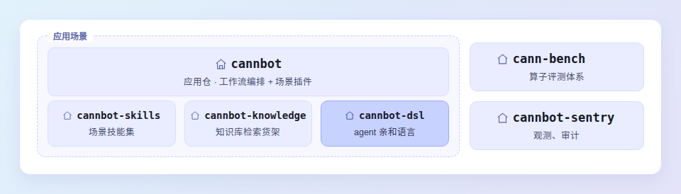

# CANNBot-DSL

> 基于 CANNBot-DSL 的 Ascend NPU 复杂算子样例集合，配套完整的文档站与精度测试。

<sub><span style="color:#999999">当前为尝鲜版本，CANNBot-DSL 的 API 接口不保证兼容性，后续版本可能发生变更。</span></sub>

[📖 概述](#概述) · [💻 软硬件配套](#软硬件配套说明) · [⚡️ 快速上手](#快速上手) · [📦 算子列表](#算子列表) · [📚 文档导航](#文档导航) · [📂 目录结构](#目录结构) · [🔥 更新日志](CHANGELOG.md) · [📜 许可证](LICENSE)

<!-- TODO(发布后)：补顶部徽章行（许可证 / 文档站 / CANN 版本 / 所属 SIG）。 -->
<!-- TODO(发布后)：补语言切换入口（中文 | English）。本次仅提供中文。 -->

---

## 🔥 最新动态

> **2026-09-30**
>
> - **✅ 支持 DeepSeek V4.1**：本仓算子集已覆盖相关算子，包括 [`indexer_prologue_qw`](samples/indexer_prologue_qw)、[`indexer_prologue_k`](samples/indexer_prologue_k)、[`attn_prologue`](samples/attn_prologue)、[`quant_lightning_indexer_dsl`](samples/quant_lightning_indexer_dsl)、[`quant_sparse_lightning_indexer_dsl`](samples/quant_sparse_lightning_indexer_dsl)、[`mixed_quant_sparse_flash_mla`](samples/mixed_quant_sparse_flash_mla)。
>
> - **🚀 新增 17 个算子样例，并更新既有算子适配最新 CANNBot-DSL**。例如，[Sparse Flash Attention](samples/sparse_flash_attention) 相比 AscendC 版本，**加速比最高达到 1.63 倍**；[Qwen Sparse Attention](samples/qwen_sparse_attn) 相比 AscendC 版本，长 KV decode 场景**平均加速比达到 1.23 倍**。其余算子的详细信息见[算子列表](#算子列表)。
>
> - **🛠 支持样例运行与自定义算子的调试开发**：CANNBot-DSL 0.7.0 版本发布，可直接通过 `python -m pip install cannbot-dsl` 安装；本仓样例可直接运行，自定义算子可通过 `net/native_package` 编译打包为 Native 算子包。使用说明见[快速上手](#快速上手)，打包方式见 [Native 打包说明](net/native_package/README.md)，接口与调试能力见 [API 文档](https://cannbot-dsl.gitcode.com/api/)。

<!-- TODO(算子全量合入后)：本节只保留当前这批重大更新，跟随后续合入滚动替换，
     顶部那行日期（现为 2026-09-30）需一并更新为最新一批的合入日期。
     历史沿革由 CHANGELOG.md 承载，但其首节目前只记到 2026-09-29，且只收录了
     attn_prologue、batch_matmul、matmul_streamk、quant_batch_matmul_mxa8w4 四条；
     engram_gate、indexer_prologue_k、flash_mla_with_kvcache、quant_block_sparse_attn、
     flash_attn 的 metadata 变长序列支持、既有算子适配 0.7.0 的迁移，
     以及 flash_kda_metadata / fused_recurrent_kda_snapshot 两个样例的撤并，均未收录，需补齐。 -->

<!-- TODO(发布前)：第二条的「17 个」按 2026-09-29 与 2026-09-30 两批合入的新增算子计，
     metadata 算子计入其主算子（含 flash_attn_metadata）；「更新适配」的具体范围也需一并核实。 -->

## 📌 概述

CANNBot 是 [CANN](https://hiascend.com/software/cann) 社区的 Infra 智能体层，用 Agent 完成 AscendC/PyPTO/TileLang/Triton 等各类语言的算子开发、模型迁移与推理优化，并延伸至图模式、Runtime 等更多 CANN 开发场景。

本仓（cannbot-dsl）是其 DSL 仓，提供 Agent 亲和的编程范式；仓群还包括 [cannbot](https://gitcode.com/cann/cannbot)、[cannbot-skills](https://gitcode.com/cann/cannbot-skills)、[cannbot-knowledge](https://gitcode.com/cann/cannbot-knowledge)、[cann-bench](https://gitcode.com/cann/cann-bench)、[cannbot-sentry](https://gitcode.com/cann/cannbot-sentry) 等仓库，结构如下。



## 💻 软硬件配套说明

| 维度 | 支持的版本 |
| :--- | :--- |
| 昇腾产品 | Ascend 950PR / Ascend 950DT（NPU ARCH 3510），见[硬件兼容性查询](https://www.hiascend.com/hardware/compatibility) |
| CPU 架构 | x86_64 / aarch64 |
| 操作系统 | CANN 支持的 Linux 发行版，见[硬件兼容性查询](https://www.hiascend.com/hardware/compatibility) |
| Python | 3.10、3.11、3.12 |
| CANN | 建议 9.2.0-beta.2，见 [CANN 安装部署](https://www.hiascend.com/cann/download) |
| CANNBot-DSL | 0.7.0 |
| torch | 2.7.1 / 2.9.0 / 2.10.0 / 2.11.0 / 2.12.0 |

> 上表口径截至 2026-09-30。CANN 版本以 [CANN 安装部署](https://www.hiascend.com/cann/download)为准。

<!-- TODO(发布后)：`cannbot-dsl` 0.7.0 上架 pip 源后，复核本表版本号与「快速上手」中的安装命令。 -->

## ⚡️ 快速上手

### 1. 安装 CANN

版本要求见[软硬件配套说明](#软硬件配套说明)。CANN 软件包为 Linux 版本，分 `x86_64` 与 `aarch64` 两种架构，下文以 `x86_64`、CANN 9.2.0-beta.2 为例。

软件包可从 [CANN 安装部署](https://www.hiascend.com/cann/download)页面获取，也可直接从镜像 `wget` 下载（`aarch64` 机器把下面 URL 中的 `x86_64` 换成 `aarch64`）：

```bash
CANN_BASE=https://ascend.devcloud.huaweicloud.com/artifactory/cann-run/software/9.2.0-beta.2/x86_64

wget ${CANN_BASE}/Ascend-cann-toolkit_9.2.0-beta.2_linux-x86_64.run
wget ${CANN_BASE}/Ascend-cann-950-ops_9.2.0-beta.2_linux-x86_64.run
```

`${install_path}` 为安装路径，默认 `/usr/local/Ascend`：

```bash
bash ./Ascend-cann-toolkit_9.2.0-beta.2_linux-x86_64.run --install --force --install-path=${install_path}
bash ./Ascend-cann-950-ops_9.2.0-beta.2_linux-x86_64.run --install --force --install-path=${install_path}

source ${install_path}/ascend-toolkit/set_env.sh
```

复现 DeepSeek V4.1 相关算子建议使用 CANN `9.2.0~weekly.20260909.01`，包目录见 [cann-run-mirror/software/legacy/20260909000323409](https://ascend.devcloud.huaweicloud.com/artifactory/cann-run-mirror/software/legacy/20260909000323409)。

### 2. 安装 CANNBot-DSL

CANNBot-DSL 以 whl 包发布，编译器后端已包含在包内，安装后即可使用，无需再从源码构建。发行包名为 `cannbot-dsl`，导入名为 `cannbotdsl`：

```bash
python -m pip install cannbot-dsl
```

<!-- TODO(发布后)：`cannbot-dsl` 0.7.0 上架后复核本节命令与配套版本号（上架前公网仅 0.0.3 Alpha）。 -->

安装完成后验证版本：

```bash
python -c 'import cannbotdsl; print(cannbotdsl.__version__)'
```

### 3. 运行一个算子

以 `sparse_flash_attention` 为例，BSND、BF16，每个 Query token 选取 TOPK 个逻辑 KV token：

```python
import math
import torch
import torch_npu

from sparse_flash_attention import sparse_flash_attention

B, S1, S2, N1, N2 = 1, 2, 16, 8, 1
D, DR, TOPK = 512, 64, 8

query = torch.randn(B, S1, N1, D, dtype=torch.bfloat16).npu()
query_rope = torch.randn(B, S1, N1, DR, dtype=torch.bfloat16).npu()
key = torch.randn(B, S2, N2, D, dtype=torch.bfloat16).npu()
key_rope = torch.randn(B, S2, N2, DR, dtype=torch.bfloat16).npu()

sparse_indices = torch.tensor(
    [[[[0, 2, 4, 6, 8, 10, 12, 14]],
      [[1, 3, 5, 7, 9, 11, 13, 15]]]],
    dtype=torch.int32,
).npu()

output, softmax_max, softmax_sum = sparse_flash_attention(
    query=query,
    key=key,
    value=key,                 # MLA-absorb；当前 kernel 使用 key 参与 PV
    sparse_indices=sparse_indices,
    query_rope=query_rope,
    key_rope=key_rope,
    scale_value=1.0 / math.sqrt(D + DR),
    sparse_block_size=1,
    layout_query="BSND",
    layout_kv="BSND",
    sparse_mode=0,
    attention_mode=2,
    return_softmax_lse=True,
)

print("output", tuple(output.shape))
print("softmax_max", tuple(softmax_max.shape))
print("softmax_sum", tuple(softmax_sum.shape))
```

样例以目录为单位组织，运行前请切换到该样例所在目录，或把样例目录加入 `PYTHONPATH`：

```bash
cd samples/sparse_flash_attention
python3 your_script.py
```

运行成功时打印：

```text
output (1, 2, 8, 512)
softmax_max (1, 1, 2, 8)
softmax_sum (1, 1, 2, 8)
```

各算子的接口参数、数据类型约束与返回值说明，见[算子列表](#算子列表)中对应样例的 README。

### 4. 运行精度测试

```bash
python3 -m pytest test/sparse_flash_attention/test_sparse_flash_attention.py -v
```

<!-- TODO(算子全量合入后)：补充「一次跑全部样例测试」的命令与耗时说明。 -->

## 📦 算子列表

本仓算子持续合入中，当前已开源算子如下：

| 样例 | 接口 | 说明 |
| :--- | :--- | :--- |
| [matmul/matmul](samples/matmul/matmul) | `matmul()` | A16W16 矩阵乘，`C[M,N] = A[M,K] × B[N,K]^T` |
| [matmul/matmul](samples/matmul/matmul) | `matmul_streamk()` | 同目录的 Stream-K（DPSK）实现，DP + SK 混合调度，适合小 M/N、大 K |
| [matmul/batch_matmul](samples/matmul/batch_matmul) | `batch_matmul()` | 批量矩阵乘，batch 维右对齐广播，支持 rank 2~6 |
| [matmul/quant_matmul](samples/matmul/quant_matmul) | `npu_quant_matmul()` | MXFP8 / MXFP4 全量化矩阵乘（`quant_batch_matmul_mx.py`） |
| [matmul/quant_matmul](samples/matmul/quant_matmul) | `npu_quant_matmul()` | per-tensor（TT）量化矩阵乘，支持 HiFloat8 / INT8 / FP8（`quant_batch_matmul_hif8_tt.py`） |
| [matmul/quant_matmul](samples/matmul/quant_matmul) | `matmul_mix_quant()` | MXA8W4：MXFP8 激活 × MXFP4 权重（`quant_batch_matmul_mxa8w4.py`） |
| [grouped_matmul](samples/grouped_matmul) | `group_matmul()` | 分组矩阵乘，支持 M 轴 / K 轴分组 |
| [flash_attn](samples/flash_attn) | `flash_attn()`、`flash_attn_metadata()` | Flash Attention，支持 GQA、变长序列与分页 KV Cache |
| [flash_attn_fp8_fullquant](samples/flash_attn_fp8_fullquant) | `flash_attn_fp8_fullquant()` | FP8 全量化 Attention，支持 GQA、分页 KV Cache 与 causal mask |
| [sparse_flash_attention](samples/sparse_flash_attention) | `sparse_flash_attention()` | Sparse Flash Attention（SFA），按 `sparse_indices` 选取参与计算的 KV token |
| [qwen_sparse_attn](samples/qwen_sparse_attn) | `qwen_sparse_attn()` | 固定 `block_size=128` 的分块稀疏注意力，含 AICPU metadata 规划 |
| [flash_mla_with_kvcache](samples/flash_mla_with_kvcache) | `flash_mla_with_kvcache()`、`flash_mla_with_kvcache_metadata()` | Flash MLA 推理，Q 为 TND、KV 走分页 cache |
| [quant_block_sparse_attn](samples/quant_block_sparse_attn) | `quant_block_sparse_attn()`、`quant_block_sparse_attn_metadata()` | FP8 量化块稀疏注意力，面向分页 prefill |
| [mixed_quant_sparse_flash_mla](samples/mixed_quant_sparse_flash_mla) | `mixed_quant_sparse_flash_mla()` | 混合量化稀疏 MLA：BF16 Q + FP8 原始 KV + 可选 FP4 压缩 KV |
| [mixed_quant_sparse_flash_mla_metadata](samples/mixed_quant_sparse_flash_mla_metadata) | `mixed_quant_sparse_flash_mla_metadata()` | MQSMLA 的 AICPU 分核调度，输出整行 / FlashDecode 分片计划 |
| [flash_kda](samples/flash_kda) | `flash_kda()`、`flash_kda_metadata()` | Kimi Delta Attention prefill 融合算子，含 AICPU 调度 metadata |
| [attn_prologue](samples/attn_prologue) | `attn_prologue()` | MXFP8 的 QA/KV 投影、RMSNorm、QR 量化、QB 投影、RoPE 与 KV cache 写回 |
| [indexer_prologue_qw](samples/indexer_prologue_qw) | `indexer_prologue_qw()` | MXFP8 Q GEMM、尾部 RoPE、MXFP4 量化，以及 BF16 W GEMM |
| [indexer_prologue_k](samples/indexer_prologue_k) | `indexer_prologue_k()` | Indexer K 路前处理：BF16 投影、RMSNorm、RoPE、MXFP4 量化与分页 cache 写入 |
| [qsa_indexer](samples/qsa_indexer) | `qsa_indexer()`、`qsa_indexer_metadata()` | 压缩 Key 稀疏索引，选高分压缩块并展开为 token 索引 |
| [stem_indexer](samples/stem_indexer) | `stem_indexer()`、`stem_indexer_metadata()` | 块级特征打分 + 动态 TopK 选择 Key Block |
| [quant_lightning_indexer_dsl](samples/quant_lightning_indexer_dsl) | `quant_lightning_indexer()` | MXFP4 Lightning Indexer（QLI），遍历上下文选 TopK token |
| [quant_lightning_indexer_metadata_dsl](samples/quant_lightning_indexer_metadata_dsl) | `quant_lightning_indexer_metadata()` | QLI 配套的 AICPU 调度算子 |
| [quant_sparse_lightning_indexer_dsl](samples/quant_sparse_lightning_indexer_dsl) | `quant_sparse_lightning_indexer()` | MXFP4 Sparse Lightning Indexer（QSLI），仅访问候选 Key 块 |
| [quant_sparse_lightning_indexer_metadata_dsl](samples/quant_sparse_lightning_indexer_metadata_dsl) | `quant_sparse_lightning_indexer_metadata()` | QSLI 配套的 AICPU 调度算子 |
| [kv_compress_epilog](samples/kv_compress_epilog) | `kv_compress_epilog()` | KV Cache 量化压缩与按槽位原地更新 |
| [rms_norm](samples/rms_norm) | `rms_norm()` | RMSNorm，`y = x · rstd · γ` |
| [engram_gate](samples/engram_gate) | `engram_gate()` | Engram 残差门：双路 RMS、加权点积与 signed-sqrt sigmoid 门控 |
| [pointnet_sa](samples/pointnet_sa) | `pointnet_sa()` | PointNet++ SA 层的 shared MLP + max-pool |
| [voxel_conv](samples/voxel_conv) | `voxel_conv()` | VoxelNet Convolutional Middle Layers |

<!-- TODO(算子全量合入后)：补全本表（不要漏掉后续合入的算子）。当前已知缺口：
     1) scripts/ci/operator_list.yaml 与 test/test_config.yaml 登记的算子均已有对应样例目录，无缺口。
     2) docs/examples/index.md 的样例索引仍滞后（仅 10 行），缺 batch_matmul、matmul_streamk、
        quant_matmul 的另两个实现、flash_attn_fp8_fullquant、sparse_flash_attention、qwen_sparse_attn、
        flash_mla_with_kvcache、quant_block_sparse_attn、mixed_quant_sparse_flash_mla 及其 metadata、
        indexer_prologue_qw、indexer_prologue_k、qsa_indexer、stem_indexer、QLI/QSLI 及其 metadata、
        engram_gate 等，需同步。
     3) figures/ 下 17 张图均已被引用；但 attn_prologue、indexer_prologue_k、mixed_quant_sparse_flash_mla、
        qsa_indexer、quant_lightning_indexer_dsl、quant_sparse_lightning_indexer_dsl 等样例的 README
        已给出性能数据，尚无对应性能对比图。
     4) `flash_kda_metadata`、`fused_recurrent_kda_snapshot` 两个样例已在本轮撤并（前者的实现并入
        `samples/flash_kda/`，后者删除），CHANGELOG.md 中两者的历史条目保留未动，发布前需确认口径。 -->

## 📚 文档导航

接口文档发布在文档站 <https://cannbot-dsl.gitcode.com/api/>；算子样例、测试与仓库结构不另设站点页面，直接阅读仓内文件。

| 内容 | 说明 | 入口 |
| :--- | :--- | :--- |
| API 总览 | Host / Kernel / AI CPU 三类公共接口，以及 AOT 编译与 Native 算子包发布 | [/api/](https://cannbot-dsl.gitcode.com/api/) |
| Host API | 数据描述（`TensorSpec` / `TensorListSpec` / `Dim`）与平台信息接口 | [/api/host/](https://cannbot-dsl.gitcode.com/api/host/) |
| Kernel API | 类型与视图、控制流、数据搬运、Cube 与寄存器计算、同步与缓存、系统变量 | [/api/kernel/](https://cannbot-dsl.gitcode.com/api/kernel/) |
| AI CPU API | AI CPU 侧调度接口 | [/api/aicpu/](https://cannbot-dsl.gitcode.com/api/aicpu/) |
| 装饰器 | `@host`、`@jit`、`@kernel` 等六个装饰器说明 | [/api/decorators.html](https://cannbot-dsl.gitcode.com/api/decorators.html) |
| 接口清单 | 全部接口的索引 | [/api/api-list.html](https://cannbot-dsl.gitcode.com/api/api-list.html) |
| 算子样例 | 各样例目录下的 README：接口签名、数据类型约束与运行方式 | [samples/](samples/) |
| 精度测试 | 与样例一一对应的 pytest 用例 | [test/](test/) |
| Native 打包 | 把 `samples/` 下的算子编译打包为 Native wheel | [net/native_package/README.md](net/native_package/README.md) |
| 更新日志 | 版本与算子变更记录 | [CHANGELOG.md](CHANGELOG.md) |

<!-- TODO(文档站新增 API 分区后)：同步扩充本表。
     TODO：本仓暂不提供「复现与调试开发」的独立文档，`快速上手` 与各样例 README 覆盖复现步骤，
     调试能力见 API 文档的 Kernel API 部分；待该指南成型后在本表补一行。 -->
<!-- TODO(托管支持 cleanUrls 后)：`/api/decorators.html`、`/api/api-list.html` 两个叶子页现带 `.html`。
     站点 VitePress 配置为 `cleanUrls: true`，但托管层未做 rewrite，无后缀的叶子页冷启动会 404
     （目录页如 `/api/`、`/api/host/` 不受影响），故按可直接访问的形态书写；
     托管侧补上 rewrite 后可去掉后缀。 -->

## 📂 目录结构

关键目录如下，详细目录参见[仓库结构](docs/guide/repository.md)。

```bash
cannbot-dsl/
├── docs/          # 文档站源码（VitePress）
├── samples/       # 算子样例及各自的 README
├── test/          # 与样例对应的测试代码
├── figures/       # 样例 README 使用的性能对比图
├── net/           # Native 算子编译与 wheel 打包
└── scripts/       # CI 与合规检查脚本
```

<!-- TODO：本节与 docs/guide/repository.md 的分工是「简版索引 / 详版说明」。
     但两处集合目前不一致（repository.md 多列了 build.sh 与 requirements.txt、缺 net/ 与
     install_deps.sh），描述措辞也不同，需对齐。该文件不在本次改动范围内。 -->

## 📝 相关信息

- [更新日志](CHANGELOG.md)
- [参与贡献](docs/community/contributing.md)
- [许可证](LICENSE)：CANN Open Software License Agreement Version 2.0

---

欢迎通过 Issue 与合并请求参与项目建设。问题反馈与交流请使用 [GitCode 仓库](https://gitcode.com/cann/cannbot-dsl)的 Issues 与 Discussions。
