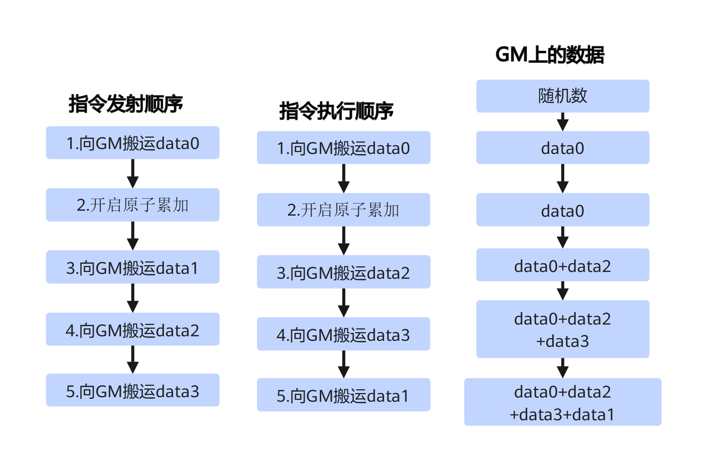
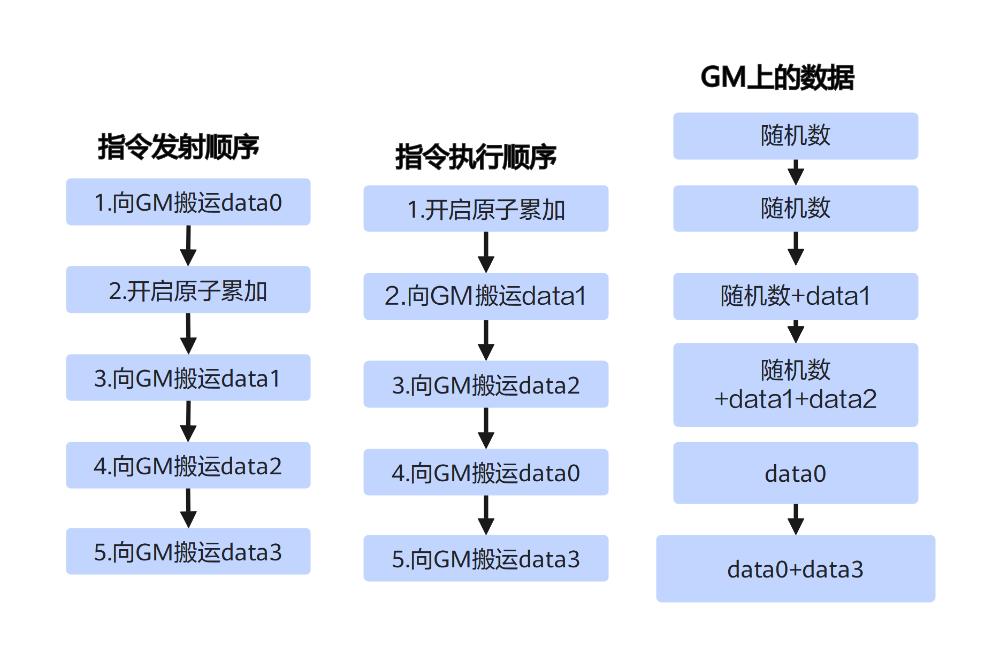
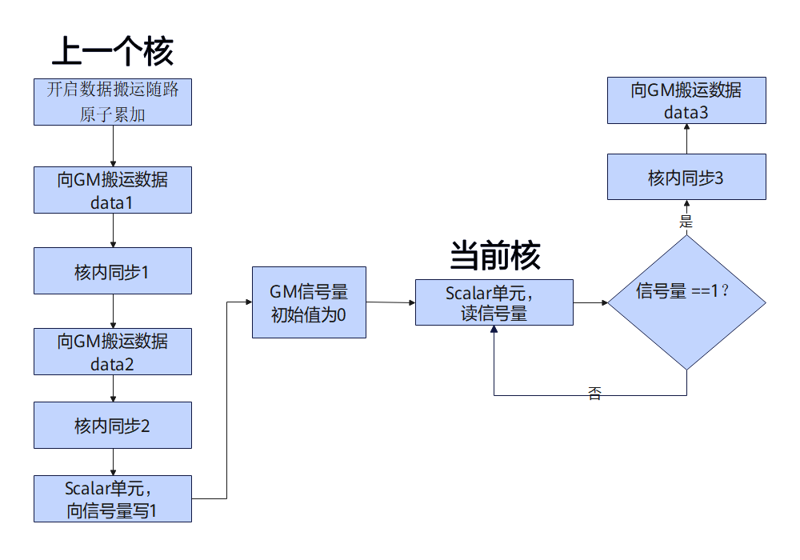

# 关键特性说明

确定性计算是指在相同输入条件下，无论执行次数或执行环境如何变化，总能产生完全一致输出结果的计算过程。确定性计算为系统稳定性和实验可验证性提供保障。

对下文描述中出现的接口有以下说明：

- 对于浮点数类型的原子累加，本文以[`mem_copy`](/api/kernel/data-movement/mem-copy)（`atomic_add=True`）为例。
- 对于AIV和AIC中向GM搬运数据的接口，本文分别以UB→GM与L0C→GM的[`mem_copy`](/api/kernel/data-movement/mem-copy)为例。

## 确定性计算概述

为引出原子操作场景下非确定性计算的问题，我们构建如下常见的确定性计算场景：首先，通过单组浮点数数据搬运完成GM的初始化；随后，启动原子累加操作；最后，经由多次数据搬运，在GM上对多组浮点数数据进行累加。具体伪代码如下：

```text
1. cb.mem_copy(dst, data0);                     // 数据搬运，覆盖GM原有随机值，期望GM数据为data0。
2. cb.mem_copy(dst, data1, atomic_add=True);    // 带随路原子累加的搬运，期望GM数据为data0 + data1。
3. cb.mem_copy(dst, data2, atomic_add=True);    // 带随路原子累加的搬运，期望GM数据为data0 + data1 + data2。
4. cb.mem_copy(dst, data3, atomic_add=True);    // 带随路原子累加的搬运，期望GM数据为data0 + data1 + data2 + data3。
```

完整可运行示例请参见[`mem_copy`](/api/kernel/data-movement/mem-copy)的调用示例。

如下图1所示，开发者的预期结果：指令发射的顺序能够严格对应实际指令执行顺序，多次执行该段代码，无论执行多少次，最终GM数据均为data0 + data1 + data2 + data3，结果完全一致，实现确定性计算。

**图1** 确定性计算场景，GM上数据变化过程


但实际情况是，若开发者不做干预，程序每次运行时这些指令的执行顺序都可能发生变化，最终导致GM数据与预期结果不一致。下面列举两种可能的指令执行顺序及其对应的执行流程。

## 非确定性计算，结果1

**图2** 非确定性计算场景1，GM上数据变化过程



如图2所示，该场景中指令执行流程如下：

1. 初始状态，GM数据为：随机值；
2. 向GM搬运data0，GM数据被初始化为：data0；
3. 三次带随路原子累加的搬运指令乱序，实际执行顺序为“搬出data2→搬出data3→搬出data1”，最终GM上数据为：data0 + data2 + data3 + data1。

**非确定性计算的产生原因1：**

带随路原子操作的搬运指令乱序，由于浮点数加法不满足结合律，即\(a+b\)+c!=a+\(b+c\)，使得最终GM数据data0 + data2 + data3 + data1与预期的data0 + data1 + data2 + data3存在偏差。

带随路原子操作的搬运指令乱序，导致最终结果产生偏差的前提条件有以下三条：

- 原子操作类型为原子累加（最大值、最小值运算满足结合律）。
- 原子操作数据类型为浮点数（整数加法满足结合律）。
- 带随路原子操作的搬运指令达到3条及以上（浮点数加法满足交换律，但是不满足结合律）。

## 非确定性计算，结果2

**图3** 非确定性计算场景2，GM上数据变化过程



如图3所示，该场景中指令执行流程如下：

1. 初始状态，GM数据为：随机值；
2. 先后执行两次带随路原子累加的搬运指令，执行顺序为“搬出data1→搬出data2”，GM数据为：随机值 + data1 + data2；
3. 向GM搬运data0，GM上累加的结果被data0覆盖，GM数据为：data0；
4. 最后执行data3的搬运，最终GM上数据为：data0 + data3。

**非确定性计算的产生原因2：**

普通搬运指令与带随路原子操作的搬运指令之间发生乱序，会导致GM上已完成原子操作的数据被data0错误覆盖，进而产生非确定性计算结果。

此类乱序导致结果偏差无需满足任何前提条件，开发者无需再区分原子操作类型、原子操作数据类型，也无需考虑带随路原子操作的搬运指令数量是否达到3条及以上。

## 确定性计算实现方案

根据导致非确定性计算的两个根因，下面也从解决这两个方面描述确定性计算实现的方案。核心思想是在指令之间插入适当的同步，使每次程序运行时相关指令都按照预期确定的顺序执行，最终保证每次执行程序输出的结果都相同。具体来说包含以下两个方面：

- 普通搬运指令与带随路原子累加的搬运指令之间插入同步

    如下伪代码所示，在指令1与2之间插入同步，能够确保开始原子操作前GM的初始值符合预期。

- 带随路原子累加的搬运指令之间的同步

    指令2与3、3与4之间插入同步，能够确保浮点数累加的顺序符合预期。

```text
// 整个原子累加在同一个核内执行，控制4个指令的执行顺序为“1→2→3→4”。
1. cb.mem_copy(dst, data0);                     // 数据搬运，覆盖GM原有随机值，期望GM数据为data0。
核内同步
2. cb.mem_copy(dst, data1, atomic_add=True);    // 带随路原子累加的搬运，期望GM数据为data0 + data1。
核内同步
3. cb.mem_copy(dst, data2, atomic_add=True);    // 带随路原子累加的搬运，期望GM数据为data0 + data1 + data2。
核内同步
4. cb.mem_copy(dst, data3, atomic_add=True);    // 带随路原子累加的搬运，期望GM数据为data0 + data1 + data2 + data3。
```

如下伪代码所示，在一个纯Vector算子中，当上述指令都在不同AIV核中执行时，需要将上述的核内同步替换为核间同步。

```text
// 整个原子累加在4个不同核中执行，控制4个核执行的顺序为“核0→核1→核2→核3”。
if cb.get_block_idx() == 0:
    cb.mem_copy(dst, data0);                    // 数据搬运，覆盖GM原有随机值，期望GM数据为data0。
    核间同步
elif cb.get_block_idx() == 1:
    核间同步
    cb.mem_copy(dst, data1, atomic_add=True);   // 带随路原子累加的搬运，期望GM数据为data0 + data1。
    核间同步
elif cb.get_block_idx() == 2:
    核间同步
    cb.mem_copy(dst, data2, atomic_add=True);   // 带随路原子累加的搬运，期望GM数据为data0 + data1 + data2。
    核间同步
else:
    核间同步
    cb.mem_copy(dst, data3, atomic_add=True);   // 带随路原子累加的搬运，期望GM数据为data0 + data1 + data2 + data3。
```

下面介绍如何基于硬件同步指令实现核内同步，以及如何基于软件同步方案实现核间同步。

## 核内同步

搬运指令和带随路原子累加的搬运指令的流水类型如下表所示，当上述指令在同一个核内执行时，开发者按需插入`cb.vec_sync_pipe`（AIV）或者`cb.cube_sync_pipe`（AIC）等流水同步接口。

**表1** 原子操作确定性计算相关指令的流水类型

| 指令名称 | 流水类型 |
| --- | --- |
| [`mem_copy`](/api/kernel/data-movement/mem-copy)（UB→GM） | PIPE_MTE3 |
| [`mem_copy`](/api/kernel/data-movement/mem-copy)（L0C→GM） | PIPE_FIX |

## 核间同步

确定性计算场景下的核间同步可通过软件仿真实现：通过GM中的信号量实现核间同步，先建立一对核（AIV或AIC）之间的同步，进而扩展至多个核之间的同步。

下图展示了两个核之间如何通过GM中的信号量进行核间同步：

- 上一个核完成数据搬运或原子操作后，会通过Scalar单元向核间共享的GM中的信号量写入值1，表示自己的任务已完成。上一个核中也需要插入核内同步：
    - 当上一个核内有多条搬运指令时，它们之间需要插入核内同步1。
    - Scalar单元向GM写数据之前必须保证前序所有搬运指令都已经执行完成，因此它们之间也需要插入核内同步2。

- 当前核在执行搬运任务前，会通过Scalar单元不断读取该信号量的值。如果信号量不等于1，当前核会进入阻塞等待状态；当检测到信号量等于1时，当前核会解除阻塞，开始执行自己的数据搬运或原子操作。为确保信号量等于1之前，当前核不会执行搬运指令，需要在搬运指令之前插入核内同步3。

**图4** 一对核之间软件同步方案流程图



Scalar单元访问GM上的信号量，存在两种访问方式：

- 经过DCache访问

    当开发者通过`x_gm[i]`（其中`x_gm`为指向GM上Tensor的变量）读写GM时，需手动调用[`dcci_single`](/api/kernel/synchronization-cache/dcci-single)接口，以保证多核间的数据一致性。

- 不通过DCache访问

    使用[`load_bypass`](/api/kernel/scalar_compute/scalar_load/load-bypass)和与其对应的绕过DCache写入能力（[`vec_store_bypass`](/api/kernel/scalar_compute/scalar_store/vec-store-bypass)、[`cube_store_bypass`](/api/kernel/scalar_compute/scalar_store/cube-store-bypass)）直接访问GM。这种方式无需额外操作即可保证多核间数据的一致性。

如图4所示，核间同步方案中也需要与核内同步配合使用，现将三处核内同步作用说明如下：

- 核内同步1（可选）：核内存在多条数据搬运指令时，通过该同步保证各搬运操作严格按顺序执行。
- 核内同步2（必备）：等待前一个核全部任务执行完毕后，才允许Scalar单元向全局内存信号量写入1。
- 核内同步3（必备）：等待Scalar单元检测到信号量更新为1后，当前核再启动后续任务执行。
