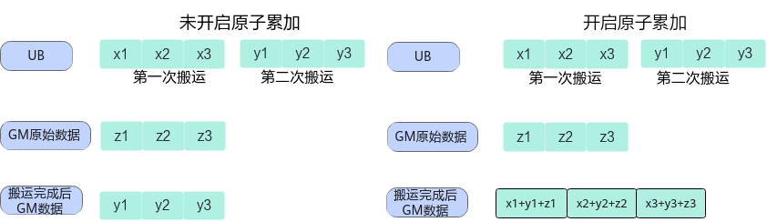
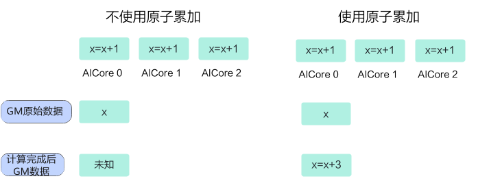

# 原子操作概述

数据搬运随路原子操作接口用于对后续目的地址为GM的数据搬运指令开启原子操作，涉及的接口请参见表1。如下图1的左侧子图所示，未开启原子操作时，写入GM的数据搬运完成后，GM中原始数据将被新搬运数据完全覆盖。如图1右侧子图所示，当数据搬运随路原子操作接口被调用后，系统将为后续写入GM的数据搬运开启原子操作。此时，数据搬运完成后，GM中的最终数据由原始GM数据与新搬运数据共同决定。

## 数据搬运随路原子操作

**图1** 数据搬运随路原子累加效果

**表1** 数据搬运随路原子操作接口

| 对应接口 | 接口功能描述 |
| --- | --- |
| [`mem_copy`](/api/kernel/data-movement/mem-copy)（`atomic_add=True`） | 对后续目的地址为GM的数据搬运开启原子累加。原子累加过程：将待拷贝的内容和GM已有内容进行求和，然后将求和结果写入GM。 |

DSL 目前只提供随路原子累加，未提供随路原子取大、取小以及关闭随路原子操作的接口；随路原子累加仅支持UB→GM与L0C→GM方向的搬运。

## 标量原子操作

针对Ascend 950PR&950DT系列产品，新增Scalar原子操作接口，能够在指定GM地址上进行单点原子计算操作，涉及的接口请参见表2。对比数据搬运随路原子操作接口，Scalar原子操作接口不会影响后续向GM搬运数据的指令。

如下图2左侧子图所示，不使用`atomic_add`接口时，多个AI Core同时对同一GM地址执行累加操作会相互覆盖，操作不具备原子性，最终结果不可预期。如右侧子图所示，使用`atomic_add`接口后，各AI Core的累加操作串行化执行，确保每次累加操作的原子性，最终结果符合预期。

**图2** 标量原子累加效果

**表2** Scalar原子操作接口

| 对应接口 | 接口功能描述 |
| --- | --- |
| [`atomic_add`](/api/kernel/atomic/scalar_atomic/atomic-add) | 用于在指定GM地址上进行原子加操作，将address指向的GM地址上的旧值（`old_value`）与输入标量值（value）求和，将和结果（`new_value`）写回GM地址，返回该地址修改前的值（`old_value`）。 |
| [`atomic_min`](/api/kernel/atomic/scalar_atomic/atomic-min) | 用于在指定GM地址上进行原子取最小值操作，将address指向的GM地址上的旧值（`old_value`）与输入标量值（value）做比较，将较小值（`new_value`）写回GM地址，返回该地址修改前的值（`old_value`）。 |
| [`atomic_max`](/api/kernel/atomic/scalar_atomic/atomic-max) | 用于在指定GM地址上进行原子取大操作，将address指向的GM地址上的旧值（`old_value`）与输入的标量值（value）进行比较，将较大值（`new_value`）写回GM地址，返回该地址修改前的值（`old_value`）。 |
| [`atomic_cas`](/api/kernel/atomic/scalar_atomic/atomic-cas) | 在指定GM地址上进行原子比较操作，读取address指向的GM地址上的旧值（`old_value`）与输入标量值value1进行比较：如果相等，则将输入标量值value2写入GM地址；如果不相等，则GM地址上的值保持不变。返回该地址修改前的值（`old_value`）。 |
| [`atomic_exch`](/api/kernel/atomic/scalar_atomic/atomic-exch) | 用于在GM内存中执行原子交换操作，读取address指向的GM地址上的旧值（`old_value`），并将输入的标量值（value）替换旧值存储回同一地址，返回该地址修改前的值（`old_value`）。 |
| [`atomic_and`](/api/kernel/atomic/scalar_atomic/atomic-and) | 对GM中的数据与指定数据执行原子与操作，即将val按位与到address指向的数据元素上。读取address指向的GM地址上的旧值（`old_value`），将旧值与输入标量值val进行按位与运算，将结果（`new_value`）写回GM地址，返回该地址修改前的值（`old_value`）。 |
| [`atomic_inc`](/api/kernel/atomic/scalar_atomic/atomic-inc) | 对GM中address指向的计数器执行原子递增操作，如果address上的数值大于等于指定数值val，则对address赋值为0，否则将address上数值加1，返回该地址修改前的值（`old_value`）。 |
| [`atomic_dec`](/api/kernel/atomic/scalar_atomic/atomic-dec) | 对GM中address指向的计数器执行原子递减操作，如果address上的数值等于0或大于指定数值val，则对address赋值为val，否则将address上数值减1，返回该地址修改前的值（`old_value`）。 |
| [`atomic_or`](/api/kernel/atomic/scalar_atomic/atomic-or) | 对GM中的数据与指定数据执行原子或操作，即将val按位或到address指向的数据元素上。读取address指向的GM地址上的旧值（`old_value`），将旧值与输入标量值val进行按位或运算，将结果（`new_value`）写回GM地址，返回该地址修改前的值（`old_value`）。 |
| [`atomic_sub`](/api/kernel/atomic/scalar_atomic/atomic-sub) | 对GM中的数据与指定数据执行原子减操作，即将val从address指向的数据元素上减去。读取address指向的GM地址上的旧值（`old_value`），将旧值减去输入标量值val，将结果（`new_value`）写回GM地址，返回该地址修改前的值（`old_value`）。 |
| [`atomic_xor`](/api/kernel/atomic/scalar_atomic/atomic-xor) | 对GM中的数据与指定数据执行原子异或操作，即将val按位异或到address指向的数据元素上。读取address指向的GM地址上的旧值（`old_value`），将旧值与输入标量值val进行按位异或运算，将结果（`new_value`）写回GM地址，返回该地址修改前的值（`old_value`）。 |
