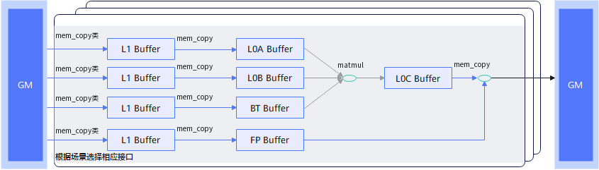

# 普通矩阵计算流程

矩阵计算接口针对矩阵计算编程模型提供了数据搬入、矩阵计算和结果搬出接口，分别承载Cube核中各个通路的搬运能力和计算能力，如下图所示：

**图1** 普通矩阵基础计算流程图

1. 通过 [`mem_copy`](/api/kernel/data-movement/mem-copy) 搬入已排布好的A、B矩阵；对于ND输入，使用 [`mem_copy`](/api/kernel/data-movement/mem-copy) 的ND2Nz随路转换完成分形转换。Bias和随路量化系数也先搬入L1 Buffer。

2. 通过 [`mem_copy`](/api/kernel/data-movement/mem-copy) 将A、B分别搬入L0A Buffer、L0B Buffer；根据输入布局选择是否转置。Bias和量化系数分别通过 [`mem_copy`](/api/kernel/data-movement/mem-copy) 搬入对应Buffer。

3. 通过 [`matmul`](/api/kernel/cube_compute/matmul) 计算，输出至L0C Buffer。矩阵的M、K、N由入参Tensor的shape决定，初次从零计算时设置 `init=True`；后续K块累加时设置 `init=False`。Bias初始化的参数说明见 [`matmul`](/api/kernel/cube_compute/matmul)。

4. 通过 [`mem_copy`](/api/kernel/data-movement/mem-copy) 搬出结果，配置随路量化、激活和输出格式，也可搬到L1 Buffer。
