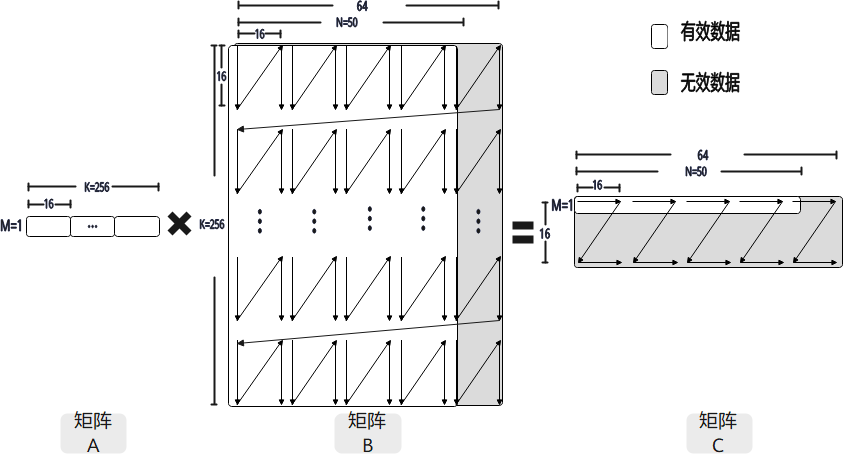
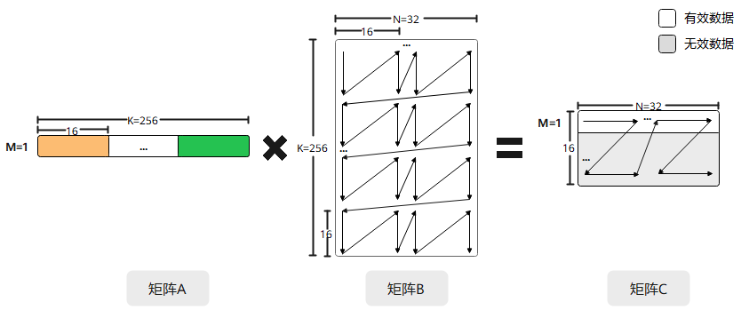
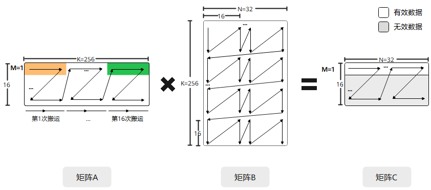
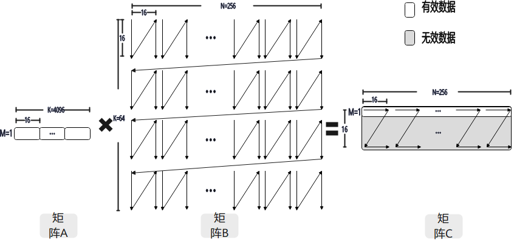

# GEMV

**特性说明：**

Gemv的核心功能体现为：当矩阵A的维度M取值为1时，接口会自动启用Gemv功能，该操作退化为1×K维度的行向量与K×N维度矩阵之间的乘法运算。

针对Ascend 950PR&950DT系列产品，`disable_gemv` 参数的默认值为 `True`，即默认关闭Gemv功能；如需开启该功能，需要显式设置 `disable_gemv=False`。

**特性约束：**

1. 1×K矩阵A需满足512B地址对齐，K个数据连续存储；以 `dtypes.float16` 类型为例，当K=256时，软件侧可视作16\*16分块，配置m=1后硬件解析为1\*256向量，可通过 [`mem_copy`](/api/kernel/data-movement/mem-copy) 将256个 `float16` 数据从L1 Buffer搬至L0A Buffer。

2. C矩阵是一个（1\*N）的向量，当1×N向量被划分为多个1×16子向量时，每个子向量在L0C Buffer中占用1024B，但实际有效数据仅占最低64B。例如，当N=50时，共划分4个1\*16子向量，占用4\*1024B = 4096B，其中每个子向量可容纳64B，四块可容纳256B；N=50时逻辑有效数据为50×4B=200B。

**图1** GEMV模式，矩阵乘示意图



**使用优势：**

开启GEMV模式，则矩阵乘法将M方向作为非对齐场景进行处理。GEMV模式相较于非对齐处理方式，搬运数据量更少，可减少搬运开销。下面以M=1，K=256，N=32，左右矩阵数据类型为 `dtypes.float16` 的矩阵乘示例说明。

- GEMV模式

    将A矩阵从L1 Buffer搬运到L0A Buffer时，1\*256的向量被当作16\*16的矩阵进行处理，调用 [`mem_copy`](/api/kernel/data-movement/mem-copy) 一次完成16\*16分形大小的矩阵搬运。B矩阵的搬运以及矩阵乘计算跟基础场景相同，如下图所示。

    **图2** GEMV模式M=1的矩阵乘计算示意图

    

- 非GEMV模式

    将A矩阵从L1 Buffer搬运到L0A Buffer时，1\*256的向量被当作非对齐矩阵数据进行处理，将M方向对齐到32字节后进行搬运。图中需要覆盖K/16=16个输入分形，搬运的数据量相应增加。分形个数不等于接口调用次数，需结合所选搬运接口的步长与重复参数确定调用次数，如下图所示。

    **图3** 非GEMV模式M=1的矩阵乘计算示意图

    

**配置片段：**

**表1** 示例配置说明

| 矩阵 | 维度大小 | 数据类型 |
| --- | --- | --- |
| A | 1 * 4096 | `dtypes.float16` |
| B | 4096 * 256 | `dtypes.float16` |
| C | 1 * 256 | `dtypes.float32` |

A矩阵为1\*4096的向量，通过 [`mem_copy`](/api/kernel/data-movement/mem-copy) 搬运到L0A Buffer上；C矩阵为1\* 256的向量，共可以划分为16个1 \* 16的子向量，占用16 \* 1024B = 16384B\(f162f32\)，其中有效数据仅仅为16 \* 64B = 1024B。

**图4** GEMV模式矩阵乘示意图



```python
# m = 1，开启GEMV能力
cb.matmul(c, a, b, disable_gemv=False)
```

针对Ascend 950PR&950DT系列产品，关闭GEMV模式时保持 `disable_gemv` 的默认值 `True` 即可，无需显式配置：

```python
# m = 1，关闭GEMV能力
cb.matmul(c, a, b)
```

完整可运行示例请参见 [`matmul`](/api/kernel/cube_compute/matmul) 的调用示例。
