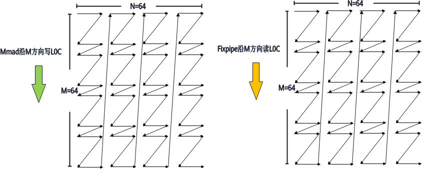

# UnitFlag

**特性说明：**

unitFlag的核心功能体现为：`matmul` 和L0C Buffer搬出接口引入了单元标志（unit-flag）机制，通过以内存块为粒度实现精细化的数据同步，从而有效降低同步延迟，提升系统整体性能。当UnitFlag开关打开后，对于L0C Buffer中的内存块，硬件提供单元标志位指示该块是否可读或可写，内存块的具体大小由硬件行为控制，用户无需感知。

`matmul` 通过 `unit_flag=2`（ENABLE_KEEP）或 `unit_flag=3`（ENABLE_UPDATE）启用单元标志。

当 `unit_flag=2`（ENABLE_KEEP）时，开启unitFlag功能，在硬件执行完指令后，不改变单元标志位；

- 对于写操作（`matmul` 接口），如果单元标志位0，则硬件直接写入L0C Buffer；否则，如果单元标志位为1，则写操作会等待直到单元标志变为0；执行完成后将单元标志位保持为0；
- 对于读操作（L0C Buffer搬出接口），如果单元标志位1，则硬件直接读取L0C Buffer；否则，如果单元标志位为0，则读操作会等待直到单元标志变为1；执行完成后将单元标志位保持为1；

当 `unit_flag=3`（ENABLE_UPDATE）时，开启unitFlag功能，在硬件执行完指令后，改变单元标志位；

- 对于写操作（`matmul` 接口），如果单元标志位0，则硬件直接写入L0C Buffer；否则，如果单元标志位为1，则写操作会等待直到单元标志变为0；执行完成后将单元标志位设置成1；
- 对于读操作（L0C Buffer搬出接口），如果单元标志位1，则硬件直接读取L0C Buffer；否则，如果单元标志位为0，则读操作会等待直到单元标志变为1；执行完成后将单元标志位设置成0；

根据上述特性，如果用户在进行A矩阵\[128, 1024\]、B矩阵为\[1024, 128\]的矩阵乘计算时，需要沿着K轴进行迭代循环，假设每次迭代K长度为128，则需要迭代8次，此时8次 `matmul` 对应1次搬出操作；

- 前7次 `matmul` 都设置成 `unit_flag=2`（ENABLE_KEEP），写入后将单元标记位始终为0，保证后续 `matmul` 可以写入L0C Buffer；
- 最后1次 `matmul` 设置成 `unit_flag=3`（ENABLE_UPDATE），写入后将单元标志位设置成1，保证Fixpipe可以读取L0C Buffer；
- 搬出接口设置为 `unit_flag=3`（ENABLE_UPDATE），读取后将单元标记位设置为0，保证后续 `matmul` 接口可以顺利写入L0C Buffer数据；

如果用户需要单次 `matmul` 的结果分多次搬出时，譬如 `matmul` 计算结果的L0C Buffer为M\(128\) x N\(256\)，沿N轴分两次搬出；这样一次 `matmul` 会对应两次搬出操作；

- `matmul` 的时候需要设置 `unit_flag=3`（ENABLE_UPDATE），保证搬出时可以读取L0C Buffer数据；
- 每一次搬出接口都设置为 `unit_flag=3`（ENABLE_UPDATE），读取后将单元标记位设置为0，保证后续其他 `matmul` 接口在复用这块L0C Buffer地址时可以顺利写入数据；

当开启unitFlag后，`matmul` 和L0C Buffer搬出接口会对同一块分形的L0C Buffer进行读写操作，因此 `matmul` 计算和L0C Buffer搬出接口保持一致的读写顺序，有助于获得更优的性能表现。

在调用 `matmul` 接口时，通过 [`cb.cube.set_mmad_direction('m')`](/api/kernel/cube_compute/set-mmad-direction) 或 [`cb.cube.set_mmad_direction('n')`](/api/kernel/cube_compute/set-mmad-direction) 配置计算方向，计算方向与推荐场景的具体说明请参考对应接口文档。

**图1** matmul和L0C Buffer搬出接口同时沿M方向写/读



**特性约束：**

- `matmul` 和L0C Buffer搬出接口均提供了UnitFlag控制参数来控制该功能的启用，需确保两者同步开启，才能正常生效。
- 当希望控制同一块L0C Buffer内存空间能持续只被多条 `matmul` 或多条搬出指令操作时，需将对应的前n-1条指令的 `unit_flag` 设置为 `2`（ENABLE_KEEP），维持被操作内存空间的持续占用状态，最后一条指令设置为 `3`（ENABLE_UPDATE），解除被占用状态。
- 当启用unitFlag功能后，建议 `matmul` 的计算数据量与搬出的数据量保持一致。若 `matmul` 计算了大块数据（M × N = 128 × 128），但只搬出了其中一部分数据（M × N = 64 × 64），则可能会导致执行异常。

**沿K轴迭代循环配置片段：**

```python
# 配置计算方向与UnitFlag
cb.cube.set_mmad_direction('n')
# 前 k_round-1 次迭代：unit_flag=2（ENABLE_KEEP），保证 matmul 在K迭代循环中可以一直写入L0C Buffer
cb.matmul(c, a, b, init=True, unit_flag=2)
# 最后一次迭代：unit_flag=3（ENABLE_UPDATE），保证L0C Buffer搬出接口可以读取L0C Buffer
cb.matmul(c, a, b, init=False, unit_flag=3)
# L0C Buffer搬出接口同样设置为 unit_flag=3（ENABLE_UPDATE）
cb.mem_copy(c_gm, c, unit_flag=3)
```

完整可运行示例请参见 [`matmul`](/api/kernel/cube_compute/matmul) 的调用示例。
