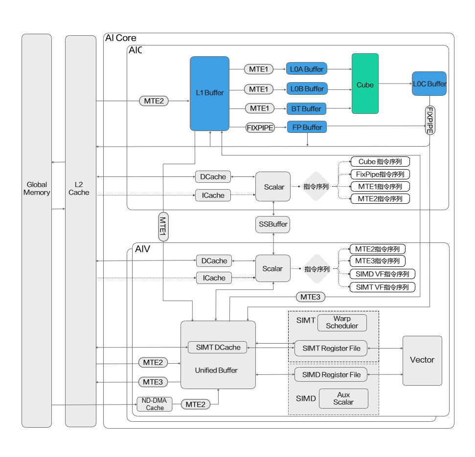

# 矩阵计算单元

Cube计算单元专用于执行矩阵运算，直接访问的专用缓存如下：L0A Buffer用于存储左矩阵，L0B Buffer用于存储右矩阵，L0C Buffer则用于存储初始化累加值和矩阵计算结果。

下图高亮部分展示了Cube计算单元及其直接访问的专用缓存。

**图1** NPU架构版本3510矩阵计算单元架构图

矩阵计算关联的存储单元为：

| Buffer类型 | 说明 |
| ----------- | ------ |
| L0A Buffer | AI Core内部物理存储单元，通常用于存储矩阵计算的左矩阵。 |
| L0B Buffer | AI Core内部物理存储单元，通常用于存储矩阵计算的右矩阵。 |
| L0C Buffer | AI Core内部物理存储单元，通常用于存储矩阵计算的结果，以及矩阵累加初始化值。 |
| L1 Buffer | AI Core内部物理存储单元，空间相对较大，通常用于缓存矩阵计算的输入数据。矩阵计算的输入一般需要从GM搬运到L1 Buffer，然后分别搬运到L0A Buffer和L0B Buffer。 |
| Fixpipe Buffer | AI Core内部物理存储单元，通常用于存储Fixpipe搬运过程中所需的量化参数等数据。 |
| BiasTable Buffer | 偏置存储，AI Core内部物理存储单元，通常用于存储矩阵计算所需的Bias（偏置）数据。 |
