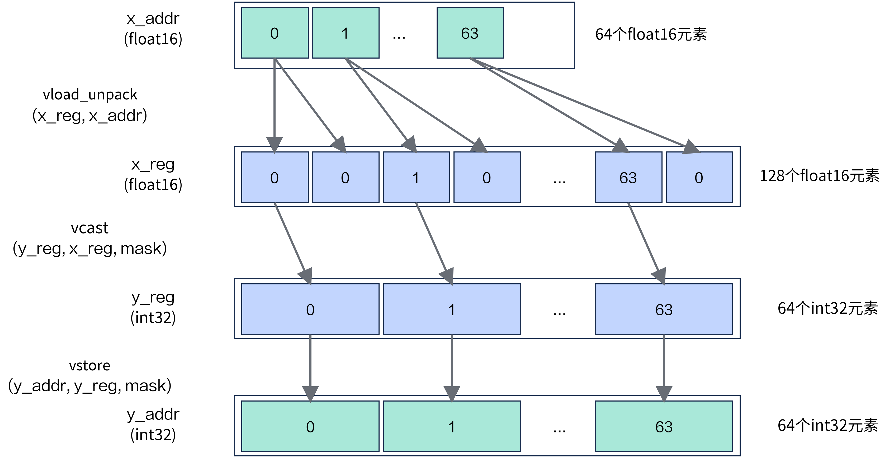
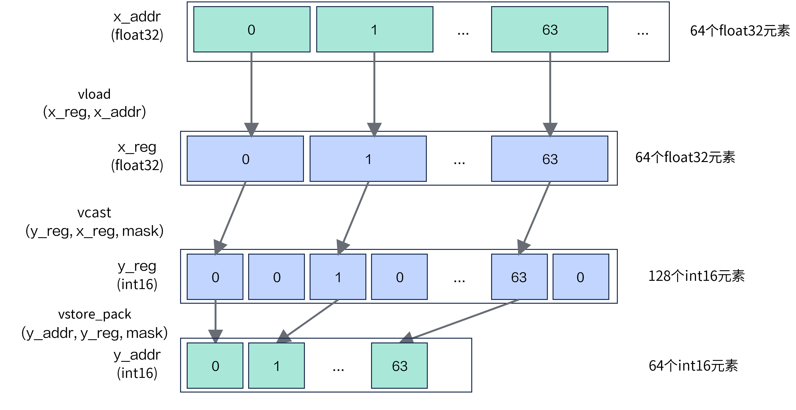

# 关键特性说明

## 硬件循环（HardwareLoop）

Reg矢量计算架构中，Vector Function（VF）是实现高性能向量计算的核心载体。VF中可以包含最多四层嵌套循环，每层循环中还可以包含多个串行循环。VF循环对控制结构的支持有限，仅支持for循环和条件判断，不支持switch、do-while和while-do等其他控制结构。当VF中的循环满足Hardware Loop编码规范会被编译器优化为Hardware Loop，提升整体的编码性能，否则它的循环逻辑会由迭代变量和条件判断语句构成Software Loop，无法开启VF循环优化。

### Hardware Loop编码规范

- Hardware Loop最多能支持的嵌套层数为4层；支持串行的Hardware Loop循环。
- 迭代变量类型 VF内所有Loop的迭代变量必须是uint16_t类型。
- 起始值与步长 循环起始值从0开始。 每次迭代的步长必须是递增1。
- 循环内不允许跳转指令，比如条件判断跳转，如if/else、三元运算符?:。 VF内if/else在Loop内会阻碍Hardware Loop的生成，编译器虽然会尽可能的做if/else消除优化，但是不做完全性保证。
- 一旦执行，循环计数/边界不允许被更改。
- 若要利用外层循环的计数作为循环边界，将外层循环计数器赋值给标量后作为内层循环边界。

## 指令双发优化

### 指令双发

指令双发指的是处理器在同一个时钟周期内，能够同时发射两条指令到执行单元进行处理。

这种机制可以在不改变程序逻辑的前提下，提升处理器在单位时间内的指令处理效率，是实现指令级并行的重要基础之一。

### 合理拆分VF循环

VF并不是写的越长，把所有运算都放在一个for循环内就好，需要适当的搬出中间结果到Unified Buffer（UB），减少数据依赖。当指令数量过多，可能触发Icache Miss，即使循环间不存在依赖，也无法进行双发。当循环内包含同步，可以通过切分循环将同步外提减少同步次数。

### 手动控制循环拆分

如果循环内存在依赖关系过多的指令，指令无法并发执行，即无法启用双发特性。可以通过 `cb.range` 的 `unroll` 参数展开循环，提升指令双发能力，贴近硬件乱序执行的特性；减少指令因为寄存器资源未到位而产生的等待。

## VF融合

VF融合是将代码中多个Vector Function融合成一个Vector Function，有效提升性能。VF融合是编译器优化特性，VF融合会借助Loop Fuse算法，将VF转换成Loop形态，然后将控制流等价（Control-Flow-Equivalent）的VF进行融合，最后将VF进行还原。编译器首先会做融合前的合法性检查，判断两个VF是否等价，Main侧中间代码是否能在VF内执行以及融合后是否可产生正收益。如果满足VF融合条件，编译器会自动执行VF融合优化，为保证融合后的VF执行逻辑与语义与融合前一致，会在原来两个VF之间保守地插入同步指令，编译器还会尝试外提、合并融合后的VF中的指令，对VF代码进行优化。融合策略是能融尽融，用户按照符合融合的合法性检查的模式进行编码，可以增加VF融合的机会。用户也可以参考融合原理手动进行融合优化。

在 DSL 中，融合仅作用于用户显式指定的 VF 作用域（`with vf(mode="simd"):`）：将可融合的相邻矢量操作放在同一个 VF 作用域内，中间结果可以不经过 UB 中转；将需要独立同步或独立流水的操作拆分到不同的 VF 作用域，可以避免不必要的保守同步。

## 数据搬运优化

Reg矢量计算接口提供了下表所示多种搬运指令，合理选择搬运接口并利用接口能力进行优化。

| 场景 | 接口 | 描述 |
| :-- | :-- | :-- |
| 连续对齐搬入 | [`vload`](/api/kernel/reg_compute/load/vload) | 从32字节对齐的UB起始地址连续搬入到向量数据寄存器或掩码寄存器。 |
| 非连续对齐搬入 | [`vload_strided`](/api/kernel/reg_compute/load/vload-strided) | 从32字节对齐的UB起始地址非连续搬入多个DataBlock。 |
| 连续非对齐搬入 | [`vload_unalign`](/api/kernel/reg_compute/load/vload-unalign) | 从非32字节对齐的UB起始地址连续搬入到向量数据寄存器。 |
| 掩码寄存器搬入 | [`vmask_load`](/api/kernel/reg_compute/load/vmask-load) | 从UB连续搬入掩码寄存器。 |
| 离散搬入 | [`vgather`](/api/kernel/reg_compute/ub_gather/vgather) | 根据索引值将UB中的元素收集到向量数据寄存器。 |
| DataBlock离散搬入 | [`vgather_datablock`](/api/kernel/reg_compute/ub_gather/vgather-datablock) | 根据索引值将UB中的元素按DataBlock（32B）收集到向量数据寄存器。 |
| 连续对齐搬出 | [`vstore`](/api/kernel/reg_compute/store/vstore) | 将向量数据寄存器或掩码寄存器连续搬出到32字节对齐的UB地址。 |
| 连续非对齐搬出 | [`vstore_unalign_post`](/api/kernel/reg_compute/store/vstore-unalign-post) | 将向量数据寄存器连续搬出到非32字节对齐的UB地址。 |
| 离散搬出 | [`vscatter`](/api/kernel/reg_compute/scatter/vscatter) | 根据索引值将向量数据寄存器中的元素离散搬出到UB。 |
| 寄存器间搬运 | [`vmask`](/api/kernel/reg_compute/reg_logic/vmask) | 将向量数据寄存器中被掩码筛选的有效元素复制到另一个向量数据寄存器。 |

### 数据搬运启用分布模式

- 连续对齐搬入

  如图1，将UB地址`x_addr`上数据量为VL/2的 `dtypes.float16` 元素通过[`vload_unpack`](/api/kernel/reg_compute/load/vload-unpack)搬入`x_reg`，调用[`vcast`](/api/kernel/reg_compute/reg_convert/vcast)（`reg_layout=cb.reg.RegLayout.ZERO`）将 `dtypes.float16` 转换为 `dtypes.int32` 并写入`y_reg`，最后通过[`vstore`](/api/kernel/reg_compute/store/vstore)搬出至UB地址`y_addr`。

  **图1** half转int32类型转换过程

  

- 连续对齐搬出

  如图2，将UB地址`x_addr`上数据量为VL的 `dtypes.float32` 元素通过[`vload`](/api/kernel/reg_compute/load/vload)搬入`x_reg`，调用[`vcast`](/api/kernel/reg_compute/reg_convert/vcast)（`reg_layout=cb.reg.RegLayout.ZERO`）将 `dtypes.float32` 转换为 `dtypes.int16` 并写入`y_reg`，最后通过[`vstore_pack`](/api/kernel/reg_compute/store/vstore-pack)搬出至UB地址`y_addr`。

  **图2** float转int16类型转换过程

  
