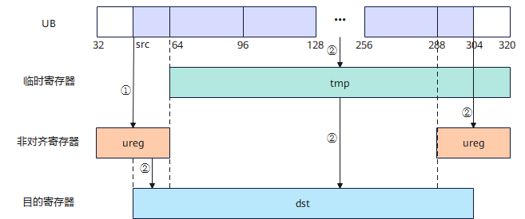
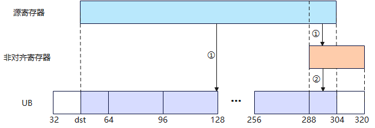
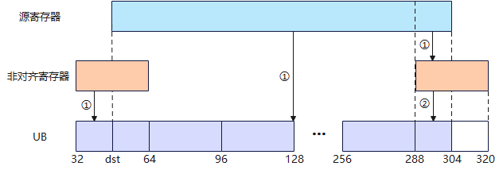
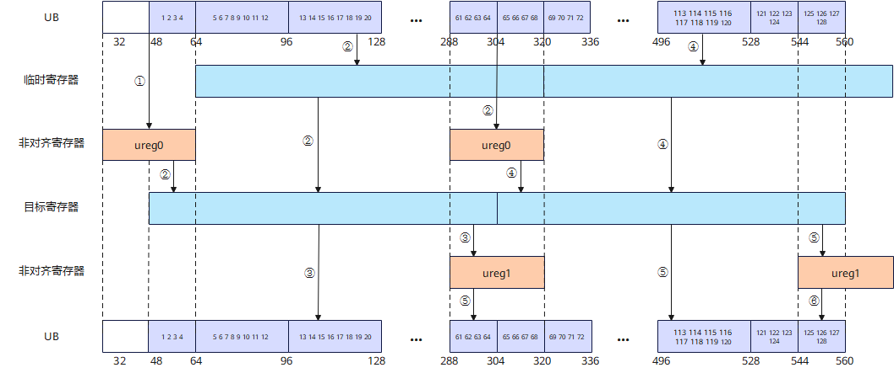

# Reg数据搬入概述

Reg数据搬入接口用于将Unified Buffer（UB）中的数据搬入矢量数据寄存器、掩码寄存器或非对齐寄存器。接口均仅在AIV上生效，且需在VF作用域内调用。

## 接口分类与选择

根据数据访问方式、搬入后的数据排布以及是否需要自动更新地址，选择相应接口。

### 矢量数据寄存器搬入

#### 对齐搬入

**表1** 矢量数据寄存器对齐搬入接口

| 接口名称 | 模式 | 功能简述 | 地址对齐要求 |
| --- | --- | --- | --- |
| [`vload`](vload.md) | 连续对齐搬入模式 | 连续搬入一个VL长度的数据，由用户更新源地址。 | 32字节 |
| [`vload`](vload.md) | 立即数偏移搬入模式 | 从源起始地址偏移指定距离后搬入一个VL长度的数据。 | 32字节 |
| [`vload`](vload.md)（`post_update=True`） | Post Update搬入模式 | 搬入一个VL长度的数据，并按立即数偏移自动更新源地址。 | 32字节 |
| [`vload_strided`](vload-strided.md) | 非连续对齐搬入模式 | 按配置的DataBlock步长非连续搬入8个DataBlock，通过返回值返回结果。 | 32字节 |
| [`vload_broadcast`](vload-broadcast.md) | 对齐搬入模式 | 将一个元素广播到整个矢量数据寄存器。 | 按dtype对齐 |
| [`vload_broadcast`](vload-broadcast.md) | 立即数偏移搬入模式 | 从立即数偏移位置读取一个元素并广播。 | 按dtype对齐 |
| [`vload_deinterleave`](vload-deinterleave.md) | 对齐搬入模式 | 读取2×VL长度的数据，解交织后写入两个矢量数据寄存器。 | 32字节 |
| [`vload_deinterleave`](vload-deinterleave.md) | 立即数偏移搬入模式 | 从立即数偏移位置读取数据并解交织。 | 32字节 |
| [`vload_downsample`](vload-downsample.md) | 对齐搬入模式 | 读取2×VL长度的数据，保留偶数下标元素。 | 32字节 |
| [`vload_downsample`](vload-downsample.md) | 立即数偏移搬入模式 | 从立即数偏移位置读取数据并进行2倍下采样。 | 32字节 |
| [`vload_upsample`](vload-upsample.md) | 对齐搬入模式 | 读取VL/2长度的数据，将每个元素重复两次。 | 32字节 |
| [`vload_upsample`](vload-upsample.md) | 立即数偏移搬入模式 | 从立即数偏移位置读取数据并进行2倍上采样。 | 32字节 |
| [`vload_unpack`](vload-unpack.md)（`UnpackMode.UNPACK2`） | 对齐搬入模式 | 读取VL/2长度的数据，在每个源元素后补1个0。 | 32字节 |
| [`vload_unpack`](vload-unpack.md)（`UnpackMode.UNPACK2`） | 立即数偏移搬入模式 | 从立即数偏移位置读取数据，在每个源元素后补1个0。 | 32字节 |
| [`vload_unpack`](vload-unpack.md)（`UnpackMode.UNPACK4`） | 对齐搬入模式 | 读取VL/4长度的数据，在每个源元素后补3个0。 | 32字节 |
| [`vload_unpack`](vload-unpack.md)（`UnpackMode.UNPACK4`） | 立即数偏移搬入模式 | 从立即数偏移位置读取数据，在每个源元素后补3个0。 | 32字节 |

#### 非对齐搬入

**表2** 矢量数据寄存器非对齐搬入接口

| 接口名称 | 模式 | 功能简述 | 地址对齐要求 |
| --- | --- | --- | --- |
| [`vload_unalign_init`](vload-unalign-init.md) | 源地址预处理模式 | 根据源地址初始化非对齐寄存器。 | 按dtype对齐 |
| [`vload_unalign`](vload-unalign.md) | 连续非对齐搬入模式 | 使用预处理结果搬入一个VL长度的数据，由用户更新源地址。 | 按dtype对齐 |

### 掩码寄存器搬入

**表3** 掩码寄存器搬入接口

| 接口名称 | 模式 | 功能简述 | 地址对齐要求 |
| --- | --- | --- | --- |
| [`vmask_load`](vmask-load.md)（`dist='norm'`） | 连续对齐搬入 | 连续搬入VL/8长度的数据，通过返回值返回结果。 | 32字节 |
| [`vmask_load`](vmask-load.md)（`dist='downsample'`） | 对齐搬入模式 | 读取VL/4长度的数据，保留偶数下标bit，通过返回值返回结果。 | 32字节 |
| [`vmask_load`](vmask-load.md)（`dist='upsample'`） | 对齐搬入模式 | 读取VL/16长度的数据，将每个bit重复两次，通过返回值返回结果。 | 16字节 |

## 通用约束

- Reg矢量计算接口通用约束请参见[通用约束](../overview.md#通用约束)。
- 各功能模式下的实际读取地址必须满足[接口分类与选择](#接口分类与选择)中的地址对齐要求，且实际读取范围必须在UB地址空间内且不越界，否则会报错。
- UB容量上限为256KB，用户可用容量随编译选项与编程场景变化（默认预留6KB SIMD VF栈 + 2KB 框架预留，可用248KB；SIMD+SIMT混编时再划分32KB～128KB作Data Cache，可用容量进一步减少）。UB地址偏移后不可超过实际可用容量，否则会报错。
- 如果本指令与其他指令存在UB地址重叠，需要插入同步指令[`vmem_bar`](../reg_sync/vmem-bar.md)，保证多个指令串行化，防止出现异常数据。

## 关键特性说明

### 对齐连续搬入方式对比

对齐连续搬入提供多种源地址维护方式。以下示例均将长度为1024、数据类型为`half`的源数据连续搬入矢量数据寄存器，再写入UB。单次迭代处理128个元素，共迭代8次，最终结果均为`dst[i] = src[i]`。

**表4** 对齐连续搬入方式对比

| 场景 | 搬入方式 | 源地址维护方式 | 适用场景 |
| --- | --- | --- | --- |
| 场景1 | 连续对齐搬入 | 调用方自行计算每次搬入的源地址。 | 源地址偏移规则简单，且需要由用户显式控制地址。 |
| 场景2 | 立即数偏移搬入 | 将相对源基地址的元素偏移作为`offset`参数传入，接口不修改源地址。 | 需要保留源基地址，并通过普通整数指定偏移。 |
| 场景3 | Post Update搬入 | `post_update=True`时接口在每次搬入后自动更新源地址，`offset`作为 Post Update 步长。 | 连续搬入且无需用户手动维护源地址。 |

### 非对齐搬运特性

非对齐搬运用于有效起始地址满足dtype对齐、但不满足32字节对齐的连续数据搬入或搬出场景。搬入和搬出均通过非对齐寄存器保存跨32字节边界的数据，以保证连续数据的完整性。

#### 非对齐搬入原理

非对齐搬入通过非对齐寄存器缓存起始地址所在32字节块的前置数据，再与后续读取的数据拼接，得到从有效起始地址开始的VL长度数据。

**图1** 非对齐搬入示意图



设有效起始字节地址为`src_start_addr`，将其向低地址方向按32字节对齐，得到`aligned_src_start_addr`。处理过程如下：

1. 调用[`vload_unalign_init`](vload-unalign-init.md)，将`[aligned_src_start_addr, aligned_src_start_addr + 32)`范围内的数据缓存至非对齐寄存器。
2. 调用[`vload_unalign`](vload-unalign.md)，将前置缓存与后续读取数据拼接，得到`[src_start_addr, src_start_addr + VL)`范围的数据并写入矢量数据寄存器。连续搬入时，需要再次调用预处理接口以缓存下一次连续搬入所需的前置数据。

实际访问会覆盖向低地址方向对齐后的32字节范围，因此除有效起始地址满足dtype对齐外，对齐后的读取范围也必须位于UB地址空间内。

**表5** 非对齐搬入接口的配合关系

| 主搬入方式 | 配套接口 | 说明 |
| --- | --- | --- |
| [`vload_unalign`](vload-unalign.md) | [`vload_unalign_init`](vload-unalign-init.md) | 用户手动更新源地址。每次搬入前均需调用预处理接口，且两个接口必须使用相同的源地址。 |

#### 非对齐搬出原理

非对齐搬出将矢量数据寄存器中的连续数据写入非32字节对齐的UB地址。每次主搬出会将可以直接写入的主块写入UB，并将末尾不能构成32字节对齐块的数据保存在非对齐寄存器。后续连续搬出时，接口将该尾块与本次主块的起始数据拼接后写入UB，并更新本次尾块。

首次搬出前，非对齐寄存器无需初始化。连续调用时，必须复用同一个非对齐寄存器；若上一次尾块与本次主块不连续，则需要在下一次主搬出前调用后处理接口完成前一次尾块的写入。

**图2** 非对齐搬出示意图（首次搬出）



首次搬出时，非对齐寄存器中没有前序尾块数据。主搬出接口将矢量数据寄存器中可直接写入的数据写入UB，并将末尾数据保存至非对齐寄存器。调用后处理接口后，尾块数据被写入UB。

**图3** 非对齐搬出示意图（连续搬出）



后续连续搬出时，主搬出接口将非对齐寄存器中的前序尾块与本次矢量数据寄存器的主块数据拼接后写入UB，再将本次尾块更新至非对齐寄存器。连续搬出结束后，调用后处理接口写入最后一次缓存的尾块。

**表6** 非对齐搬出接口的配合关系

| 主搬出方式 | 配套接口 | 说明 |
| --- | --- | --- |
| [`vstore_unalign`](../reg_permute_sel/vstore-unalign.md) | [`vstore_unalign_post`](../store/vstore-unalign-post.md) | 用户手动更新目的地址。 |

#### 非对齐搬入搬出示例

下图以`uint32_t`数据为例，展示连续非对齐搬入后再连续非对齐搬出的过程。搬入前置初始化和搬出后处理均位于循环外：连续搬入时，预处理接口更新的非对齐寄存器可供下一次搬入使用；连续搬出时，[`vstore_unalign`](../reg_permute_sel/vstore-unalign.md)将尾块保存在非对齐寄存器，最后一次循环结束后再统一写回。

**图4** 连续非对齐搬入搬出示例



搬运步骤如下：

1. 图中①：循环开始前，[`vload_unalign_init`](vload-unalign-init.md)将源地址所在32字节块的数据缓存到非对齐寄存器，为首次非对齐搬入准备前置数据。
2. 图中②：首次循环调用[`vload_unalign`](vload-unalign.md)，将非对齐寄存器中的前置数据与后续读取数据拼接为一个VL长度的数据，并更新非对齐寄存器。
3. 图中③：首次调用[`vstore_unalign`](../reg_permute_sel/vstore-unalign.md)，将数据中可直接写入的主块数据写入UB，将尾块缓存到非对齐寄存器。
4. 图中④：后续循环再次调用`vload_unalign`，复用更新后的非对齐寄存器完成下一次搬入，并再次更新该寄存器。
5. 图中⑤：后续调用`vstore_unalign`，将非对齐寄存器中的前序尾块与本次数据中的主块数据拼接后写入UB，再将本次尾块更新到非对齐寄存器。
6. 图中⑥：循环结束后，[`vstore_unalign_post`](../store/vstore-unalign-post.md)将非对齐寄存器中最后缓存的尾块写入UB，完成连续非对齐搬出。

示例中`count`为每次搬运的元素个数。循环内需要复用各自的非对齐寄存器。`count`不超过单个矢量数据寄存器可容纳的元素个数，且搬入、搬出地址范围必须位于实际可用UB空间内。

### b64数据类型的搬运

以下接口支持b64数据类型。


**表7** 支持b64数据类型的接口

| 支持的数据类型 | 接口 |
| --- | --- |
| `dtypes.int64`、`dtypes.uint64` | [`vload`](vload.md) |
| `dtypes.int64` | [`vload_unalign_init`](vload-unalign-init.md)<br>[`vload_unalign`](vload-unalign.md) |

[`vload`](vload.md)的非连续对齐搬入模式中，处理`dtypes.int64`数据时，掩码以连续8个bit为一组，仅每组最低位的bit有效，用于控制对应的一个b64元素。

## 调用示例

将代码保存为`load_unalign.py`后，可通过`python`命令运行。

以下调用示例代码仅Ascend 950PR&950DT系列产品支持。

```python
# Copyright (c) 2026 Huawei Technologies Co., Ltd.
# Licensed under the CANN Open Software License Agreement Version 2.0.

import torch
import torch_npu  # noqa: F401  # Register the Ascend NPU backend with PyTorch.

from cannbotdsl import Channel, host, mem_copy
from cannbotdsl.lang.kernel import kernel
from cannbotdsl.lang.vf import vf
from cannbotdsl.ops.reg import (
    full_mask,
    vload_unalign,
    vload_unalign_init,
    vsqueeze_and_storeunalign_finalize,
    vsqueeze_and_storeunalign_init,
    vstore_unalign,
    vstore_unalign_begin,
)
from cannbotdsl.tensor import MemLoc

@kernel
def _load_unalign_kernel(src0, dst):
    buf = Channel(MemLoc.UB, (65,), src0.dtype, depth=1)
    out = Channel(MemLoc.UB, (64,), dst.dtype, depth=1)

    mem_copy(buf.produce(), src0)

    in0 = buf.consume()
    res = out.produce()
    with vf(mode="simd"):
        mask = full_mask()
        # 非对齐搬入：先初始化非对齐寄存器，再拼接出从元素1开始的VL长度数据
        vload_unalign_init(in0, 1)
        v = vload_unalign(in0, 1)
        # 非对齐搬出：连续搬出主块，循环结束后写回暂存的尾块
        sq = vsqueeze_and_storeunalign_init(v, mask=mask)
        ureg = vstore_unalign_begin(res)
        vstore_unalign(res, 0, sq, ureg)
        vsqueeze_and_storeunalign_finalize(res, 0, ureg)

    mem_copy(dst, out.consume())

@host
def run(src0, dst):
    _load_unalign_kernel[1](src0, dst)

def main():
    src0 = torch.arange(65, dtype=torch.float32, device="npu:0")
    dst = torch.empty((64,), dtype=torch.float32, device="npu:0")

    run(src0, dst)
    torch.npu.synchronize()

    torch.testing.assert_close(dst.cpu(), src0.cpu()[1:])
    print("load unalign example passed")
    print(f"first={float(dst.cpu()[0]):.4f}, last={float(dst.cpu()[-1]):.4f}")

if __name__ == "__main__":
    main()
```

### 预期结果

```text
load unalign example passed
first=1.0000, last=64.0000
```
