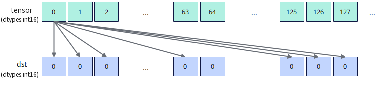

# `vload_broadcast`

## 产品支持情况

- Ascend 950PR/Ascend 950DT：支持
- Atlas A3 训练系列产品/Atlas A3 推理系列产品：不支持
- Atlas A2 训练系列产品/Atlas A2 推理系列产品：不支持
- Atlas 200I/500 A2 推理产品：不支持
- Atlas 推理系列产品 AI Core：不支持
- Atlas 推理系列产品 Vector Core：不支持
- Atlas 训练系列产品：不支持

## 功能说明

从Unified Buffer（UB）中按dtype对齐的起始地址读取一个元素，并将该元素广播到整个矢量数据寄存器。结果通过函数返回值返回，搬运过程中数据格式和内容保持不变。本接口提供两种功能模式：

- **对齐搬入模式**：将UB源地址的数据搬入到矢量数据寄存器，由用户自行更新源地址。
- **立即数偏移搬入模式**：从相对源起始地址偏移指定距离的位置搬入数据。本接口不会自动更新源地址。

**图1** 广播搬入矢量数据寄存器



本接口仅在AIV上生效。

## 函数原型

```python
def vload_broadcast(tensor, offset=0, *, mode=None, width=None, post_update: bool=False) -> RawVReg: ...
```

**支持的数据类型：**

dtype支持的数据类型为`int4b_t`、`dtypes.int8`、`dtypes.uint8`、`dtypes.fp4x2_e2m1`、`dtypes.fp4x2_e1m2`、`dtypes.hifloat8`、`dtypes.float8_e8m0`、`dtypes.float8_e5m2`、`dtypes.float8_e4m3fn`、`dtypes.int16`、`dtypes.uint16`、`dtypes.float16`、`dtypes.bfloat16`、`dtypes.int32`、`dtypes.uint32`、`dtypes.float32`。当dtype为`int4b_t`时，返回的矢量数据寄存器的实际类型为`dtypes.int4x2`。

## 参数说明

**表** 参数说明

| 参数名 | 输入/输出 | 描述 |
| --- | --- | --- |
| `tensor` | 输入 | 源UB地址，实际读取地址必须按dtype对齐。 |
| `offset` | 输入 | 相对`tensor`起始地址的偏移，单位为元素个数。 |
| `mode` | 输入 | 广播模式，取值为`'brc'`、`'datablock'`或`'elem2datablock'`，默认值为`None`。取值为`None`或`'brc'`时，将`tensor`首个元素广播到返回值的整个矢量数据寄存器；取值为`'datablock'`或`'elem2datablock'`时，将每个元素广播到返回值中对应的一个`DataBlock`（32字节）中，`'datablock'`为`'elem2datablock'`的别名。 |
| `width` | 输入 | 广播的数据位宽，取值为`'b8'`或`'b16'`，默认值为`None`。取值为`'b8'`时将`tensor`的首个8bit元素广播到返回值中每个8bit位置，取值为`'b16'`时将`tensor`的首个16bit元素广播到返回值中每个16bit位置；取值为`None`时按`tensor`的元素数据类型广播。 |
| `post_update` | 输入 | 是否采用Post Update模式。取值为`True`或`False`，默认值为`False`。取值为`True`时，接口采用Post Update模式，搬入完成后自动更新源地址指针，`offset`为Post Update步长，单位为`width`对应的元素宽度；仅`mode`为全lane广播（取值为`None`或`'brc'`）时支持。 |

## 返回值说明

返回保存广播搬入结果的矢量数据寄存器，数据类型与`tensor`保持一致。

## 约束说明

### 通用约束

- 本接口仅在AIV上生效。
- 本接口需在VF作用域内调用。
- 各功能模式下的实际读取地址必须按dtype对齐，且实际读取范围必须在UB地址空间内且不越界，否则会报错。
- UB容量上限为256KB，用户可用容量随编译选项与编程场景变化（默认预留6KB SIMD VF栈 + 2KB 框架预留，可用248KB；SIMD+SIMT混编时再划分32KB～128KB作Data Cache，可用容量进一步减少）。UB地址偏移后不可超过实际可用容量，否则会报错。
- 如果本指令与其他指令存在UB地址重叠，需要插入同步指令[`vmem_bar`](../reg_sync/vmem-bar.md)，保证多个指令串行化，防止出现异常数据。

## 调用示例

将代码保存为`vload_broadcast.py`后，可通过`python`命令运行。

以下调用示例代码仅Ascend 950PR&950DT系列产品支持。

```python
# Copyright (c) 2026 Huawei Technologies Co., Ltd.
# Licensed under the CANN Open Software License Agreement Version 2.0.

import torch
import torch_npu  # noqa: F401  # Register the Ascend NPU backend with PyTorch.

from cannbotdsl import Channel, host, mem_copy
from cannbotdsl.lang.kernel import kernel
from cannbotdsl.lang.vf import vf
from cannbotdsl.ops.reg import full_mask, vload_broadcast, vstore
from cannbotdsl.tensor import MemLoc

@kernel
def _vload_broadcast_kernel(src0, dst):
    buf = Channel(MemLoc.UB, (64,), src0.dtype, depth=1)
    out = Channel(MemLoc.UB, (64,), dst.dtype, depth=1)

    mem_copy(buf.produce(), src0)

    in0 = buf.consume()
    res = out.produce()
    with vf(mode="simd"):
        mask = full_mask()
        vstore(res, 0, vload_broadcast(in0, 0), mask)

    mem_copy(dst, out.consume())

@host
def run(src0, dst):
    _vload_broadcast_kernel[1](src0, dst)

def main():
    src0 = torch.arange(64, dtype=torch.float32, device="npu:0")
    dst = torch.empty_like(src0)

    run(src0, dst)
    torch.npu.synchronize()

    # mode取默认值，将首个元素广播到整个矢量数据寄存器
    torch.testing.assert_close(dst.cpu(), src0.cpu()[0].expand(64))
    print("vload_broadcast example passed")
    print(f"first={float(dst.cpu()[0]):.4f}, last={float(dst.cpu()[-1]):.4f}")

if __name__ == "__main__":
    main()
```

### 预期结果

```text
vload_broadcast example passed
first=0.0000, last=0.0000
```
