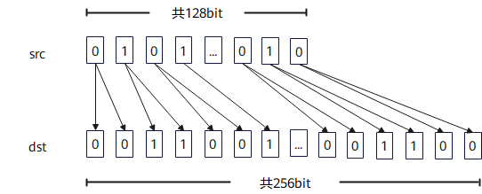

# `vload_upsample`

## 产品支持情况

- Ascend 950PR/Ascend 950DT：支持
- Atlas A3 训练系列产品/Atlas A3 推理系列产品：不支持
- Atlas A2 训练系列产品/Atlas A2 推理系列产品：不支持
- Atlas 200I/500 A2 推理产品：不支持
- Atlas 推理系列产品 AI Core：不支持
- Atlas 推理系列产品 Vector Core：不支持
- Atlas 训练系列产品：不支持

## 功能说明

从Unified Buffer（UB）中满足对应对齐要求的起始地址读取连续数据并进行2倍上采样，结果通过函数返回值返回。从UB中32字节对齐的起始地址读取VL/2长度数据，将每个源元素重复两次后返回VL长度数据。

本接口提供两种功能模式：

- **对齐搬入模式**：将UB源地址的数据上采样后搬入到矢量数据寄存器或掩码寄存器，由用户自行更新源地址。
- **立即数偏移搬入模式**：从相对源起始地址偏移指定距离的位置搬入数据。本接口不会自动更新源地址。

对齐搬入模式中，通过函数返回值返回掩码寄存器时，请使用[`vmask_load`](vmask-load.md)。

**图1** 上采样搬入掩码寄存器



本接口仅在AIV上生效。

## 函数原型

```python
def vload_upsample(tensor, offset=0, *, post_update: bool=False) -> RawVReg: ...
```

**支持的数据类型：**

dtype支持的数据类型为`int4b_t`、`dtypes.int8`、`dtypes.uint8`、`dtypes.fp4x2_e2m1`、`dtypes.fp4x2_e1m2`、`dtypes.hifloat8`、`dtypes.float8_e8m0`、`dtypes.float8_e5m2`、`dtypes.float8_e4m3fn`、`dtypes.int16`、`dtypes.uint16`、`dtypes.float16`、`dtypes.bfloat16`。当dtype为`int4b_t`时，返回的矢量数据寄存器的实际类型为`dtypes.int4x2`。

## 参数说明

**表** 参数说明

| 参数名 | 输入/输出 | 描述 |
| --- | --- | --- |
| `tensor` | 输入 | 源UB地址，实际读取地址必须按32字节对齐。 |
| `offset` | 输入 | 相对`tensor`起始地址的偏移，单位为元素个数。 |
| `post_update` | 输入 | 是否采用Post Update模式。取值为`True`或`False`，默认值为`False`。取值为`True`时，接口采用Post Update模式，搬入完成后自动更新源地址指针，`offset`为Post Update步长，单位为元素个数，源地址增加`offset × sizeof(dtype)`字节。 |

## 返回值说明

返回保存上采样搬入结果的矢量数据寄存器，数据类型与`tensor`保持一致。

## 约束说明

### 通用约束

- 本接口仅在AIV上生效。
- 本接口需在`cb.vf()`作用域内调用。
- 实际读取地址必须按32字节对齐，实际读取范围必须在UB地址空间内且不越界，否则会报错。
- UB容量上限为256KB，用户可用容量随编译选项与编程场景变化（默认预留6KB SIMD VF栈 + 2KB 框架预留，可用248KB；SIMD+SIMT混编时再划分32KB～128KB作Data Cache，可用容量进一步减少）。UB地址偏移后不可超过实际可用容量，否则会报错。
- 如果本指令与其他指令存在UB地址重叠，需要插入同步指令[`vmem_bar`](../reg_sync/vmem-bar.md)，保证多个指令串行化，防止出现异常数据。

## 调用示例

将代码保存为`vload_upsample.py`后，可通过`python`命令运行。

以下调用示例代码仅Ascend 950PR&950DT系列产品支持。

```python
# Copyright (c) 2026 Huawei Technologies Co., Ltd.
# Licensed under the CANN Open Software License Agreement Version 2.0.

import cannbotdsl as cb
import torch
import torch_npu  # noqa: F401  # Register the Ascend NPU backend with PyTorch.


@cb.kernel
def vload_upsample_kernel(src0, dst):
    buf = cb.Channel(cb.MemLoc.UB, (64,), src0.dtype, depth=1)
    out = cb.Channel(cb.MemLoc.UB, (128,), dst.dtype, depth=1)

    cb.mem_copy(buf.produce(), src0)

    in0 = buf.consume()
    res = out.produce()
    with cb.vf(mode="simd"):
        mask = cb.reg.full_mask(elem_bits=16)
        cb.reg.vstore(res, 0, cb.reg.vload_upsample(in0, 0), mask)

    cb.mem_copy(dst, out.consume())


@cb.jit
def run(src0, dst):
    vload_upsample_kernel[1](src0, dst)


src0 = torch.arange(64, dtype=torch.int32).to(torch.float16).to("npu:0")
dst = torch.empty((128,), dtype=torch.float16, device="npu:0")

run(src0, dst)
torch.npu.synchronize()

assert bool((dst.cpu() == src0.cpu().repeat_interleave(2)).all()), f"upsample mismatch: {dst.cpu()[:4].tolist()}"
print("vload_upsample example passed")
print(f"first={float(dst.cpu()[0]):.4f}, last={float(dst.cpu()[-1]):.4f}")
```

### 预期结果

```text
vload_upsample example passed
first=0.0000, last=63.0000
```
