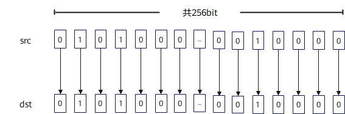

# `vmask_load`

## 产品支持情况

- Ascend 950PR/Ascend 950DT：支持
- Atlas A3 训练系列产品/Atlas A3 推理系列产品：不支持
- Atlas A2 训练系列产品/Atlas A2 推理系列产品：不支持
- Atlas 200I/500 A2 推理产品：不支持
- Atlas 推理系列产品 AI Core：不支持
- Atlas 推理系列产品 Vector Core：不支持
- Atlas 训练系列产品：不支持

## 功能说明

从Unified Buffer（UB）中32字节对齐的起始地址读取VL/8长度数据，并通过函数返回值返回掩码寄存器。搬运过程中数据格式和内容保持不变。连续搬入时，需要在每次调用前手动更新源地址。

本接口与[`vload`](vload.md)连续对齐搬入模式搬运的数据相同，区别在于本接口通过函数返回值返回掩码寄存器。

**图1** 连续搬入掩码寄存器



本接口仅在AIV上生效。

## 函数原型

```python
def vmask_load(tensor, offset=0, *, elem_bits: int=32, dist='norm') -> Mask: ...
```

## 参数说明

**表** 参数说明

| 参数名 | 输入/输出 | 描述 |
| --- | --- | --- |
| `tensor` | 输入 | 源UB地址，实际读取地址必须按32字节对齐，搬入VL/8长度数据。 |
| `offset` | 输入 | 相对`tensor`起始地址的偏移，单位为元素个数，默认值为`0`。 |
| `elem_bits` | 输入 | 掩码元素位宽，支持`8`、`16`、`32`，对应b8、b16、b32模式，默认值为`32`。 |
| `dist` | 输入 | 搬入模式，取值为`'norm'`、`'upsample'`或`'downsample'`，默认值为`'norm'`。取值为`'norm'`时搬入VL/8长度数据；取值为`'upsample'`时读取VL/16长度数据；取值为`'downsample'`时读取VL/4长度数据。 |

## 返回值说明

返回保存连续对齐搬入结果的掩码寄存器。

## 约束说明

- 本接口仅在AIV上生效。
- 本接口需在VF作用域内调用。
- `tensor`的实际读取地址必须按32字节对齐，且实际读取范围必须在UB地址空间内且不越界，否则会报错。
- 如果本指令与其他指令存在UB地址重叠，需要插入同步指令[`vmem_bar`](../reg_sync/vmem-bar.md)，保证多个指令串行化。

## 调用示例

将代码保存为`vmask_load.py`后，可通过`python`命令运行。

以下调用示例代码仅Ascend 950PR&950DT系列产品支持。

```python
# Copyright (c) 2026 Huawei Technologies Co., Ltd.
# Licensed under the CANN Open Software License Agreement Version 2.0.

import torch
import torch_npu  # noqa: F401  # Register the Ascend NPU backend with PyTorch.

from cannbotdsl import Channel, dtypes, host, mem_copy
from cannbotdsl.lang.kernel import kernel
from cannbotdsl.lang.vf import vf
from cannbotdsl.ops.reg import (
    create_mask,
    full_mask,
    vdups,
    vload,
    vmask_load,
    vmask_store,
    vmem_bar,
    vselect,
    vstore,
)
from cannbotdsl.tensor import MemLoc

@kernel
def _vmask_load_kernel(src0, dst):
    buf = Channel(MemLoc.UB, (64,), src0.dtype, depth=1)
    tmp = Channel(MemLoc.UB, (64,), dtypes.int32, depth=1)
    out = Channel(MemLoc.UB, (64,), dst.dtype, depth=1)

    mem_copy(buf.produce(), src0)

    in0 = buf.consume()
    saved = tmp.produce()
    reloaded = tmp.consume()
    res = out.produce()
    with vf(mode="simd"):
        mask = full_mask()
        saved_mask = create_mask(pattern="vl32", elem_bits=32)
        vmask_store(saved, 0, saved_mask)
        vmem_bar()
        kept = vmask_load(reloaded, 0)
        vstore(res, 0, vselect(vload(in0, 0),
                                            vdups(0.0, dtypes.float32),
                                            cond_mask=kept), mask)

    mem_copy(dst, out.consume())

@host
def run(src0, dst):
    _vmask_load_kernel[1](src0, dst)

def main():
    src0 = torch.arange(1, 65, dtype=torch.float32, device="npu:0")
    dst = torch.empty_like(src0)
    expected = src0.cpu().clone()
    expected[32:] = 0.0

    run(src0, dst)
    torch.npu.synchronize()

    assert bool((dst.cpu() == expected).all()), f"mask mismatch: {dst.cpu()[:4].tolist()}"
    print("vmask_load example passed")
    print(f"kept={int((dst.cpu() != 0).sum())}, last_kept={float(dst.cpu()[31]):.4f}")

if __name__ == "__main__":
    main()
```

### 预期结果

```text
vmask_load example passed
kept=32, last_kept=32.0000
```
