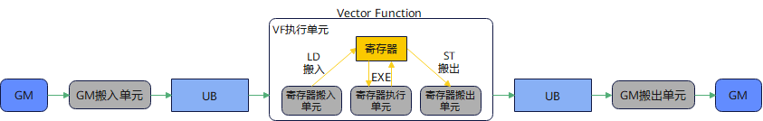

# 概述

Reg矢量计算接口提供面向 Reg 矢量计算架构的寄存器级矢量计算能力，用户可以通过该接口直接对芯片中涉及 Vector 计算的寄存器进行操作，实现更大的灵活性和更好的性能。Reg矢量计算接口的输入或输出数据使用矢量数据寄存器 `RawVReg` 和掩码寄存器 `Mask`，而不是 Unified Buffer（UB）。对于计算类接口，其功能是从给定的寄存器获取数据，进行计算，并将结果保存在给定的寄存器。对于搬运类接口，其功能是实现 UB 和寄存器之间的数据搬运。由此可见，Reg矢量计算接口将数据搬运和 Reg 计算过程交给用户自主控制，从而实现更大的开发自由度。

## 如何使用Reg矢量计算接口

基于寄存器的编程模型是指将数据从 UB 通过 Reg 搬运指令（[Reg数据搬入](/api/kernel/reg_compute/load/)）加载到寄存器中，进行复杂的数学计算后通过 Reg 搬运指令（[Reg数据搬出](/api/kernel/reg_compute/store/)）搬出到 UB 中，所有的计算逻辑均在寄存器中完成，从而减少 UB 中间数据的反复读写，大大提升整体性能，具体流程如下所示：

**图1** Reg矢量计算



以调用示例为例，完整的 Vector Function 计算过程由以下几部分组成：

- 编写和调用 Vector Function。Vector Function 在VF作用域中定义，可在核函数中调用；
- 定义矢量数据寄存器（`RawVReg`）、掩码寄存器（`Mask`）；
- 编写循环处理多个 VL 长度的数据；[`update_mask`](/api/kernel/reg_compute/reg_mask/update-mask) 系列接口用于更新参与计算的 mask，每次循环都会消耗一个 VL 长度的元素；
- 循环内调用 Reg 数据搬入接口连续对齐搬入（[`vload`](/api/kernel/reg_compute/load/vload)）从 UB 中搬入单个 VL 长度数据；
- 循环内调用 Reg 计算接口 [`vadd`](/api/kernel/reg_compute/reg_arith/vadd) 完成单次 Repeat 计算；
- 循环内调用 Reg 数据搬出接口连续对齐搬出（[`vstore`](/api/kernel/reg_compute/store/vstore)）往 UB 中搬出计算后的数据。

## 调用示例

将代码保存为`reg_add.py`后，可通过`python`命令运行。

以下调用示例代码仅Ascend 950PR&950DT系列产品支持。

```python
# Copyright (c) 2026 Huawei Technologies Co., Ltd.
# Licensed under the CANN Open Software License Agreement Version 2.0.

import torch
import torch_npu  # noqa: F401  # Register the Ascend NPU backend with PyTorch.

from cannbotdsl import Channel, host, mem_copy
from cannbotdsl.lang.kernel import kernel
from cannbotdsl.lang.vf import vf
from cannbotdsl.ops.reg import update_mask, vadd, vload, vstore
from cannbotdsl.tensor import MemLoc

@kernel
def _reg_add_kernel(src0, src1, dst):
    buf0 = Channel(MemLoc.UB, (64,), src0.dtype, depth=1)
    buf1 = Channel(MemLoc.UB, (64,), src1.dtype, depth=1)
    out = Channel(MemLoc.UB, (64,), dst.dtype, depth=1)

    # GM 数据搬运至 UB
    mem_copy(buf0.produce(), src0)
    mem_copy(buf1.produce(), src1)

    in0 = buf0.consume()
    in1 = buf1.consume()
    res = out.produce()
    # Vector Function：更新 mask、搬入、计算、搬出
    with vf(mode="simd"):
        mask, _ = update_mask(64, 32)
        acc = vadd(vload(in0, 0), vload(in1, 0), mask=mask)
        vstore(res, 0, acc, mask)

    # UB 数据搬运至 GM
    mem_copy(dst, out.consume())

@host
def run(src0, src1, dst):
    _reg_add_kernel[1](src0, src1, dst)

def main():
    src0 = torch.arange(64, dtype=torch.float32, device="npu:0")
    src1 = torch.arange(64, dtype=torch.float32, device="npu:0") + 1.0
    dst = torch.empty_like(src0)

    run(src0, src1, dst)
    torch.npu.synchronize()

    torch.testing.assert_close(dst.cpu(), (src0 + src1).cpu())
    print("reg compute example passed")
    print(f"first={float(dst.cpu()[0]):.4f}, last={float(dst.cpu()[-1]):.4f}")

if __name__ == "__main__":
    main()
```

### 预期结果

```text
reg compute example passed
first=1.0000, last=127.0000
```

## 通用约束

- GM 与 UB 间的数据搬运需通过 [`mem_copy`](/api/kernel/data-movement/mem-copy) 完成。
- Vector Function 的流水类型为 `PIPE_V`，Vector Function 内部如存在 UB 地址重叠或跨流水依赖，需要根据具体接口约束插入 [`vmem_bar`](/api/kernel/reg_compute/reg_sync/vmem-bar)。
- Reg矢量计算接口仅在 AIV 上生效，在非 AIV 上调用时不执行计算。
- Reg矢量计算接口需要在VF作用域内调用，不支持在核函数中直接调用。
- 对于支持配置 `mask` 参数的 Reg矢量计算接口，`mask` 需通过[掩码寄存器操作](/api/kernel/reg_compute/reg_mask/)接口预先赋值后再传入，未赋值的掩码寄存器内容不确定，会导致有效元素位置错误。
