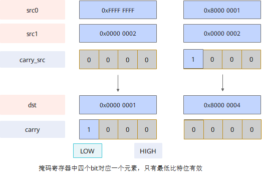
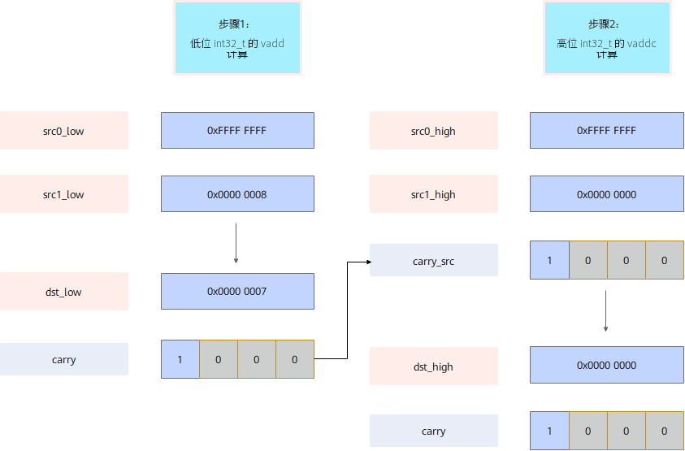

# `vaddc`

## 产品支持情况

- Ascend 950PR/Ascend 950DT：支持
- Atlas A3 训练系列产品/Atlas A3 推理系列产品：不支持
- Atlas A2 训练系列产品/Atlas A2 推理系列产品：不支持
- Atlas 200I/500 A2 推理产品：不支持
- Atlas 推理系列产品 AI Core：不支持
- Atlas 推理系列产品 Vector Core：不支持
- Atlas 训练系列产品：不支持

## 功能说明

该接口根据`mask`，对源操作数`src0`、`src1`及输入进位`carry_src`进行按元素求和操作，将加法和作为返回值返回，同时将每个元素的进位结果写入`carry`（存放进位标志的掩码寄存器）。

Carry flag（进位/借位标志）用于表示加法进位或者减法无借位。若`src0`，`src1`，`carry_src`输入按位相加后最高位有进位，在`carry`中对应位置每4bit的最低位写1，否则写0。

硬件计算时按照32位无符号数处理，矢量数据寄存器写入加法和的低32位，掩码寄存器写入每个元素加法产生的进位输出，计算公式如下：

$$
\{carry_i, dst_i\} = \{1'b0, src0_i\} + \{1'b0, src1_i\} + \{32'b0, carry\_src_i\}
$$



本接口仅在AIV上生效。

## 函数原型

```python
def vaddc(src0: RawVReg, src1: RawVReg, carry_src: Mask, *, mask: Mask) -> tuple[Mask, RawVReg]: ...
```

**支持的数据类型：**

`dtypes.int32`、`dtypes.uint32`。

## 参数说明

**表** 参数说明

| 参数名 | 输入/输出 | 描述 |
| --- | --- | --- |
| `src0` | 输入 | 源操作数（矢量数据寄存器）。 |
| `src1` | 输入 | 源操作数（矢量数据寄存器）。 |
| `carry_src` | 输入 | 源操作数（掩码寄存器），输入的进位标志。 |
| `mask` | 输入 | 源操作数掩码（掩码寄存器）。用于指示在计算过程中哪些元素参与计算。对应位置为1时参与计算，为0时不参与计算。mask未筛选的元素在输出中置零。 |

## 返回值说明

- 返回`(carry, dst)`：`dst`为矢量数据寄存器，存储加法和的低32位，数据类型与`src0`一致；`carry`为掩码寄存器，存储加法计算后的进位数据。

## 约束说明

- 本接口仅在AIV上生效。
- `mask`需通过掩码设置接口预先赋值后再传入，未赋值的掩码寄存器内容不确定，会导致有效元素位置错误。
- 运算输出完整计算结果（包含进位位），硬件不会对输出进行饱和或截断。

## 关键特性

以`dtypes.uint64`类型数据计算`0xFFFFFFFF FFFFFFFF` + `0x00000000 00000008` = `0x00000000 00000007`为例，`vadd`/`vaddc`接口的适用场景如下图：



## 调用示例

将代码保存为`vaddc.py`后，可通过`python`命令运行。

以下调用示例代码仅Ascend 950PR&950DT系列产品支持。

```python
# Copyright (c) 2026 Huawei Technologies Co., Ltd.
# Licensed under the CANN Open Software License Agreement Version 2.0.

import cannbotdsl as cb
import torch
import torch_npu  # noqa: F401  # Register the Ascend NPU backend with PyTorch.


@cb.kernel
def vaddc_kernel(src0, src1, dst, carry_out):
    buf0 = cb.Channel(cb.MemLoc.UB, (64,), src0.dtype, depth=1)
    buf1 = cb.Channel(cb.MemLoc.UB, (64,), src1.dtype, depth=1)
    out = cb.Channel(cb.MemLoc.UB, (64,), dst.dtype, depth=1)
    cbuf = cb.Channel(cb.MemLoc.UB, (8,), carry_out.dtype, depth=1)

    cb.mem_copy(buf0.produce(), src0)
    cb.mem_copy(buf1.produce(), src1)

    in0 = buf0.consume()
    in1 = buf1.consume()
    res = out.produce()
    cout = cbuf.produce()
    with cb.vf(mode="simd"):
        mask = cb.reg.full_mask()
        carry_src = cb.reg.create_mask(pattern="allf", elem_bits=32)
        carry, acc = cb.reg.vaddc(cb.reg.vload(in0, 0), cb.reg.vload(in1, 0),
                                  carry_src, mask=mask)
        cb.reg.vstore(res, 0, acc, mask)
        cb.reg.vmask_store(cout, 0, carry)

    cb.mem_copy(dst, out.consume())
    cb.mem_copy(carry_out, cbuf.consume())


@cb.jit
def run(src0, src1, dst, carry_out):
    vaddc_kernel[1](src0, src1, dst, carry_out)


src0 = torch.full((64,), -1, dtype=torch.int32, device="npu:0")
src1 = torch.full((64,), 1, dtype=torch.int32, device="npu:0")
dst = torch.zeros_like(src0)
carry_out = torch.zeros((8,), dtype=torch.int32, device="npu:0")

run(src0, src1, dst, carry_out)
torch.npu.synchronize()

torch.testing.assert_close(dst.cpu(), torch.zeros_like(src0.cpu()))
carry_words = carry_out.cpu()
print("vaddc example passed")
print(f"first={int(dst.cpu()[0])}, last={int(dst.cpu()[-1])}, "
      f"carry_ok={bool((carry_words != 0).any())}")
```

### 预期结果

```text
vaddc example passed
first=0, last=0, carry_ok=True
```
