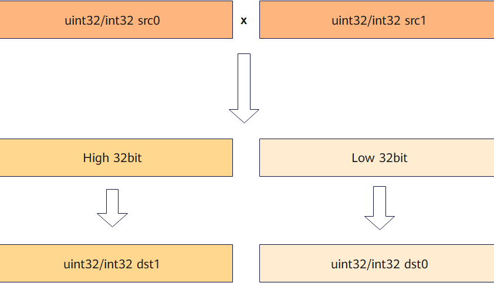

# `vmull`

## 产品支持情况

- Ascend 950PR/Ascend 950DT：支持
- Atlas A3 训练系列产品/Atlas A3 推理系列产品：不支持
- Atlas A2 训练系列产品/Atlas A2 推理系列产品：不支持
- Atlas 200I/500 A2 推理产品：不支持
- Atlas 推理系列产品 AI Core：不支持
- Atlas 推理系列产品 Vector Core：不支持
- Atlas 训练系列产品：不支持

## 功能说明

根据`mask`将两个源矢量数据寄存器中的有效元素相乘，数据类型位宽为32位的元素相乘得到64位乘积，拆分为低32位与高32位分别作为返回值返回。`mask`对应位置为1的元素参与计算，为0的元素在返回值中置零。计算公式如下：

$$
dst0_i = (src0_i \times src1_i) \& ((1 \ll bit) - 1)
$$

$$
dst1_i = (src0_i \times src1_i) \gg bit
$$

其中，`bit`表示`src0`和`src1`的数据类型位宽。

**图 1** `vmull`计算示意图



本接口仅在AIV上生效。

## 函数原型

```python
def vmull(src0: RawVReg, src1: RawVReg, dtype, *, mask: Mask) -> tuple[RawVReg, RawVReg]: ...
```

**支持的数据类型：**

`dtypes.int32`、`dtypes.uint32`。

## 参数说明

**表** 参数说明

| 参数名 | 输入/输出 | 描述 |
| --- | --- | --- |
| `src0` | 输入 | 源操作数（矢量数据寄存器）。 |
| `src1` | 输入 | 源操作数（矢量数据寄存器）。数据类型须与`src0`一致。 |
| `dtype` | 输入 | 返回结果的数据类型，须与`src0`的数据类型一致。 |
| `mask` | 输入 | 源操作数掩码（掩码寄存器），用于指示参与计算的元素。对应位置为1时参与计算，为0时不参与计算且`dst0`、`dst1`对应元素置零。 |

## 返回值说明

- 返回`(dst0, dst1)`：64位乘积拆分为低32位`dst0`与高32位`dst1`，数据类型均与`src0`一致。

## 约束说明

### 通用约束

- 本接口仅在AIV上生效。
- 本接口需在`cb.vf()`作用域内调用。
- `mask`需通过掩码设置接口预先赋值后再传入，未赋值的掩码寄存器内容不确定，会导致有效元素位置错误。
- 掩码位为0的元素位置不参与乘法运算，`dst0`和`dst1`对应位置写0。

### 计算约束

- `dst0`与`dst1`必须为不同的矢量数据寄存器，否则存在未定义行为。
- 源操作数和返回值可以是相同的矢量数据寄存器。

## 调用示例

将代码保存为`vmull.py`后，可通过`python`命令运行。

以下调用示例代码仅Ascend 950PR&950DT系列产品支持。

```python
# Copyright (c) 2026 Huawei Technologies Co., Ltd.
# Licensed under the CANN Open Software License Agreement Version 2.0.

import cannbotdsl as cb
import torch
import torch_npu  # noqa: F401  # Register the Ascend NPU backend with PyTorch.


@cb.kernel
def vmull_kernel(src0, src1, low, high):
    buf0 = cb.Channel(cb.MemLoc.UB, (64,), src0.dtype, depth=1)
    buf1 = cb.Channel(cb.MemLoc.UB, (64,), src1.dtype, depth=1)
    lo = cb.Channel(cb.MemLoc.UB, (64,), low.dtype, depth=1)
    hi = cb.Channel(cb.MemLoc.UB, (64,), high.dtype, depth=1)

    cb.mem_copy(buf0.produce(), src0)
    cb.mem_copy(buf1.produce(), src1)

    in0 = buf0.consume()
    in1 = buf1.consume()
    res_lo = lo.produce()
    res_hi = hi.produce()
    with cb.vf(mode="simd"):
        mask = cb.reg.full_mask()
        dst0, dst1 = cb.reg.vmull(cb.reg.vload(in0, 0), cb.reg.vload(in1, 0),
                                  cb.dtypes.int32, mask=mask)
        cb.reg.vstore(res_lo, 0, dst0, mask)
        cb.reg.vstore(res_hi, 0, dst1, mask)

    cb.mem_copy(low, lo.consume())
    cb.mem_copy(high, hi.consume())


@cb.jit
def run(src0, src1, low, high):
    vmull_kernel[1](src0, src1, low, high)


src0 = torch.full((64,), 65536, dtype=torch.int32, device="npu:0")
src1 = torch.full((64,), 65536, dtype=torch.int32, device="npu:0")
low = torch.zeros_like(src0)
high = torch.zeros_like(src0)

run(src0, src1, low, high)
torch.npu.synchronize()

# 65536 * 65536 = 0x0000000100000000
torch.testing.assert_close(low.cpu(), torch.zeros_like(src0.cpu()))
torch.testing.assert_close(high.cpu(), torch.ones_like(src0.cpu()))
print("vmull example passed")
print(f"low={int(low.cpu()[0])}, high={int(high.cpu()[0])}")
```

### 预期结果

```text
vmull example passed
low=0, high=1
```
