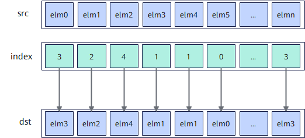

# `vgather_reg`

## 产品支持情况

- Ascend 950PR/Ascend 950DT：支持
- Atlas A3 训练系列产品/Atlas A3 推理系列产品：不支持
- Atlas A2 训练系列产品/Atlas A2 推理系列产品：不支持
- Atlas 200I/500 A2 推理产品：不支持
- Atlas 推理系列产品 AI Core：不支持
- Atlas 推理系列产品 Vector Core：不支持
- Atlas 训练系列产品：不支持

## 功能说明

根据索引位置`index`将源操作数`src`按元素收集，将结果作为返回值返回。

**寄存器源收集模式**：源操作数与收集结果均为矢量数据寄存器。按 `index` 矢量寄存器中保存的逐元素索引，从`src`矢量数据寄存器中选择对应位置的元素，将结果作为返回值返回，不使用掩码。

**图 1** 寄存器源收集模式



本接口仅在AIV上生效。

## 函数原型

```python
def vgather_reg(src: RawVReg, index: RawVReg) -> RawVReg: ...
```

**支持的数据类型：**

支持数据类型列表
**表1** 寄存器源收集模式支持数据类型列表

| dtype | index_dtype |
| :---------- | :-------------- |
| `dtypes.int8` | `dtypes.uint8` |
| `dtypes.uint8` | `dtypes.uint8` |
| `dtypes.hifloat8` | `dtypes.uint8` |
| `dtypes.float8_e8m0` | `dtypes.uint8` |
| `dtypes.float8_e5m2` | `dtypes.uint8` |
| `dtypes.float8_e4m3fn` | `dtypes.uint8` |
| `dtypes.int16` | `dtypes.uint16` |
| `dtypes.uint16` | `dtypes.uint16` |
| `dtypes.float16` | `dtypes.uint16` |
| `dtypes.bfloat16` | `dtypes.uint16` |
| `dtypes.int32` | `dtypes.uint32` |
| `dtypes.uint32` | `dtypes.uint32` |
| `dtypes.float32` | `dtypes.uint32` |

## 参数说明

**表** 参数说明

| 参数名 | 输入/输出 | 描述 |
| --- | --- | --- |
| `src` | 输入 | 源操作数（矢量数据寄存器）。 |
| `index` | 输入 | 数据索引（矢量数据寄存器）。单位是元素个数，返回值的第i个元素取自`src`中索引为`index[i]`的元素。 |

## 返回值说明

- 返回收集结果，返回值类型与源操作数`src`的数据类型一致。

## 约束说明

### 通用约束

- 本接口需在`cb.vf()`作用域内调用，源操作数与收集结果均为矢量数据寄存器。

### 寄存器源收集模式约束

- `src`为矢量数据寄存器类型，位宽是固定的`Vector Length (VL)`，存储的元素个数固定。如果`index`中索引值超出当前矢量数据寄存器中能存储的最大元素个数时，按照如下方式处理：设定当前矢量数据寄存器所能存储的最大数据元素个数为`VL_T`, `index`中索引值为`i`，索引值更新为`i % VL_T`。

## 调用示例

将代码保存为`vgather_reg.py`后，可通过`python`命令运行。

以下调用示例代码仅Ascend 950PR&950DT系列产品支持。

```python
# Copyright (c) 2026 Huawei Technologies Co., Ltd.
# Licensed under the CANN Open Software License Agreement Version 2.0.

import cannbotdsl as cb
import torch
import torch_npu  # noqa: F401  # Register the Ascend NPU backend with PyTorch.


@cb.kernel
def vgather_reg_kernel(src0, index, dst):
    buf = cb.Channel(cb.MemLoc.UB, shape=(64,), dtype=src0.dtype, depth=1)
    idx = cb.Channel(cb.MemLoc.UB, shape=(64,), dtype=cb.dtypes.uint32, depth=1)
    out = cb.Channel(cb.MemLoc.UB, shape=(64,), dtype=dst.dtype, depth=1)

    cb.mem_copy(buf.produce(), src0)
    cb.mem_copy(idx.produce(), index)

    src = buf.consume()
    ind = idx.consume()
    res = out.produce()
    with cb.vf(mode="simd"):
        mask = cb.reg.full_mask()
        cb.reg.vstore(res, 0, cb.reg.vgather_reg(cb.reg.vload(src, 0), cb.reg.vload(ind, 0)), mask)

    cb.mem_copy(dst, out.consume())


@cb.jit
def run(src0, index, dst):
    vgather_reg_kernel[1](src0, index, dst)


src0 = torch.arange(64, dtype=torch.int32, device="npu:0") * 10
index = torch.arange(63, -1, -1, dtype=torch.int32, device="npu:0").view(torch.uint32)
dst = torch.empty_like(src0)

run(src0, index, dst)
torch.npu.synchronize()

torch.testing.assert_close(dst.cpu(), src0.cpu()[index.cpu().to(torch.int32)])
print("vgather_reg example passed")
print(f"first={int(dst.cpu()[0])}, last={int(dst.cpu()[-1])}")
```

### 预期结果

```text
vgather_reg example passed
first=630, last=0
```
