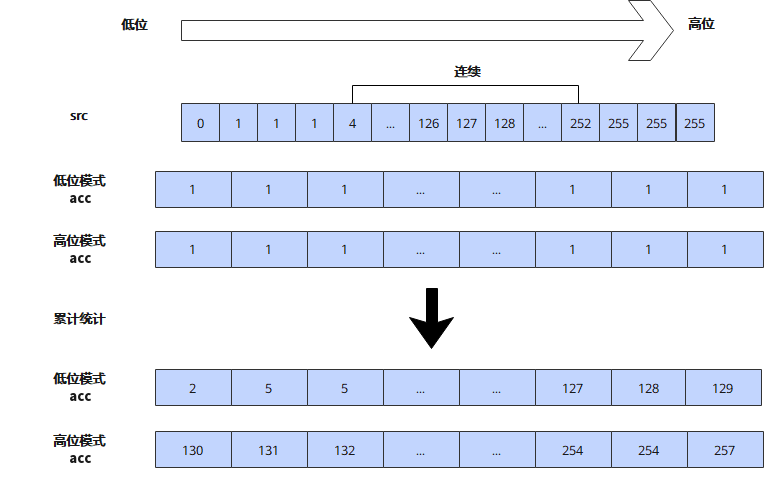

# `vhistogram_accumulate`

## 产品支持情况

- Ascend 950PR/Ascend 950DT：支持
- Atlas A3 训练系列产品/Atlas A3 推理系列产品：不支持
- Atlas A2 训练系列产品/Atlas A2 推理系列产品：不支持
- Atlas 200I/500 A2 推理产品：不支持
- Atlas 推理系列产品 AI Core：不支持
- Atlas 推理系列产品 Vector Core：不支持
- Atlas 训练系列产品：不支持

## 功能说明

对输入矢量数据寄存器中的元素进行累计频率统计，生成累计直方图。统计结果在目的矢量数据寄存器原有数据基础上累加。支持配置掩码用于指示参与统计的元素，掩码位为1时，对应元素参与统计；为0时不统计。掩码不影响目的矢量数据寄存器的写入行为。本接口需在`cb.vf()`作用域内调用。

由于源矢量数据寄存器`src`的数据类型为`dtypes.uint8`，取值范围为[0, 255]，而目的矢量数据寄存器`acc`的元素类型为`dtypes.uint16`，且一个Vector Length可存储128个`dtypes.uint16`数据，因此本接口支持以下两种模式，其中n为`acc`的元素索引，n ∈ {0, 1, ..., 127}：

- **低位模式（`BIN0`）**：`acc[n]`累加`src`中取值不大于`n`的元素个数，累计阈值范围为[0, 127]。
- **高位模式（`BIN1`）**：`acc[n]`累加`src`中取值不大于`128 + n`的元素个数，累计阈值范围为[128, 255]。

示例如下图所示：



本接口仅在AIV上生效。

## 函数原型

```python
def vhistogram_accumulate(acc: RawVReg, src: RawVReg, *, mask: Mask, bin: int=0) -> RawVReg: ...
```

**支持的数据类型：**

`src`支持的数据类型为`dtypes.uint8`，`acc`支持的数据类型为`dtypes.uint16`。

## 参数说明

**表** 参数说明

| 参数名 | 输入/输出 | 描述 |
| --- | --- | --- |
| `acc` | 输入 | 目的操作数（矢量数据寄存器），统计结果在其原有数据基础上累加。 |
| `src` | 输入 | 源操作数（矢量数据寄存器）。 |
| `mask` | 输入 | 源操作数掩码（掩码寄存器），用于指示在计算过程中哪些元素参与计算。mask中与元素对应的比特位为1时，该元素参与计算；为0时，该元素不参与计算。 |
| `bin` | 输入 | 统计模式，取值为0时使用低位模式（`BIN0`），取值为1时使用高位模式（`BIN1`）。默认值为0。 |

## 返回值说明

- 返回累计频率统计结果，返回值类型与目的操作数`acc`的数据类型一致。

## 约束说明

### 通用约束

- 本接口需在`cb.vf()`作用域内调用。
- `mask`需通过掩码设置接口预先赋值后再传入；未赋值的掩码寄存器内容不确定，会导致参与统计的元素位置错误。

### 计算约束

- `mask`用于筛选源操作数，不影响`acc`中未被累加位置的原有数据和写入行为。掩码位为0时，源操作数`src`对应位置的数值将被忽略，`acc`对应位置数值为忽略该位置`src`后统计得到的值。
- `acc`中的统计结果在原有数据基础上累加。首次统计前需初始化`acc`；多次调用本接口时，后一次统计结果累加到前一次统计结果中。
- `acc`的数据类型为`dtypes.uint16`，单个统计结果的最大值为65535。用户需保证累加后的统计结果不超过该范围，否则会发生溢出。

## 调用示例

将代码保存为`vhistogram_accumulate.py`后，可通过`python`命令运行。

以下调用示例代码仅Ascend 950PR&950DT系列产品支持。

```python
# Copyright (c) 2026 Huawei Technologies Co., Ltd.
# Licensed under the CANN Open Software License Agreement Version 2.0.

import cannbotdsl as cb
import torch
import torch_npu  # noqa: F401  # Register the Ascend NPU backend with PyTorch.


@cb.kernel
def vhistogram_accumulate_kernel(src0, dst):
    buf = cb.Channel(cb.MemLoc.UB, shape=(256,), dtype=src0.dtype, depth=1)
    out = cb.Channel(cb.MemLoc.UB, shape=(128,), dtype=cb.dtypes.uint16, depth=1)

    cb.mem_copy(buf.produce(), src0)

    src = buf.consume()
    res = out.produce()
    with cb.vf(mode="simd"):
        src_mask = cb.reg.create_mask(pattern="all", elem_bits=8)
        dst_mask = cb.reg.create_mask(pattern="all", elem_bits=16)
        acc = cb.reg.vdups(0, cb.dtypes.uint16, mask=dst_mask)
        hist = cb.reg.vhistogram_accumulate(acc, cb.reg.vload(src, 0), mask=src_mask)
        cb.reg.vstore(res, 0, hist, dst_mask)

    cb.mem_copy(dst, out.consume())


@cb.jit
def run(src0, dst):
    vhistogram_accumulate_kernel[1](src0, dst)


src0 = (torch.arange(256, dtype=torch.int64) % 32).to(torch.uint8).to("npu:0")
dst = torch.empty((128,), dtype=torch.uint16).to("npu:0")

run(src0, dst)
torch.npu.synchronize()

values = torch.arange(256, dtype=torch.int64) % 32
expected = torch.cumsum(torch.bincount(values, minlength=128), dim=0).to(torch.int32)
torch.testing.assert_close(dst.cpu().to(torch.int32), expected)
print("vhistogram_accumulate example passed")
print(f"first={int(dst.cpu()[0])}, last={int(dst.cpu()[-1])}")
```

### 预期结果

```text
vhistogram_accumulate example passed
first=8, last=256
```
