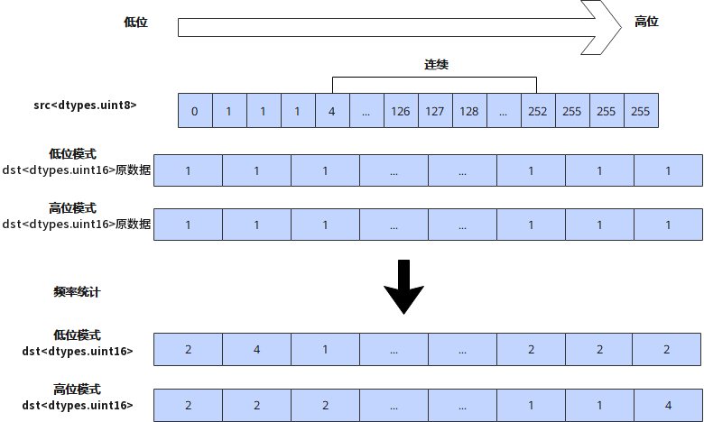

# `vhistogram_frequency`

## 产品支持情况

- Ascend 950PR/Ascend 950DT：支持
- Atlas A3 训练系列产品/Atlas A3 推理系列产品：不支持
- Atlas A2 训练系列产品/Atlas A2 推理系列产品：不支持
- Atlas 200I/500 A2 推理产品：不支持
- Atlas 推理系列产品 AI Core：不支持
- Atlas 推理系列产品 Vector Core：不支持
- Atlas 训练系列产品：不支持

## 功能说明

对输入矢量数据寄存器中的元素进行频率统计，生成直方图，统计结果作为返回值返回。支持配置掩码用于指示参与统计的元素，掩码为1的元素参与统计，掩码为0的元素不统计。本接口需在VF作用域内调用。

由于源矢量数据寄存器`src`数据类型为`dtypes.uint8`（取值范围0~255），而目的矢量数据寄存器每个元素为`dtypes.uint16`，且一个Vector Length可存储128个`dtypes.uint16`数据，因此本接口支持两种模式：

- **低位模式（`BIN0`）**：统计`src`中数值在[0, 127]范围内的出现次数。返回值的第0个元素表示数值0的出现次数，第127个元素表示数值127的出现次数。
- **高位模式（`BIN1`）**：统计`src`中数值在[128, 255]范围内的出现次数。返回值的第0个元素表示数值128的出现次数，第127个元素表示数值255的出现次数。

示例如下图所示：



本接口仅在AIV上生效。

## 函数原型

```python
def vhistogram_frequency(src: RawVReg, *, mask: Mask, bin: int=0) -> RawVReg: ...
```

## 参数说明

**表** 参数说明

| 参数名 | 输入/输出 | 描述 |
| --- | --- | --- |
| `src` | 输入 | 源操作数（矢量数据寄存器）。 |
| `mask` | 输入 | 源操作数掩码（掩码寄存器），用于指示在计算过程中哪些元素参与计算。对应位置为1时参与计算，为0时不参与计算。 |
| `bin` | 输入 | 统计模式，取值为0时使用低位模式（`BIN0`），取值为1时使用高位模式（`BIN1`）。默认值为0。 |

## 返回值说明

- 返回频率统计结果，返回值元素类型为`dtypes.uint16`。

## 约束说明

### 通用约束

- 本接口需在VF作用域内调用。
- `mask`需通过掩码设置接口预先赋值后再传入；未赋值的掩码寄存器内容不确定，会导致参与统计的元素位置错误。

### 计算约束

- `mask`用于筛选源操作数：掩码位为0时，源操作数`src`对应位置的数值将被忽略，返回值对应位置数值为忽略该位置`src`后统计得到的值。
- 本接口每次调用都从零开始计数，不累加前一次调用的结果；需要在上一次统计结果的基础上累加时，请使用[`vhistogram_accumulate`](./vhistogram-accumulate.md)。

## 调用示例

将代码保存为`vhistogram_frequency.py`后，可通过`python`命令运行。

以下调用示例代码仅Ascend 950PR&950DT系列产品支持。

```python
# Copyright (c) 2026 Huawei Technologies Co., Ltd.
# Licensed under the CANN Open Software License Agreement Version 2.0.

import torch
import torch_npu  # noqa: F401  # Register the Ascend NPU backend with PyTorch.

from cannbotdsl import Channel, dtypes, host, mem_copy
from cannbotdsl.lang.kernel import kernel
from cannbotdsl.lang.vf import vf
from cannbotdsl.ops.reg import create_mask, vhistogram_frequency, vload, vstore
from cannbotdsl.tensor import MemLoc

@kernel
def _vhistogram_frequency_kernel(src0, dst):
    buf = Channel(MemLoc.UB, shape=(256,), dtype=src0.dtype, depth=1)
    out = Channel(MemLoc.UB, shape=(128,), dtype=dtypes.uint16, depth=1)

    mem_copy(buf.produce(), src0)

    src = buf.consume()
    res = out.produce()
    with vf(mode="simd"):
        src_mask = create_mask(pattern="all", elem_bits=8)
        dst_mask = create_mask(pattern="all", elem_bits=16)
        hist = vhistogram_frequency(vload(src, 0), mask=src_mask)
        vstore(res, 0, hist, dst_mask)

    mem_copy(dst, out.consume())

@host
def run(src0, dst):
    _vhistogram_frequency_kernel[1](src0, dst)

def main():
    src0 = (torch.arange(256, dtype=torch.int64) % 32).to(torch.uint8).to("npu:0")
    dst = torch.empty((128,), dtype=torch.uint16).to("npu:0")

    run(src0, dst)
    torch.npu.synchronize()

    expected = torch.zeros(128, dtype=torch.int32)
    expected[:32] = 8
    torch.testing.assert_close(dst.cpu().to(torch.int32), expected)
    print("vhistogram_frequency example passed")
    print(f"first={int(dst.cpu()[0])}, last={int(dst.cpu()[-1])}")

if __name__ == "__main__":
    main()
```

### 预期结果

```text
vhistogram_frequency example passed
first=8, last=0
```
