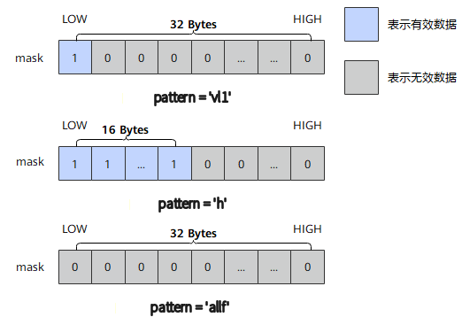

# `create_mask`

## 产品支持情况

- Ascend 950PR/Ascend 950DT：支持
- Atlas A3 训练系列产品/Atlas A3 推理系列产品：不支持
- Atlas A2 训练系列产品/Atlas A2 推理系列产品：不支持
- Atlas 200I/500 A2 推理产品：不支持
- Atlas 推理系列产品 AI Core：不支持
- Atlas 推理系列产品 Vector Core：不支持
- Atlas 训练系列产品：不支持

## 功能说明

根据传入的`pattern`生成对应的掩码寄存器，支持b8、b16、b32三种位宽模式。`pattern`参数指定mask的模式，即指定哪些位置的元素参与计算。

位宽模式说明：
- b8模式：每个bit对应一个8bit元素（共256元素），用于8bit数据类型的矢量计算。
- b16模式：每2个bit为一组对应一个16bit元素（共128元素），用于16bit数据类型的矢量计算。
- b32模式：每4个bit为一组对应一个32bit元素（共64元素），用于32bit数据类型的矢量计算。

**图1** `create_mask`原理



本接口仅在AIV上生效。

## 函数原型

```python
def create_mask(pattern: str='all', elem_bits: int=32) -> Mask: ...
```

## 参数说明

**表** 参数说明

| 参数名 | 输入/输出 | 描述 |
| --- | --- | --- |
| `pattern` | 输入 | mask模式，取值如下：<br>• all：所有元素设置为有效数据，全部参与计算<br>• vl1：最低1个元素设置为有效数据<br>• vl2：最低2个元素设置为有效数据<br>• vl3：最低3个元素设置为有效数据<br>• vl4：最低4个元素设置为有效数据<br>• vl8：最低8个元素设置为有效数据<br>• vl16：最低16个元素设置为有效数据<br>• vl32：最低32个元素设置为有效数据<br>• vl64：最低64个元素设置为有效数据<br>• vl128：最低128个元素设置为有效数据<br>• m3：下标为3的倍数的元素设置为有效数据<br>• m4：下标为4的倍数的元素设置为有效数据<br>• h：低一半的元素设置为有效数据<br>• q：低四分之一的元素设置为有效数据<br>• allf：所有元素设置为无效元素，均不参与计算 |
| `elem_bits` | 输入 | 掩码元素位宽，支持`8`、`16`、`32`，对应b8、b16、b32模式。 |

## 返回值说明

返回掩码寄存器，类型为`Mask`。

## 约束说明

- 本接口仅在AIV上生效。
- 本接口需在`cb.vf()`作用域内调用。
- 掩码寄存器的数量上限为8，超过上限的掩码寄存器会写入预留的8K Unified Buffer（UB）内存中，可能引起性能劣化。编译器会自动复用生命周期结束的寄存器和预留内存，若两者均可用，优先复用寄存器。

## 调用示例

将代码保存为`create_mask.py`后，可通过`python`命令运行。

以下调用示例代码仅Ascend 950PR&950DT系列产品支持。

```python
# Copyright (c) 2026 Huawei Technologies Co., Ltd.
# Licensed under the CANN Open Software License Agreement Version 2.0.

import cannbotdsl as cb
import torch
import torch_npu  # noqa: F401  # Register the Ascend NPU backend with PyTorch.


@cb.kernel
def create_mask_kernel(src0, dst):
    buf = cb.Channel(cb.MemLoc.UB, (64,), src0.dtype, depth=1)
    out = cb.Channel(cb.MemLoc.UB, (64,), dst.dtype, depth=1)
    cb.mem_copy(buf.produce(), src0)

    in0 = buf.consume()
    res = out.produce()
    with cb.vf(mode="simd"):
        m = cb.reg.create_mask(pattern="vl32", elem_bits=32)
        zero = cb.reg.vdups(0.0, cb.dtypes.float32)
        acc = cb.reg.vselect(cb.reg.vload(in0, 0), zero, cond_mask=m)
        cb.reg.vstore(res, 0, acc, cb.reg.full_mask())

    cb.mem_copy(dst, out.consume())


@cb.jit
def run(src0, dst):
    create_mask_kernel[1](src0, dst)


src0 = torch.arange(64, dtype=torch.float32, device="npu:0")
dst = torch.empty_like(src0)

run(src0, dst)
torch.npu.synchronize()

expected = torch.cat([src0.cpu()[:32], torch.zeros(32)])
torch.testing.assert_close(dst.cpu(), expected)
print(f"first={float(dst.cpu()[0]):.4f}, last={float(dst.cpu()[-1]):.4f}")
```

### 预期结果

```text
first=0.0000, last=0.0000
```
