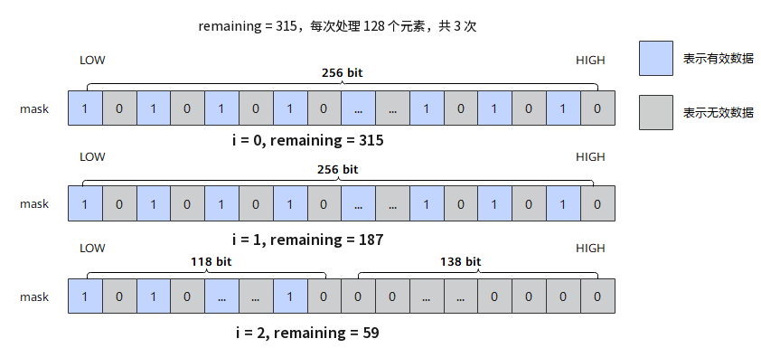

# `update_mask`

## 产品支持情况

- Ascend 950PR/Ascend 950DT：支持
- Atlas A3 训练系列产品/Atlas A3 推理系列产品：不支持
- Atlas A2 训练系列产品/Atlas A2 推理系列产品：不支持
- Atlas 200I/500 A2 推理产品：不支持
- Atlas 推理系列产品 AI Core：不支持
- Atlas 推理系列产品 Vector Core：不支持
- Atlas 训练系列产品：不支持

## 功能说明

根据元素个数`remaining`生成mask，并自动将`remaining`减去当前向量处理单元的元素个数。支持b8、b16、b32三种位宽模式，由于VL=256B，各模式的向量处理单元元素个数为：

- b8模式：每次处理256个元素，用于8 bit数据类型的矢量计算。
- b16模式：每次处理128个元素，用于16 bit数据类型的矢量计算。
- b32模式：每次处理64个元素，用于32 bit数据类型的矢量计算。

**图1** `update_mask`更新流程



本接口仅在AIV上生效。

## 函数原型

```python
def update_mask(remaining, elem_bits: int=32) -> (Mask, Int32): ...
```

## 参数说明

**表** 参数说明

| 参数名 | 输入/输出 | 描述 |
| --- | --- | --- |
| `remaining` | 输入/输出 | 元素个数。调用后自动减去当前向量处理单元的元素个数（b8模式、b16模式、b32模式分别为256、128、64）。<br>执行完一次该接口后，`remaining` = (`remaining` < VL_T) ? 0 : (`remaining` - VL_T)，VL_T表示位宽为VL的矢量数据寄存器中，可存放数据类型T的元素个数。<br>例如，有320个b16数据类型的元素，每次处理128个元素：<br>第一次调用接口，生成的mask对应的元素全为有效数据，`remaining` = 320-128 = 192。<br>第二次调用接口，生成的mask对应的元素全为有效数据，`remaining` = 192-128 = 64。<br>第三次调用接口，生成的mask对应的元素只有低半部分为有效数据，`remaining` = 0。 |
| `elem_bits` | 输入 | 掩码元素位宽，支持`8`、`16`、`32`，对应b8、b16、b32模式，默认值为`32`。 |

## 返回值说明

- 返回掩码寄存器和更新后的元素个数，类型分别为`Mask`、`Int32`。

## 约束说明

- 本接口仅在AIV上生效。
- 掩码寄存器的数量上限为8，超过上限的掩码寄存器会写入预留的8K Unified Buffer（UB）内存中，可能引起性能劣化。编译器会自动复用生命周期结束的寄存器和预留内存，若两者均可用，优先复用寄存器。
- 本接口需在`cb.vf()`作用域内调用。

## 调用示例

将代码保存为`update_mask.py`后，可通过`python`命令运行。

以下调用示例代码仅Ascend 950PR&950DT系列产品支持。

```python
# Copyright (c) 2026 Huawei Technologies Co., Ltd.
# Licensed under the CANN Open Software License Agreement Version 2.0.

import cannbotdsl as cb
import torch
import torch_npu  # noqa: F401  # Register the Ascend NPU backend with PyTorch.


@cb.kernel
def update_mask_kernel(src0, dst):
    buf = cb.Channel(cb.MemLoc.UB, (64,), src0.dtype, depth=1)
    out = cb.Channel(cb.MemLoc.UB, (64,), dst.dtype, depth=1)
    cb.mem_copy(buf.produce(), src0)

    in0 = buf.consume()
    res = out.produce()
    with cb.vf(mode="simd"):
        m, _ = cb.reg.update_mask(20, elem_bits=32)
        zero = cb.reg.vdups(0.0, cb.dtypes.float32)
        acc = cb.reg.vselect(cb.reg.vload(in0, 0), zero, cond_mask=m)
        cb.reg.vstore(res, 0, acc, cb.reg.full_mask())

    cb.mem_copy(dst, out.consume())


@cb.jit
def run(src0, dst):
    update_mask_kernel[1](src0, dst)


src0 = torch.arange(64, dtype=torch.float32, device="npu:0")
dst = torch.empty_like(src0)

run(src0, dst)
torch.npu.synchronize()

expected = torch.cat([src0.cpu()[:20], torch.zeros(44)])
torch.testing.assert_close(dst.cpu(), expected)
print(f"first={float(dst.cpu()[0]):.4f}, last={float(dst.cpu()[-1]):.4f}")
```

### 预期结果

```text
first=0.0000, last=0.0000
```
