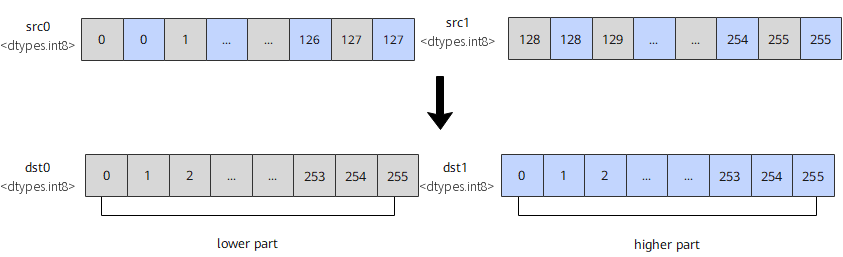

# `vdeinterleave`

## 产品支持情况

- Ascend 950PR/Ascend 950DT：支持
- Atlas A3 训练系列产品/Atlas A3 推理系列产品：不支持
- Atlas A2 训练系列产品/Atlas A2 推理系列产品：不支持
- Atlas 200I/500 A2 推理产品：不支持
- Atlas 推理系列产品 AI Core：不支持
- Atlas 推理系列产品 Vector Core：不支持
- Atlas 训练系列产品：不支持

## 功能说明

将`src0`和`src1`中的元素解交织，结果作为返回值返回，本接口提供矢量数据解交织和掩码解交织两种功能模式：

- **矢量数据解交织**：对两个源矢量数据寄存器中的有效元素逐对解交织。`src0`的偶数索引元素写入`dst0`前半部分，奇数索引元素写入`dst1`前半部分。`src1`的偶数索引元素写入`dst0`后半部分，奇数索引元素写入`dst1`后半部分。
- **掩码解交织**：对两个源掩码寄存器中的比特位按指定位宽解交织。`src0`的偶数索引位写入`dst0`前半部分，奇数索引位写入`dst1`前半部分。`src1`的偶数索引位写入`dst0`后半部分，奇数索引位写入`dst1`后半部分。

以`dtypes.int8`数据类型为例，`vdeinterleave`的实现流程如图1所示：

**图1** 解交织实现流程



本接口仅在AIV上生效。

## 函数原型

```python
def vdeinterleave(src0, src1) -> tuple[RawVReg, RawVReg]: ...
```

**支持的数据类型：**

`dtypes.int8`、`dtypes.uint8`、`dtypes.hifloat8`、`dtypes.float8_e8m0`、`dtypes.float8_e5m2`、`dtypes.float8_e4m3fn`、`dtypes.int16`、`dtypes.uint16`、`dtypes.float16`、`dtypes.bfloat16`、`dtypes.int32`、`dtypes.uint32`、`dtypes.float32`。

## 参数说明

**表** 参数说明

| 参数名 | 输入/输出 | 描述 |
| --- | --- | --- |
| `src0` | 输入 | 源操作数（矢量数据寄存器或掩码寄存器），参与解交织的操作数。其偶数索引元素（位）写入`dst0`前半部分，奇数索引元素（位）写入`dst1`前半部分。 |
| `src1` | 输入 | 源操作数（矢量数据寄存器或掩码寄存器），参与解交织的操作数。其偶数索引元素（位）写入`dst0`后半部分，奇数索引元素（位）写入`dst1`后半部分。 |

## 返回值说明

- 返回`(dst0, dst1)`，为解交织得到的两个结果寄存器，与`src0`、`src1`的数据类型一致。

## 约束说明

- 本接口需在VF作用域内调用。
- `src0`、`src1`、`dst0`、`dst1`的数据类型需要保持一致。
- `src0`和`src1`可以为同一个矢量数据寄存器或掩码寄存器。
- `dst0`与`dst1`必须为不同的矢量数据寄存器或掩码寄存器，若两者引用同一寄存器将导致两个输出互相覆盖，结果未定义。

## 调用示例

将代码保存为`vdeinterleave.py`后，可通过`python`命令运行。

以下调用示例代码仅Ascend 950PR&950DT系列产品支持。

```python
# Copyright (c) 2026 Huawei Technologies Co., Ltd.
# Licensed under the CANN Open Software License Agreement Version 2.0.

import torch
import torch_npu  # noqa: F401  # Register the Ascend NPU backend with PyTorch.

from cannbotdsl import Channel, host, mem_copy
from cannbotdsl.lang.kernel import kernel
from cannbotdsl.lang.vf import vf
from cannbotdsl.ops.reg import full_mask, vdeinterleave, vload, vstore
from cannbotdsl.tensor import MemLoc

@kernel
def _vdeinterleave_kernel(src0, src1, dst):
    buf0 = Channel(MemLoc.UB, (64,), src0.dtype, depth=1)
    buf1 = Channel(MemLoc.UB, (64,), src1.dtype, depth=1)
    out = Channel(MemLoc.UB, (128,), dst.dtype, depth=1)

    mem_copy(buf0.produce(), src0)
    mem_copy(buf1.produce(), src1)

    in0 = buf0.consume()
    in1 = buf1.consume()
    res = out.produce()
    with vf(mode="simd"):
        mask = full_mask()
        even, odd = vdeinterleave(vload(in0, 0), vload(in1, 0))
        vstore(res, 0, even, mask)
        vstore(res, 64, odd, mask)

    mem_copy(dst, out.consume())

@host
def run(src0, src1, dst):
    _vdeinterleave_kernel[1](src0, src1, dst)

def main():
    src0 = torch.arange(64, dtype=torch.float32, device="npu:0")
    src1 = src0 + 100.0
    dst = torch.empty((128,), dtype=torch.float32, device="npu:0")

    run(src0, src1, dst)
    torch.npu.synchronize()

    a, b = src0.cpu(), src1.cpu()
    expected = torch.cat([torch.cat([a[0::2], b[0::2]]), torch.cat([a[1::2], b[1::2]])])
    torch.testing.assert_close(dst.cpu(), expected)
    print("vdeinterleave example passed")
    print(f"first={float(dst.cpu()[0]):.1f}, last={float(dst.cpu()[-1]):.1f}")

if __name__ == "__main__":
    main()
```

### 预期结果

```text
vdeinterleave example passed
first=0.0, last=163.0
```
