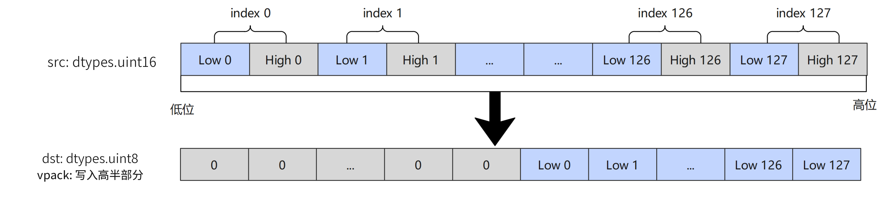

# `vpack`

## 产品支持情况

- Ascend 950PR/Ascend 950DT：支持
- Atlas A3 训练系列产品/Atlas A3 推理系列产品：不支持
- Atlas A2 训练系列产品/Atlas A2 推理系列产品：不支持
- Atlas 200I/500 A2 推理产品：不支持
- Atlas 推理系列产品 AI Core：不支持
- Atlas 推理系列产品 Vector Core：不支持
- Atlas 训练系列产品：不支持

## 功能说明

将源操作数中的元素选取低8位（b16）、低16位（b32）后压缩写入返回值中：`part`取值为`'lower'`（默认值）时写入返回值的低半部分，取值为`'highest'`时写入返回值的高半部分。



图中为`part='highest'`时的压缩结果。

本接口仅在AIV上生效。

## 函数原型

```python
def vpack(src: RawVReg, dtype, *, part: str='lower') -> RawVReg: ...
```

**支持的数据类型：**

dtype_src与dtype_dst支持的数据类型对如下：

| dtype_src | dtype_dst |
|---|---|
| `dtypes.uint16` | `dtypes.uint8` |
| `dtypes.int16` | `dtypes.uint8` |
| `dtypes.uint32` | `dtypes.uint16` |
| `dtypes.int32` | `dtypes.uint16` |

## 参数说明

**表** 参数说明

| 参数名 | 输入/输出 | 描述 |
| --- | --- | --- |
| `src` | 输入 | 源操作数（矢量数据寄存器）。 |
| `dtype` | 输入 | 返回值的数据类型，支持的类型对参见函数原型中的对应关系表。 |
| `part` | 输入 | 指定压缩结果写入返回值的半部分，取值为`'lower'`（低半部分）或`'highest'`（高半部分），默认为`'lower'`。 |

## 返回值说明

- 返回压缩结果，类型为矢量数据寄存器，其元素数据类型由`dtype`指定。

## 约束说明

- 本接口需在VF作用域内调用。
- `src`与返回值均为矢量数据寄存器。

## 调用示例

将代码保存为`vpack.py`后，可通过`python`命令运行。

以下调用示例代码仅Ascend 950PR&950DT系列产品支持。

```python
# Copyright (c) 2026 Huawei Technologies Co., Ltd.
# Licensed under the CANN Open Software License Agreement Version 2.0.

import torch
import torch_npu  # noqa: F401  # Register the Ascend NPU backend with PyTorch.

from cannbotdsl import Channel, dtypes, host, mem_copy
from cannbotdsl.lang.kernel import kernel
from cannbotdsl.lang.vf import vf
from cannbotdsl.ops.reg import create_mask, vload, vpack, vstore
from cannbotdsl.tensor import MemLoc

@kernel
def _vpack_kernel(src0, dst):
    buf = Channel(MemLoc.UB, (128,), src0.dtype, depth=1)
    out = Channel(MemLoc.UB, (128,), dst.dtype, depth=1)

    mem_copy(buf.produce(), src0)

    in0 = buf.consume()
    res = out.produce()
    with vf(mode="simd"):
        mask = create_mask(pattern="vl128", elem_bits=8)
        vstore(res, 0, vpack(vload(in0, 0), dtypes.uint8), mask)

    mem_copy(dst, out.consume())

@host
def run(src0, dst):
    _vpack_kernel[1](src0, dst)

def main():
    src0 = torch.arange(128, dtype=torch.int32).to(torch.uint16).to("npu:0")
    dst = torch.empty((128,), dtype=torch.uint8, device="npu:0")

    run(src0, dst)
    torch.npu.synchronize()

    torch.testing.assert_close(dst.cpu().to(torch.int32), src0.cpu().to(torch.int32))
    print("vpack example passed")
    print(f"first={int(dst.cpu()[0])}, last={int(dst.cpu()[-1])}")

if __name__ == "__main__":
    main()
```

### 预期结果

```text
vpack example passed
first=0, last=127
```
