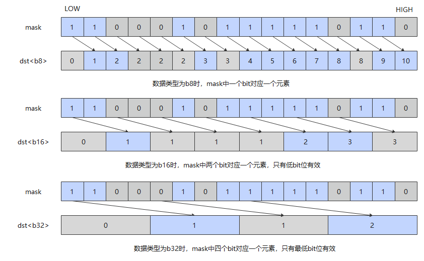

# `vsqueeze`

## 产品支持情况

- Ascend 950PR/Ascend 950DT：支持
- Atlas A3 训练系列产品/Atlas A3 推理系列产品：不支持
- Atlas A2 训练系列产品/Atlas A2 推理系列产品：不支持
- Atlas 200I/500 A2 推理产品：不支持
- Atlas 推理系列产品 AI Core：不支持
- Atlas 推理系列产品 Vector Core：不支持
- Atlas 训练系列产品：不支持

## 功能说明

将数据根据`mask`进行解压缩，将解压缩结果作为返回值返回。解压缩方式：返回值的第0个元素置为0，返回值的第i个元素等于`mask`中从第0个到第(i-1)个元素中1的数量。`mask`最高位被忽略，不参与统计。

具体算法如图1所示，返回值的首位为0。对于后续元素，与返回值[i-1]对应的有效`mask`位为1时，返回值[i]的值为返回值[i-1] + 1；对应的有效`mask`位为0时，返回值[i]的值为返回值[i-1]。

**图1** unsqueeze流程



本接口仅在AIV上生效。

## 函数原型

```python
def vsqueeze(mask: Mask, dtype) -> RawVReg: ...
```

**支持的数据类型：**

dtype支持的数据类型：`dtypes.int8`、`dtypes.uint8`、`dtypes.int16`、`dtypes.uint16`、`dtypes.int32`、`dtypes.uint32`。返回值类型接口通过函数名后缀区分数据类型，对应关系如下：

| 函数名后缀 | 数据类型 |
|---|---|
| u8 | `dtypes.uint8` |
| s8 | `dtypes.int8` |
| u16 | `dtypes.uint16` |
| s16 | `dtypes.int16` |
| u32 | `dtypes.uint32` |
| s32 | `dtypes.int32` |

## 参数说明

**表** 参数说明

| 参数名 | 输入/输出 | 描述 |
| --- | --- | --- |
| `mask` | 输入 | 源掩码寄存器，用于提供解压缩信息。 |
| `dtype` | 输入 | 返回值的数据类型，取值范围参见函数原型中的数据类型说明。 |

## 返回值说明

- 返回保存解压缩结果的矢量数据寄存器，其元素数据类型由`dtype`指定。

## 约束说明

- `mask`需通过掩码设置接口预先赋值后再传入，未赋值的掩码寄存器内容不确定，会导致有效元素位置错误。
- 本接口需在`cb.vf()`作用域内调用。
- `mask`为掩码寄存器。

## 调用示例

将代码保存为`vsqueeze.py`后，可通过`python`命令运行。

以下调用示例代码仅Ascend 950PR&950DT系列产品支持。

```python
# Copyright (c) 2026 Huawei Technologies Co., Ltd.
# Licensed under the CANN Open Software License Agreement Version 2.0.

import cannbotdsl as cb
import torch
import torch_npu  # noqa: F401  # Register the Ascend NPU backend with PyTorch.


@cb.kernel
def vsqueeze_kernel(dst):
    out = cb.Channel(cb.MemLoc.UB, (128,), dst.dtype, depth=1)

    res = out.produce()
    with cb.vf(mode="simd"):
        mask = cb.reg.create_mask(pattern="vl32", elem_bits=16)
        cb.reg.vstore(res, 0, cb.reg.vsqueeze(mask, cb.dtypes.uint16), cb.reg.full_mask(elem_bits=16))

    cb.mem_copy(dst, out.consume())


@cb.jit
def run(dst):
    vsqueeze_kernel[1](dst)


dst = torch.empty((128,), dtype=torch.uint16, device="npu:0")

run(dst)
torch.npu.synchronize()

expected = torch.tensor([min(i, 32) for i in range(128)], dtype=torch.int32)
torch.testing.assert_close(dst.cpu().to(torch.int32), expected)
print("vsqueeze example passed")
print(f"first={int(dst.cpu()[0])}, last={int(dst.cpu()[-1])}")
```

### 预期结果

```text
vsqueeze example passed
first=0, last=32
```
