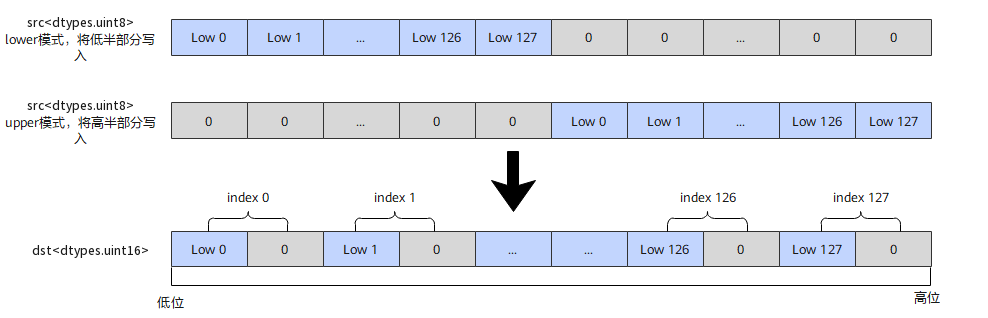
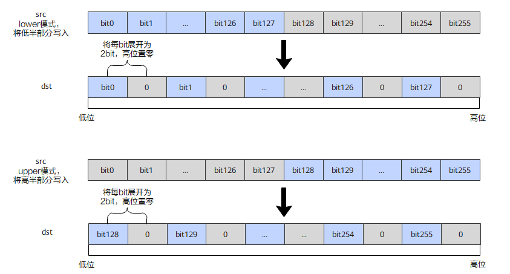

# `vunpack`

## 产品支持情况

- Ascend 950PR/Ascend 950DT：支持
- Atlas A3 训练系列产品/Atlas A3 推理系列产品：不支持
- Atlas A2 训练系列产品/Atlas A2 推理系列产品：不支持
- Atlas 200I/500 A2 推理产品：不支持
- Atlas 推理系列产品 AI Core：不支持
- Atlas 推理系列产品 Vector Core：不支持
- Atlas 训练系列产品：不支持

## 功能说明

将`src`中低半部分或高半部分的元素以扩充位宽的方式作为返回值返回，支持：

不同数据类型的扩充方式：

- 无符号整型：高位填0扩充。例如`dtypes.uint8`到`dtypes.uint16`，`src`中每个`dtypes.uint8`元素高位补0扩展为`dtypes.uint16`。
- 有符号整型：保持符号位扩充。例如`dtypes.int8`到`dtypes.int16`，`src`中每个`dtypes.int8`元素按符号位扩展为`dtypes.int16`。
- `dtypes.bool`类型（掩码寄存器）：将每bit展开为2bit，高位填0。

矢量数据寄存器unpack流程如图1所示：

**图1** 矢量数据寄存器unpack流程



掩码数据寄存器unpack流程如图2所示：

**图2** 掩码数据寄存器unpack流程



本接口仅在AIV上生效。

## 函数原型

```python
def vunpack(src: RawVReg, dtype, *, part: str='lower') -> RawVReg: ...
```

**支持的数据类型：**

dtype_src与dtype_dst支持的数据类型对如下：

| dtype_src | dtype_dst |
|---|---|
| `dtypes.uint8` | `dtypes.uint16` |
| `dtypes.int8` | `dtypes.int16` |
| `dtypes.uint16` | `dtypes.uint32` |
| `dtypes.int16` | `dtypes.int32` |

## 参数说明

**表** 参数说明

| 参数名 | 输入/输出 | 描述 |
| --- | --- | --- |
| `src` | 输入 | 源操作数（矢量数据寄存器/掩码寄存器），取低半段或高半段元素扩展位宽后作为返回值返回。 |
| `dtype` | 输入 | 返回值的数据类型，支持的类型对参见函数原型中的对应关系表。 |
| `part` | 输入 | 指定`src`中参与解包扩展的半部分，取值为`'lower'`（低半部分）或`'upper'`（高半部分），默认为`'lower'`。 |

## 返回值说明

- 返回保存解压缩结果的矢量数据寄存器，其元素数据类型由`dtype`指定。

## 约束说明

- 本接口需在VF作用域内调用。
- `src`为矢量数据寄存器或掩码寄存器。
- 低半段解包与高半段解包配合可分别解包源寄存器前半段与后半段，两次调用即可将整个源寄存器的窄类型数据全部扩展为宽类型写入两个目的寄存器。

## 调用示例

将代码保存为`vunpack.py`后，可通过`python`命令运行。

以下调用示例代码仅Ascend 950PR&950DT系列产品支持。

```python
# Copyright (c) 2026 Huawei Technologies Co., Ltd.
# Licensed under the CANN Open Software License Agreement Version 2.0.

import torch
import torch_npu  # noqa: F401  # Register the Ascend NPU backend with PyTorch.

from cannbotdsl import Channel, dtypes, host, mem_copy
from cannbotdsl.lang.kernel import kernel
from cannbotdsl.lang.vf import vf
from cannbotdsl.ops.reg import full_mask, vload, vstore, vunpack
from cannbotdsl.tensor import MemLoc

@kernel
def _vunpack_kernel(src0, dst):
    buf = Channel(MemLoc.UB, (256,), src0.dtype, depth=1)
    out = Channel(MemLoc.UB, (128,), dst.dtype, depth=1)

    mem_copy(buf.produce(), src0)

    in0 = buf.consume()
    res = out.produce()
    with vf(mode="simd"):
        mask = full_mask(elem_bits=16)
        vstore(res, 0, vunpack(vload(in0, 0), dtypes.uint16), mask)

    mem_copy(dst, out.consume())

@host
def run(src0, dst):
    _vunpack_kernel[1](src0, dst)

def main():
    src0 = torch.arange(256, dtype=torch.int32).to(torch.uint8).to("npu:0")
    dst = torch.empty((128,), dtype=torch.uint16, device="npu:0")

    run(src0, dst)
    torch.npu.synchronize()

    torch.testing.assert_close(dst.cpu().to(torch.int32), src0.cpu()[:128].to(torch.int32))
    print("vunpack example passed")
    print(f"first={int(dst.cpu()[0])}, last={int(dst.cpu()[-1])}")

if __name__ == "__main__":
    main()
```

### 预期结果

```text
vunpack example passed
first=0, last=127
```
