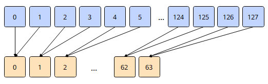

# `vpair_reduce_sum`

## 产品支持情况

- Ascend 950PR/Ascend 950DT：支持
- Atlas A3 训练系列产品/Atlas A3 推理系列产品：不支持
- Atlas A2 训练系列产品/Atlas A2 推理系列产品：不支持
- Atlas 200I/500 A2 推理产品：不支持
- Atlas 推理系列产品 AI Core：不支持
- Atlas 推理系列产品 Vector Core：不支持
- Atlas 训练系列产品：不支持

## 功能说明

根据`mask`将源操作数`src`中每两个相邻元素相加，得到计算结果。结果连续保存在返回值的低半部分，返回值的高半部分置0。以`dtypes.float16`数据类型为例，相加示意图如下：



计算公式如下：

$$
dst_i = src_{2i} + src_{2i+1} \quad (0 \le i < \frac{N}{2})
$$

其中，$N$为矢量数据寄存器的元素个数。

本接口仅在AIV上生效。

## 函数原型

```python
def vpair_reduce_sum(src: RawVReg, *, mask: Mask) -> RawVReg: ...
```

**支持的数据类型：**

`dtypes.float16`、`dtypes.float32`。

## 参数说明

**表** 参数说明

| 参数名 | 输入/输出 | 描述 |
| --- | --- | --- |
| `src` | 输入 | 源操作数（矢量数据寄存器）。 |
| `mask` | 输入 | 掩码寄存器，用于控制各元素是否参与计算。`mask`中与元素对应的比特位为1时，该元素参与计算；为0时，该元素不参与计算。 |

## 返回值说明

- 通过函数返回值返回结果：返回计算结果，类型为矢量数据寄存器，与`src`的数据类型一致。

## 约束说明

- `mask`需通过掩码设置接口预先赋值后再传入，未赋值的掩码寄存器内容不确定，会导致有效元素位置错误。
- 返回值与`src`的数据类型需要保持一致。
- `mask`指定源操作数是否参与计算，不参与计算的元素被当作0进行累加。例如：
  - 若连续两个元素a、b均不参与计算，目的操作数结果为0。
  - 若连续两个元素a、b仅元素a参与计算，目的操作数结果为a。
  - 若连续两个元素a、b仅元素b参与计算，目的操作数结果为b。
- 求和后，返回值中仅前一半元素为有效数据，后一半填充为0。搬出至Unified Buffer（UB）时需要避免数据踩踏。

## 调用示例

将代码保存为`vpair_reduce_sum.py`后，可通过`python`命令运行。

以下调用示例代码仅Ascend 950PR&950DT系列产品支持。

```python
# Copyright (c) 2026 Huawei Technologies Co., Ltd.
# Licensed under the CANN Open Software License Agreement Version 2.0.

import cannbotdsl as cb
import torch
import torch_npu  # noqa: F401  # Register the Ascend NPU backend with PyTorch.


@cb.kernel
def vpair_reduce_sum_kernel(src0, dst):
    buf = cb.Channel(cb.MemLoc.UB, (64,), src0.dtype, depth=1)
    out = cb.Channel(cb.MemLoc.UB, (64,), dst.dtype, depth=1)
    cb.mem_copy(buf.produce(), src0)

    in0 = buf.consume()
    res = out.produce()
    with cb.vf(mode="simd"):
        full = cb.reg.full_mask()
        acc = cb.reg.vpair_reduce_sum(cb.reg.vload(in0, 0), mask=full)
        cb.reg.vstore(res, 0, acc, full)

    cb.mem_copy(dst, out.consume())


@cb.jit
def run(src0, dst):
    vpair_reduce_sum_kernel[1](src0, dst)


src0 = torch.arange(1, 65, dtype=torch.float32, device="npu:0")
dst = torch.empty_like(src0)

run(src0, dst)
torch.npu.synchronize()

expected = torch.zeros(64)
expected[:32] = src0.cpu().view(32, 2).sum(dim=1)
torch.testing.assert_close(dst.cpu(), expected)
print(f"first={float(dst.cpu()[0]):.4f}, lane31={float(dst.cpu()[31]):.4f}")
```

### 预期结果

```text
first=3.0000, lane31=127.0000
```
