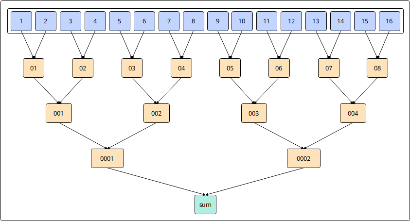

# `vreduce_sum_datablock`

## 产品支持情况

- Ascend 950PR/Ascend 950DT：支持
- Atlas A3 训练系列产品/Atlas A3 推理系列产品：不支持
- Atlas A2 训练系列产品/Atlas A2 推理系列产品：不支持
- Atlas 200I/500 A2 推理产品：不支持
- Atlas 推理系列产品 AI Core：不支持
- Atlas 推理系列产品 Vector Core：不支持
- Atlas 训练系列产品：不支持

## 功能说明

根据`mask`将每个`DataBlock`（32B）中参与计算的元素相加，得到各`DataBlock`的归约结果。结果依次保存在返回值的最低位。参考伪代码：

```python
def vreduce_sum_datablock(dst, src, mask):
    num_blocks = 8                      # 128元素 / 16元素每块 = 8块
    elems_per_block = 16                # 32B / 2B(dtypes.float16) = 16
    for b in range(num_blocks):
        values = []
        for j in range(elems_per_block):
            i = b * elems_per_block + j
            values.append(src[i] if mask[i] else 0)
        while len(values) > 1:
            values = [values[j] + values[j + 1]
                      for j in range(0, len(values), 2)]
        dst[b] = values[0]              # 每块求和值连续写入dst低位
    for i in range(num_blocks, 128):
        dst[i] = 0                      # 其余位置置0
```

本接口仅在AIV上生效。

## 函数原型

```python
def vreduce_sum_datablock(src: RawVReg, *, mask: Mask) -> RawVReg: ...
```

**支持的数据类型：**

| `src_dtype` | `dst_dtype` |
| ----------- | ----------- |
| `dtypes.int16` | `dtypes.int32` |
| `dtypes.uint16` | `dtypes.uint32` |
| `dtypes.float16` | `dtypes.float16` |
| `dtypes.int32` | `dtypes.int32` |
| `dtypes.uint32` | `dtypes.uint32` |
| `dtypes.float32` | `dtypes.float32` |

## 参数说明

**表** 参数说明

| 参数名 | 输入/输出 | 描述 |
| --- | --- | --- |
| `src` | 输入 | 源操作数（矢量数据寄存器）。 |
| `mask` | 输入 | 掩码寄存器，用于控制各元素是否参与归约。 |

## 返回值说明

- 通过函数返回值返回结果：返回归约结果，类型为矢量数据寄存器，与`dst_dtype`的数据类型一致。

## 约束说明

- `mask`需通过掩码设置接口预先赋值后再传入，未赋值的掩码寄存器内容不确定，会导致有效元素位置错误。
- 指令内累加顺序采用二叉树累加方式，在每个`DataBlock`（32B）内两两相加逐层归约求和，结果连续写入到目的操作数，目的操作数中的其它元素置0。
- 当`DataBlock`中的元素均不参与计算（`mask`全为0）时，将0写入返回值对应位置（对于浮点数则为+0）。
- 对于输入为`dtypes.uint16`/`dtypes.int16`类型的情况，会提升精度到`dtypes.uint32`/`dtypes.int32`进行计算。

## 关键特性

**`vreduce_sum_datablock` 累加顺序**：

以二叉树累加的方式计算每个`DataBlock`内的数据总和。

以`dtypes.float16`类型的数据求和为例，在每个`DataBlock`内有16个数，通过二叉树的方式，两两相加，计算过程如下图所示：

1. data1和data2相加得到data01，data3和data4相加得到data02，……，data13和data14相加得到data07，data15和data16相加得到data08；
2. data01和data02相加得到data001，data03和data04相加得到data002，……，data07和data08相加得到data004；
3. 以此类推，得到目的操作数为1个`dtypes.float16`类型的数据sum。



## 调用示例

将代码保存为`vreduce_sum_datablock.py`后，可通过`python`命令运行。

以下调用示例代码仅Ascend 950PR&950DT系列产品支持。

```python
# Copyright (c) 2026 Huawei Technologies Co., Ltd.
# Licensed under the CANN Open Software License Agreement Version 2.0.

import cannbotdsl as cb
import torch
import torch_npu  # noqa: F401  # Register the Ascend NPU backend with PyTorch.


@cb.kernel
def vreduce_sum_datablock_kernel(src0, dst):
    buf = cb.Channel(cb.MemLoc.UB, (64,), src0.dtype, depth=1)
    out = cb.Channel(cb.MemLoc.UB, (64,), dst.dtype, depth=1)
    cb.mem_copy(buf.produce(), src0)

    in0 = buf.consume()
    res = out.produce()
    with cb.vf(mode="simd"):
        full = cb.reg.full_mask()
        acc = cb.reg.vreduce_sum_datablock(cb.reg.vload(in0, 0), mask=full)
        cb.reg.vstore(res, 0, acc, full)

    cb.mem_copy(dst, out.consume())


@cb.jit
def run(src0, dst):
    vreduce_sum_datablock_kernel[1](src0, dst)


src0 = torch.arange(64, dtype=torch.float32, device="npu:0")
dst = torch.empty_like(src0)

run(src0, dst)
torch.npu.synchronize()

expected = torch.zeros(64)
expected[:8] = src0.cpu().view(8, 8).sum(dim=1)
torch.testing.assert_close(dst.cpu(), expected)
print(f"first={float(dst.cpu()[0]):.4f}, block7={float(dst.cpu()[7]):.4f}")
```

### 预期结果

```text
first=28.0000, block7=476.0000
```
