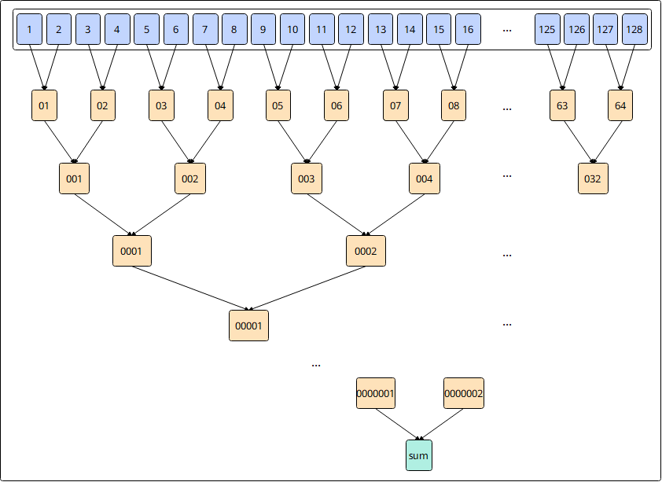

# `vreduce_sum`

## 产品支持情况

- Ascend 950PR/Ascend 950DT：支持
- Atlas A3 训练系列产品/Atlas A3 推理系列产品：不支持
- Atlas A2 训练系列产品/Atlas A2 推理系列产品：不支持
- Atlas 200I/500 A2 推理产品：不支持
- Atlas 推理系列产品 AI Core：不支持
- Atlas 推理系列产品 Vector Core：不支持
- Atlas 训练系列产品：不支持

## 功能说明

根据`mask`对源操作数`src`进行归约求和操作，用于将`src`中的所有参与计算的元素求和，得到归约结果。结果保存在返回值的第0个元素。参考伪代码：

```python
def vreduce_sum(dst, src, mask):
    values = [src[i] if mask[i] else 0 for i in range(len(src))]
    while len(values) > 1:
        values = [values[i] + values[i + 1]
                  for i in range(0, len(values), 2)]
    dst[0] = values[0]                  # 求和值
    for i in range(1, len(dst)):
        dst[i] = 0                      # 其余位置置0
```

本接口仅在AIV上生效。

## 函数原型

```python
def vreduce_sum(src: RawVReg, *, mask: Mask) -> RawVReg: ...
```

**支持的数据类型：**

| `src_dtype` | `dst_dtype` |
| ----------- | ----------- |
| `dtypes.int16` | `dtypes.int32` |
| `dtypes.uint16` | `dtypes.uint32` |
| `dtypes.float16` | `dtypes.float16` |
| `dtypes.int32` | `dtypes.int32` |
| `dtypes.uint32` | `dtypes.uint32` |
| `dtypes.float32` | `dtypes.float32` |

## 参数说明

**表** 参数说明

| 参数名 | 输入/输出 | 描述 |
| --- | --- | --- |
| `src` | 输入 | 源操作数（矢量数据寄存器）。 |
| `mask` | 输入 | 掩码寄存器，用于控制各元素是否参与归约。 |

## 返回值说明

- 通过函数返回值返回结果：返回归约结果，类型为矢量数据寄存器，与`dst_dtype`的数据类型一致。

## 约束说明

- `mask`需通过掩码设置接口预先赋值后再传入，未赋值的掩码寄存器内容不确定，会导致有效元素位置错误。
- 指令内累加顺序采用二叉树累加方式，结果连续写入到目的操作数，目的操作数中的其它元素置0。
- 当所有元素均不参与计算（`mask`全为0）时，将0写入目的操作数对应位置（特别的，对于浮点数为+0）。
- 对于输入为`dtypes.uint16`/`dtypes.int16`类型的情况，会提升精度到`dtypes.uint32`/`dtypes.int32`进行计算。

## 关键特性

**`vreduce_sum` 累加顺序**：

以二叉树累加的方式计算源操作数`src`内有效元素的数据总和。

以`dtypes.float16`类型的数据求和为例，在`src`内有128个数，通过二叉树的方式，两两相加，计算过程如下图所示：

1. data1和data2相加得到data01，data3和data4相加得到data02，……，data125和data126相加得到data63，data127和data128相加得到data64；
2. data01和data02相加得到data001，data03和data04相加得到data002，……，data63和data64相加得到data032；
3. 以此类推，得到目的操作数为1个`dtypes.float16`类型的数据sum。



## 调用示例

将代码保存为`vreduce_sum.py`后，可通过`python`命令运行。

以下调用示例代码仅Ascend 950PR&950DT系列产品支持。

```python
# Copyright (c) 2026 Huawei Technologies Co., Ltd.
# Licensed under the CANN Open Software License Agreement Version 2.0.

import torch
import torch_npu  # noqa: F401  # Register the Ascend NPU backend with PyTorch.

from cannbotdsl import Channel, host, mem_copy
from cannbotdsl.lang.kernel import kernel
from cannbotdsl.lang.vf import vf
from cannbotdsl.ops.reg import full_mask, vload, vreduce_sum, vstore_first
from cannbotdsl.tensor import MemLoc

@kernel
def _vreduce_sum_kernel(src0, dst):
    buf = Channel(MemLoc.UB, (64,), src0.dtype, depth=1)
    out = Channel(MemLoc.UB, (1,), dst.dtype, depth=1)
    mem_copy(buf.produce(), src0)

    in0 = buf.consume()
    res = out.produce()
    with vf(mode="simd"):
        acc = vreduce_sum(vload(in0, 0), mask=full_mask())
        vstore_first(res, 0, acc)

    mem_copy(dst, out.consume())

@host
def run(src0, dst):
    _vreduce_sum_kernel[1](src0, dst)

def main():
    src0 = torch.arange(1, 65, dtype=torch.float32, device="npu:0")
    dst = torch.empty((1,), dtype=torch.float32, device="npu:0")

    run(src0, dst)
    torch.npu.synchronize()

    torch.testing.assert_close(dst.cpu(), src0.sum().cpu().reshape(1))
    print(f"value={float(dst.cpu()[0]):.4f}")

if __name__ == "__main__":
    main()
```

### 预期结果

```text
value=2080.0000
```
