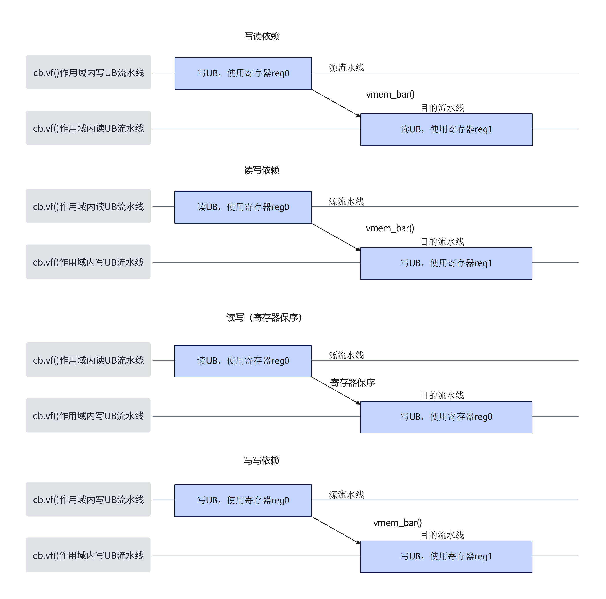

# `vmem_bar`

## 产品支持情况

- Ascend 950PR/Ascend 950DT：支持
- Atlas A3 训练系列产品/Atlas A3 推理系列产品：不支持
- Atlas A2 训练系列产品/Atlas A2 推理系列产品：不支持
- Atlas 200I/500 A2 推理产品：不支持
- Atlas 推理系列产品 AI Core：不支持
- Atlas 推理系列产品 Vector Core：不支持
- Atlas 训练系列产品：不支持

## 功能说明

Reg矢量计算内不同流水线之间的同步指令。该同步指令指定源流水线和目的流水线，如下图所示，目的流水线将等待源流水线上所有指令完成才进行执行。
读写场景下，当读指令使用的寄存器和写指令使用的寄存器相同时，可以触发寄存器保序，指令将会按照代码顺序执行，不需要插入同步指令，而当使用的寄存器不同时，如果要确保读写指令执行，则需要插入同步指令。写写场景同理。



本接口仅在AIV上生效。

## 函数原型

```python
def vmem_bar(mode='vst_vld') -> None: ...
```

## 参数说明

**表** 参数说明

| 参数名 | 输入/输出 | 描述 |
| --- | --- | --- |
| `mode` | 输入 | 同步流水线的类型，取值为`vst_vld`（默认）或`vld_vst`，取值范围见表1 `mode`取值说明。 |

**表1** 本接口支持的`mode`取值说明（源流水线/目的流水线表示的含义见表2 Reg计算流水线说明）

| 值 | 源流水线 | 目的流水线 |
| --- | --- | --- |
| `vst_vld` | `VEC_STORE` | `VEC_LOAD` |
| `vld_vst` | `VEC_LOAD` | `VEC_STORE` |

**表2** Reg计算流水线说明

| 流水线 | 含义 |
| --- | --- |
| `VEC_STORE` | Reg矢量计算内矢量写UB流水线。对应寄存器到UB的搬运指令，例如[`vstore`](../store/vstore.md)。 |
| `VEC_LOAD` | Reg矢量计算内矢量读UB流水线。对应UB到寄存器的搬运指令，例如[`vload`](../load/vload.md)。 |

## 返回值说明

- 无返回值。

## 约束说明

### 通用约束

- 本接口仅在AIV上生效。
- 本接口需在`cb.vf()`作用域内调用。

### 指令约束

- 读写依赖的场景下，如果读指令和写指令使用的寄存器相同，会触发寄存器保序，指令将会按照代码顺序执行，无需额外插入同步指令。
- 冗余的同步指令会导致性能下降，可以通过外提出循环或者循环切分避免多次调用同步指令。
- 当Unified Buffer（UB）数据存在依赖时，才需要插入同步，判断是否有依赖取决于指令读写的内存是否有重叠。部分搬运指令读写内存的模式如下：
    - [`vgather`](../ub_gather/vgather.md)/[`vscatter`](../scatter/vscatter.md)/[`vgather_datablock`](../ub_gather/vgather-datablock.md)等指令取决于`index`地址偏移。
    - [`vload_broadcast`](../load/vload-broadcast.md)单条指令读32B数据后将第一个元素进行广播。

## 调用示例

将代码保存为`vmem_bar.py`后，可通过`python`命令运行。

以下调用示例代码仅Ascend 950PR&950DT系列产品支持。

```python
# Copyright (c) 2026 Huawei Technologies Co., Ltd.
# Licensed under the CANN Open Software License Agreement Version 2.0.

import cannbotdsl as cb
import torch
import torch_npu  # noqa: F401  # Register the Ascend NPU backend with PyTorch.


@cb.kernel
def vmem_bar_kernel(src0, dst):
    buf = cb.Channel(cb.MemLoc.UB, shape=(64,), dtype=src0.dtype, depth=1)
    mid = cb.Channel(cb.MemLoc.UB, shape=(64,), dtype=src0.dtype, depth=1)
    out = cb.Channel(cb.MemLoc.UB, shape=(64,), dtype=dst.dtype, depth=1)

    cb.mem_copy(buf.produce(), src0)

    src = buf.consume()
    tmp = mid.produce()
    res = out.produce()
    with cb.vf(mode="simd"):
        mask = cb.reg.full_mask()
        cb.reg.vstore(tmp, 0, cb.reg.vload(src, 0), mask)
        cb.reg.vmem_bar("vst_vld")
        cb.reg.vstore(res, 0, cb.reg.vload(tmp, 0), mask)

    cb.mem_copy(dst, out.consume())


@cb.jit
def run(src0, dst):
    vmem_bar_kernel[1](src0, dst)


src0 = torch.arange(64, dtype=torch.float32, device="npu:0")
dst = torch.empty_like(src0)

run(src0, dst)
torch.npu.synchronize()

torch.testing.assert_close(dst.cpu(), src0.cpu())
print("vmem_bar example passed")
print(f"first={float(dst.cpu()[0]):.4f}, last={float(dst.cpu()[-1]):.4f}")
```

### 预期结果

```text
vmem_bar example passed
first=0.0000, last=63.0000
```
