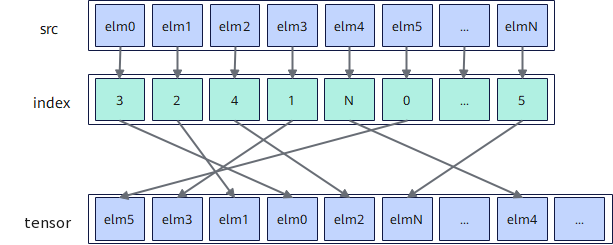

# `vscatter`

## 产品支持情况

- Ascend 950PR/Ascend 950DT：支持
- Atlas A3 训练系列产品/Atlas A3 推理系列产品：不支持
- Atlas A2 训练系列产品/Atlas A2 推理系列产品：不支持
- Atlas 200I/500 A2 推理产品：不支持
- Atlas 推理系列产品 AI Core：不支持
- Atlas 推理系列产品 Vector Core：不支持
- Atlas 训练系列产品：不支持

## 功能说明

根据索引寄存器中的索引值，将源矢量数据寄存器中的元素分散搬出到Unified Buffer（UB）。`mask`用于指示参与搬出的元素，掩码为1的源元素写入`tensor`中对应索引位置，掩码为0的源元素不写入目的地址，保留目的地址原数据。搬运过程中数据格式与内容保持不变。本接口需在`cb.vf()`作用域内调用。

分散搬出过程如下图所示。

**图1** 分散搬出数据



本接口仅在AIV上生效。

## 函数原型

```python
def vscatter(tensor, src: RawVReg, index: RawVReg, *, mask: Mask) -> None: ...
```

**支持的数据类型：**

**表1** dtype和index_dtype对应关系

| dtype | index_dtype |
|---|---|
| `dtypes.int8` | `dtypes.uint16` |
| `dtypes.uint8` | `dtypes.uint16` |
| `dtypes.int16` | `dtypes.uint16` |
| `dtypes.uint16` | `dtypes.uint16` |
| `dtypes.float16` | `dtypes.uint16` |
| `dtypes.bfloat16` | `dtypes.uint16` |
| `dtypes.int32` | `dtypes.uint32` |
| `dtypes.uint32` | `dtypes.uint32` |
| `dtypes.float32` | `dtypes.uint32` |

## 参数说明

**表** 参数说明

| 参数名 | 输入/输出 | 描述 |
| --- | --- | --- |
| `tensor` | 输出 | 目的操作数在UB中的起始地址，起始地址需32字节对齐。 |
| `src` | 输入 | 源操作数（矢量数据寄存器），数据类型须与`tensor`指向的数据类型一致。 |
| `index` | 输入 | 数据索引（矢量数据寄存器），单位为元素。 |
| `mask` | 输入 | 源操作数掩码（掩码寄存器），用于指示在计算过程中哪些元素参与搬运。对应位置为1时参与计算，为0时不参与计算，保留目的地址原数据。需通过掩码设置接口预先赋值后再传入。 |

## 返回值说明

- 无返回值。

## 约束说明

### 通用约束

- 本接口需在`cb.vf()`作用域内调用，源操作数和索引为矢量数据寄存器，目的操作数为UB地址。
- `tensor`起始地址需32字节对齐。
- UB容量上限为256KB，用户可用容量随编译选项与编程场景变化（默认预留6KB SIMD VF栈和2KB 框架预留空间，可用248KB；SIMD与SIMT混合编程时再划分32KB～128KB作为Data Cache，可用容量进一步减少）。`index`索引后的实际写入地址不可超过实际可用容量。
- `mask`需通过掩码设置接口预先赋值后再传入；未赋值的掩码寄存器内容不确定，会导致有效元素位置错误。
- 如果本指令与其他指令存在UB地址重叠，需要插入同步指令[`vmem_bar`](../reg_sync/vmem-bar.md)，保证多个指令串行化，防止出现异常数据。

### 分散搬出约束

- `mask`比特位为0的源元素不参与搬运，其对应目的地址中的原数据保持不变。
- 当`tensor`为`dtypes.int8`或`dtypes.uint8`数据类型时，源操作数中仅偶数位置的元素有效，即`src`中位置为0、2、4、...、252、254的元素会被分散搬出到目的操作数中。
- `index`中的有效索引值必须唯一。若存在重复的有效索引值，系统仅保留其中一个索引值对应的数据，其余数据将被忽略，且无法确定具体保留的数据。
- `index`索引后的实际写入地址需落在UB有效地址范围内。

## 调用示例

将代码保存为`vscatter.py`后，可通过`python`命令运行。

以下调用示例代码仅Ascend 950PR&950DT系列产品支持。

```python
# Copyright (c) 2026 Huawei Technologies Co., Ltd.
# Licensed under the CANN Open Software License Agreement Version 2.0.

import cannbotdsl as cb
import torch
import torch_npu  # noqa: F401  # Register the Ascend NPU backend with PyTorch.


@cb.kernel
def vscatter_kernel(src0, index, dst):
    buf = cb.Channel(cb.MemLoc.UB, shape=(64,), dtype=src0.dtype, depth=1)
    idx = cb.Channel(cb.MemLoc.UB, shape=(64,), dtype=cb.dtypes.uint32, depth=1)
    out = cb.Channel(cb.MemLoc.UB, shape=(64,), dtype=dst.dtype, depth=1)

    cb.mem_copy(buf.produce(), src0)
    cb.mem_copy(idx.produce(), index)

    src = buf.consume()
    ind = idx.consume()
    res = out.produce()
    with cb.vf(mode="simd"):
        mask = cb.reg.full_mask()
        cb.reg.vscatter(res, cb.reg.vload(src, 0), cb.reg.vload(ind, 0), mask=mask)

    cb.mem_copy(dst, out.consume())


@cb.jit
def run(src0, index, dst):
    vscatter_kernel[1](src0, index, dst)


src0 = torch.arange(64, dtype=torch.int32, device="npu:0") * 10
index = torch.arange(63, -1, -1, dtype=torch.int32, device="npu:0").view(torch.uint32)
dst = torch.empty_like(src0)

run(src0, index, dst)
torch.npu.synchronize()

expected = torch.zeros(64, dtype=torch.int32)
expected[index.cpu().to(torch.int64)] = src0.cpu()
torch.testing.assert_close(dst.cpu(), expected)
print("vscatter example passed")
print(f"first={int(dst.cpu()[0])}, last={int(dst.cpu()[-1])}")
```

### 预期结果

```text
vscatter example passed
first=630, last=0
```
