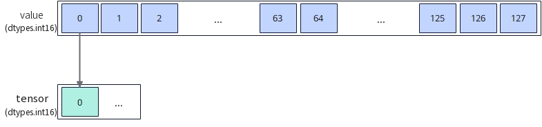

# `vstore_first`

## 产品支持情况

- Ascend 950PR/Ascend 950DT：支持
- Atlas A3 训练系列产品/Atlas A3 推理系列产品：不支持
- Atlas A2 训练系列产品/Atlas A2 推理系列产品：不支持
- Atlas 200I/500 A2 推理产品：不支持
- Atlas 推理系列产品 AI Core：不支持
- Atlas 推理系列产品 Vector Core：不支持
- Atlas 训练系列产品：不支持

## 功能说明

将矢量数据寄存器中的首个元素搬出到Unified Buffer（UB），单次搬出量为一个元素。本接口不支持设置掩码，固定搬出矢量数据寄存器中第一个元素到目的地址处，目的地址需按`sizeof(dtype)`对齐，搬运过程中数据格式与内容保持不变。

本接口提供两种参数列表不同的功能模式：

- **对齐搬出模式**：从矢量数据寄存器首个元素搬出到UB起始地址，多次调用时由用户自行更新目的地址。
- **立即数偏移搬出模式**：通过`dtypes.int32`类型的`offset`指定相对目的起始地址的元素偏移，用户可选择更新偏移或更新目的地址。

以**b16位宽单点搬出**过程为例，示意图如下：

**图1** b16单个元素搬出数据



本接口仅在AIV上生效。

## 函数原型

```python
def vstore_first(tensor, offset, value: RawVReg, *, post_update: bool=False) -> None: ...
```

**支持的数据类型：**

`dtype`支持的数据类型为`int4b_t`、`dtypes.int8`、`dtypes.uint8`、`dtypes.fp4x2_e2m1`、`dtypes.fp4x2_e1m2`、`dtypes.hifloat8`、`dtypes.float8_e8m0`、`dtypes.float8_e5m2`、`dtypes.float8_e4m3fn`、`dtypes.int16`、`dtypes.uint16`、`dtypes.float16`、`dtypes.bfloat16`、`dtypes.int32`、`dtypes.uint32`、`dtypes.float32`。

## 参数说明

**表** 参数说明

| 参数名 | 输入/输出 | 描述 |
| --- | --- | --- |
| `tensor` | 输出 | 目的操作数的起始地址，起始地址需dtype对齐。 |
| `offset` | 输入 | 相对`tensor`起始地址的偏移量，类型为`dtypes.int32`，单位为元素。 |
| `value` | 输入 | 源操作数（矢量数据寄存器）。仅首个元素参与搬出，其余元素被忽略。 |
| `post_update` | 输入 | 是否采用Post Update模式。取值为`True`或`False`，默认值为`False`。取值为`True`时，接口采用Post Update模式，搬出完成后自动更新目的地址，`offset`为地址偏移量，单位为元素，目的地址累加`offset × sizeof(dtype)`字节。 |

## 返回值说明

- 无返回值。

## 约束说明

### 通用约束

- 本接口仅在AIV上生效。
- 本接口需在VF作用域内调用。
- 源操作数为矢量数据寄存器，目的操作数为UB地址，UB地址空间外的地址不可作为`tensor`传入。
- UB容量上限：UB总容量256KB，用户可用容量随编译选项与编程场景变化（默认预留6KB SIMD VF栈+2KB 框架预留，可用248KB；SIMD+SIMT混编时再划分32KB~128KB作Data Cache，可用容量进一步减少）。`tensor`偏移后不可超过实际可用容量。
- 如果本指令与其他指令存在UB地址重叠，需要插入同步指令[`vmem_bar`](../reg_sync/vmem-bar.md)，保证多个指令串行化，防止出现异常数据。

### 指令约束

- `tensor`起始地址需dtype对齐，`offset`偏移后的实际访问地址需dtype对齐且需落在UB地址范围内。

## 调用示例

将代码保存为`vstore_first.py`后，可通过`python`命令运行。

以下调用示例代码仅Ascend 950PR&950DT系列产品支持。

```python
# Copyright (c) 2026 Huawei Technologies Co., Ltd.
# Licensed under the CANN Open Software License Agreement Version 2.0.

import torch
import torch_npu  # noqa: F401  # Register the Ascend NPU backend with PyTorch.

from cannbotdsl import Channel, host, mem_copy
from cannbotdsl.lang.kernel import kernel
from cannbotdsl.lang.vf import vf
from cannbotdsl.ops.reg import vload, vstore_first
from cannbotdsl.tensor import MemLoc

@kernel
def _vstore_first_kernel(src0, dst):
    buf = Channel(MemLoc.UB, (64,), src0.dtype, depth=1)
    out = Channel(MemLoc.UB, (1,), dst.dtype, depth=1)

    mem_copy(buf.produce(), src0)

    in0 = buf.consume()
    res = out.produce()
    with vf(mode="simd"):
        vstore_first(res, 0, vload(in0, 0))

    mem_copy(dst, out.consume())

@host
def run(src0, dst):
    _vstore_first_kernel[1](src0, dst)

def main():
    src0 = torch.arange(1, 65, dtype=torch.float32, device="npu:0")
    dst = torch.empty((1,), dtype=torch.float32, device="npu:0")

    run(src0, dst)
    torch.npu.synchronize()

    torch.testing.assert_close(dst.cpu(), src0.cpu()[:1])
    print("vstore_first example passed")
    print(f"value={float(dst.cpu()[0]):.4f}")

if __name__ == "__main__":
    main()
```

### 预期结果

```text
vstore_first example passed
value=1.0000
```
