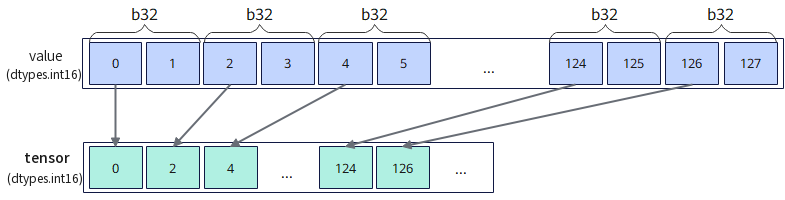

# `vstore_pack`

## 产品支持情况

- Ascend 950PR/Ascend 950DT：支持
- Atlas A3 训练系列产品/Atlas A3 推理系列产品：不支持
- Atlas A2 训练系列产品/Atlas A2 推理系列产品：不支持
- Atlas 200I/500 A2 推理产品：不支持
- Atlas 推理系列产品 AI Core：不支持
- Atlas 推理系列产品 Vector Core：不支持
- Atlas 训练系列产品：不支持

## 功能说明

将矢量数据寄存器中的数据压缩搬出到Unified Buffer（UB）。`mask`用于指示参与搬出的元素，`mask`对应位置为1时，将有效元素的低半部分bit数据写入压缩后对应的目的位置。`mask`对应位置为0时，压缩后对应的目的位置保持原值。掩码寄存器中的数据压缩搬出由[`vmask_store`](./vmask-store.md)（`dist='pack'`）提供。

矢量数据寄存器压缩搬出场景提供以下两种模式：

- **连续对齐搬出模式**：将压缩后的数据搬出到UB起始地址，由用户自行更新目的地址。
- **立即数偏移搬出模式**：通过`dtypes.int32`类型的`offset`指定相对目的起始地址的偏移，偏移单位为**元素**，用户可选择更新偏移或更新目的地址。

以**b32位宽压缩至b16位宽搬出**过程为例，示意图如下：

**图1** 压缩搬出数据



从矢量数据寄存器压缩搬出到UB的接口，根据`mask`将`value`中有效元素的低半部分bit数据连续存储于`tensor`中，支持数据类型为`b16`、`b32`、`b64`。

本接口仅在AIV上生效。

## 函数原型

```python
def vstore_pack(tensor, offset, value: RawVReg, mask: Mask, *, pack_mode, post_update: bool=False) -> None: ...
```

**支持的数据类型：**

`dtype`支持的数据类型为`dtypes.int16`、`dtypes.uint16`、`dtypes.float16`、`dtypes.bfloat16`、`dtypes.int32`、`dtypes.uint32`、`dtypes.float32`、`dtypes.int64`、`dtypes.uint64`。

## 参数说明

**表** 参数说明

| 参数名 | 输入/输出 | 描述 |
| --- | --- | --- |
| `tensor` | 输出 | 目的操作数的起始地址。起始地址需32字节对齐。 |
| `offset` | 输入 | 相对`tensor`起始地址的偏移量，类型为`dtypes.int32`，单位为元素。 |
| `value` | 输入 | 源操作数（矢量数据寄存器）。`dtype`须与`tensor`一致。 |
| `mask` | 输入 | 源操作数掩码（掩码寄存器），用于指示参与搬出的元素。对应位置为1时参与搬出，为0时不参与搬出。 |
| `pack_mode` | 输入 | 压缩模式，取值为`PackMode.PACK_HALF`或`PackMode.PACK_QUARTER`。取值为`PackMode.PACK_HALF`时，将`value`中有效元素的低半部分bit数据写入压缩后对应的目的位置；取值为`PackMode.PACK_QUARTER`时，将`value`中每个32bit的有效元素中低8bit数据写入压缩后对应的目的位置。 |
| `post_update` | 输入 | 是否采用Post Update模式。取值为`True`或`False`，默认值为`False`。取值为`True`时，`offset`仍作为目的地址偏移使用，本接口不更新目的地址指针。 |

## 返回值说明

- 无返回值。

## 约束说明

### 通用约束

- 本接口仅在AIV上生效。
- 本接口需在`cb.vf()`作用域内调用。
- `mask`需通过掩码设置接口预先赋值后再传入，未赋值的掩码寄存器内容不确定，会导致有效元素位置错误。
- 源操作数为矢量数据寄存器，目的操作数为UB地址。UB地址空间外的地址不可作为`tensor`传入。
- UB总容量为256KB，用户可用容量随编译选项与编程场景变化（默认预留6KB SIMD VF栈和2KB 框架预留空间，可用248KB；SIMD+SIMT混编时再划分32KB~128KB作为Data Cache，可用容量进一步减少）。目的操作数地址偏移后对应的UB范围不可超过实际可用容量，否则会报错。
- 如果本指令与其他指令存在UB地址重叠，需要插入同步指令[`vmem_bar`](../reg_sync/vmem-bar.md)，保证多个指令串行化，防止出现异常数据。

### 矢量数据寄存器搬出场景

- `tensor`起始地址需32字节对齐。
- `mask`比特位为1的源操作数元素参与搬出，并将低半部分bit数据写入压缩后对应的目的位置；为0的元素不参与搬出，压缩后对应的目的位置保持原值。
- `offset`的单位为元素，通过`offset`参数偏移后的实际访问地址需落在UB地址范围内，且仍需32字节对齐，否则会报错。

## 调用示例

将代码保存为`vstore_pack.py`后，可通过`python`命令运行。

以下调用示例代码仅Ascend 950PR&950DT系列产品支持。

```python
# Copyright (c) 2026 Huawei Technologies Co., Ltd.
# Licensed under the CANN Open Software License Agreement Version 2.0.

import cannbotdsl as cb
import torch
import torch_npu  # noqa: F401  # Register the Ascend NPU backend with PyTorch.


@cb.kernel
def vstore_pack_kernel(src0, dst):
    buf = cb.Channel(cb.MemLoc.UB, (64,), src0.dtype, depth=1)
    out = cb.Channel(cb.MemLoc.UB, (64,), dst.dtype, depth=1)

    cb.mem_copy(buf.produce(), src0)

    in0 = buf.consume()
    res = out.produce()
    with cb.vf(mode="simd"):
        mask = cb.reg.full_mask()
        r = cb.reg.vload(in0, 0)
        cb.reg.vstore_pack(res, 0, r, mask, pack_mode=cb.reg.PackMode.PACK_QUARTER)

    cb.mem_copy(dst, out.consume())


@cb.jit
def run(src0, dst):
    vstore_pack_kernel[1](src0, dst)


src0 = (torch.arange(64, dtype=torch.int32, device="npu:0") + 1) * 256 + 7
dst = torch.zeros((64,), dtype=torch.int8, device="npu:0")
expected = torch.full((64,), 7, dtype=torch.int8)

run(src0, dst)
torch.npu.synchronize()

assert bool((dst.cpu() == expected).all()), f"pack mismatch: {dst.cpu()[:4].tolist()}"
print("vstore_pack example passed")
print(f"first={int(dst.cpu()[0])}, last={int(dst.cpu()[-1])}")
```

### 预期结果

```text
vstore_pack example passed
first=7, last=7
```
