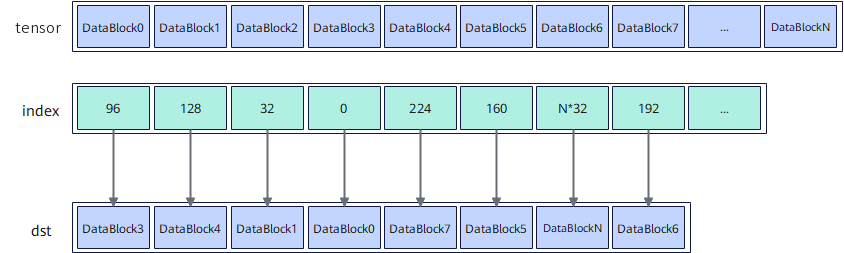

# `vgather_datablock`

## 产品支持情况

- Ascend 950PR/Ascend 950DT：支持
- Atlas A3 训练系列产品/Atlas A3 推理系列产品：不支持
- Atlas A2 训练系列产品/Atlas A2 推理系列产品：不支持
- Atlas 200I/500 A2 推理产品：不支持
- Atlas 推理系列产品 AI Core：不支持
- Atlas 推理系列产品 Vector Core：不支持
- Atlas 训练系列产品：不支持

## 功能说明

给定源操作数在Unified Buffer（UB）中的基地址和索引，根据索引位置将源操作数按DataBlock收集，将结果作为返回值返回。每个DataBlock长度为32B。



其中，index中仅前8个元素有效，每个元素对应一个DataBlock。例如，第一个元素为96（3 * 32），表示选取DataBlock3写入返回值中对应的位置。

本接口仅在AIV上生效。

## 函数原型

```python
def vgather_datablock(tensor, index: RawVReg, *, mask: Mask | None=None) -> RawVReg: ...
```

**支持的数据类型：**

**表1** 支持的数据类型

| dtype | 支持情况 |
|---|---|
| `dtypes.int4x2` | 支持 |
| `dtypes.int8` | 支持 |
| `dtypes.uint8` | 支持 |
| `dtypes.fp4x2_e2m1` | 支持 |
| `dtypes.fp4x2_e1m2` | 支持 |
| `dtypes.hifloat8` | 支持 |
| `dtypes.float8_e8m0` | 支持 |
| `dtypes.float8_e5m2` | 支持 |
| `dtypes.float8_e4m3fn` | 支持 |
| `dtypes.int16` | 支持 |
| `dtypes.uint16` | 支持 |
| `dtypes.float16` | 支持 |
| `dtypes.bfloat16` | 支持 |
| `dtypes.int32` | 支持 |
| `dtypes.uint32` | 支持 |
| `dtypes.float32` | 支持 |
| `dtypes.int64` | 不支持 |
| `dtypes.uint64` | 不支持 |

## 参数说明

**表** 参数说明

| 参数名 | 输入/输出 | 描述 |
| --- | --- | --- |
| `tensor` | 输入 | 源操作数（矢量）的起始地址。 |
| `index` | 输入 | 源操作数（矢量数据寄存器），表示返回值中每个DataBlock在UB中相对于`tensor`的索引位置。索引位置要大于等于0且32B对齐，索引可以存在相同的值。**index仅前8个数有效，单位是字节。** |
| `mask` | 输入 | 源操作数掩码（掩码寄存器）。**DataBlock搬运的有效指示，按b32格式解释。一个DataBlock对应4bit，仅每4bit中的最低位有效。由于index仅前8个元素有效，因此mask仅使用前8个b32元素对应的bit 0、4、8、12、16、20、24、28，分别控制返回值中DataBlock0至DataBlock7是否更新，其余bit无效。** |

## 返回值说明

- 返回收集结果，返回值类型与源操作数`tensor`的数据类型一致。

## 约束说明

- b64数据类型属于编译器软件仿真实现，本接口不做支持。
- 源操作数在UB中的起始地址需要32B对齐。
- 索引位置要大于等于0且32B对齐，即一个索引值对应一个DataBlock。
- 索引可以存在相同的值，即可以多次读取源操作数中同一个DataBlock的数据。
- 索引值对应的数据必须在UB有效地址范围内。
- index仅前8个元素有效。

## 调用示例

将代码保存为`vgather_datablock.py`后，可通过`python`命令运行。

以下调用示例代码仅Ascend 950PR&950DT系列产品支持。

```python
# Copyright (c) 2026 Huawei Technologies Co., Ltd.
# Licensed under the CANN Open Software License Agreement Version 2.0.

import cannbotdsl as cb
import torch
import torch_npu  # noqa: F401  # Register the Ascend NPU backend with PyTorch.


@cb.kernel
def vgather_datablock_kernel(src0, index, dst):
    buf = cb.Channel(cb.MemLoc.UB, shape=(256,), dtype=src0.dtype, depth=1)
    idx = cb.Channel(cb.MemLoc.UB, shape=(64,), dtype=cb.dtypes.uint32, depth=1)
    out = cb.Channel(cb.MemLoc.UB, shape=(256,), dtype=dst.dtype, depth=1)

    cb.mem_copy(buf.produce(), src0)
    cb.mem_copy(idx.produce(), index)

    src = buf.consume()
    ind = idx.consume()
    res = out.produce()
    with cb.vf(mode="simd"):
        mask = cb.reg.create_mask(pattern="all", elem_bits=32)
        blocks = cb.reg.vgather_datablock(src, cb.reg.vload(ind, 0), mask=mask)
        cb.reg.vstore(res, 0, blocks, cb.reg.create_mask(pattern="all", elem_bits=8))

    cb.mem_copy(dst, out.consume())


@cb.jit
def run(src0, index, dst):
    vgather_datablock_kernel[1](src0, index, dst)


src0 = torch.arange(256, dtype=torch.uint8).to("npu:0")
index = torch.zeros(64, dtype=torch.int32, device="npu:0")
index[:8] = torch.arange(224, -1, -32, dtype=torch.int32, device="npu:0")
dst = torch.empty((256,), dtype=torch.uint8).to("npu:0")

run(src0, index.view(torch.uint32), dst)
torch.npu.synchronize()

torch.testing.assert_close(dst.cpu(), src0.cpu().reshape(8, 32).flip(0).reshape(-1))
print("vgather_datablock example passed")
print(f"first={int(dst.cpu()[0])}, last={int(dst.cpu()[-1])}")
```

### 预期结果

```text
vgather_datablock example passed
first=224, last=31
```
