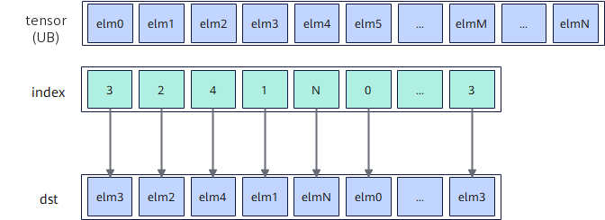
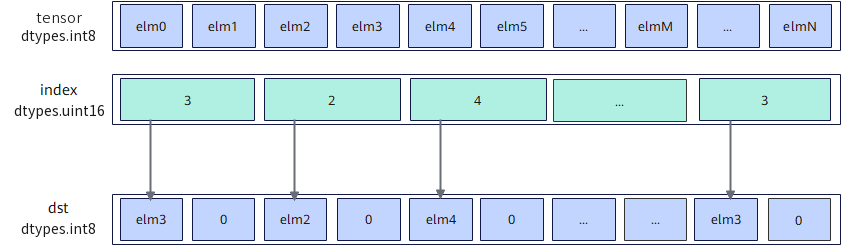

# `vgather`

## 产品支持情况

- Ascend 950PR/Ascend 950DT：支持
- Atlas A3 训练系列产品/Atlas A3 推理系列产品：不支持
- Atlas A2 训练系列产品/Atlas A2 推理系列产品：不支持
- Atlas 200I/500 A2 推理产品：不支持
- Atlas 推理系列产品 AI Core：不支持
- Atlas 推理系列产品 Vector Core：不支持
- Atlas 训练系列产品：不支持

## 功能说明

根据索引位置`index`将源操作数`tensor`按元素收集，将结果作为返回值返回。

**UB源收集模式**：源操作数为Unified Buffer（UB）地址，收集结果为矢量数据寄存器。按`index`矢量寄存器中保存的逐元素索引，从UB中读取对应位置的元素写入返回值对应位置，受`mask`掩码控制；`mask`比特位为0的位置对应返回值位置写0。

**图 1**  UB源收集模式



本接口仅在AIV上生效。

## 函数原型

```python
def vgather(tensor, index: RawVReg, *, mask: Mask) -> RawVReg: ...
```

**支持的数据类型：**

数据类型组合列表
**表1** UB源收集模式支持数据类型组合列表

| dst_dtype | src_dtype | index_dtype |
| :---------- | :---------- | :-------------- |
| `dtypes.int16` | `dtypes.int8` | `dtypes.uint16` |
| `dtypes.uint16` | `dtypes.uint8` | `dtypes.uint16` |
| `dtypes.hifloat8` | `dtypes.hifloat8` | `dtypes.uint16` |
| `dtypes.float8_e8m0` | `dtypes.float8_e8m0` | `dtypes.uint16` |
| `dtypes.float8_e5m2` | `dtypes.float8_e5m2` | `dtypes.uint16` |
| `dtypes.float8_e4m3fn` | `dtypes.float8_e4m3fn` | `dtypes.uint16` |
| `dtypes.int16` | `dtypes.int16` | `dtypes.uint16` |
| `dtypes.int16` | `dtypes.int16` | `dtypes.uint32` |
| `dtypes.uint16` | `dtypes.uint16` | `dtypes.uint16` |
| `dtypes.uint16` | `dtypes.uint16` | `dtypes.uint32` |
| `dtypes.float16` | `dtypes.float16` | `dtypes.uint16` |
| `dtypes.float16` | `dtypes.float16` | `dtypes.uint32` |
| `dtypes.bfloat16` | `dtypes.bfloat16` | `dtypes.uint16` |
| `dtypes.bfloat16` | `dtypes.bfloat16` | `dtypes.uint32` |
| `dtypes.int32` | `dtypes.int32` | `dtypes.uint32` |
| `dtypes.uint32` | `dtypes.uint32` | `dtypes.uint32` |
| `dtypes.float32` | `dtypes.float32` | `dtypes.uint32` |

> 说明：`tensor`为`dtypes.int8`或`dtypes.uint8`时，返回值类型分别为`dtypes.int16`或`dtypes.uint16`，不会返回b8数据类型。

## 参数说明

**表** 参数说明

| 参数名 | 输入/输出 | 描述 |
| --- | --- | --- |
| `tensor` | 输入 | 源操作数（矢量）的起始地址。在UB中的起始地址需要32B对齐，须落在UB地址空间内。 |
| `index` | 输入 | 数据索引（矢量数据寄存器）。返回值中每个元素在UB中相对于`tensor`的索引位置，单位是元素个数。 |
| `mask` | 输入 | 源操作数掩码（掩码寄存器）。mask用于指示在计算过程中哪些元素参与计算。对应位置为1时参与计算，为0时不参与计算。mask未筛选的元素在输出中置零。 |

## 返回值说明

- 返回收集结果，返回值类型与源操作数`tensor`的数据类型一致；`tensor`为`dtypes.int8`或`dtypes.uint8`时，返回值类型分别为`dtypes.int16`或`dtypes.uint16`。

## 约束说明

### 通用约束

- 本接口需在`cb.vf()`作用域内调用，源操作数为UB地址、收集结果为矢量数据寄存器。
- `mask`需通过掩码设置接口预先赋值后再传入，未赋值的掩码寄存器内容不确定，会导致有效元素位置错误。

### UB源收集模式约束

- UB地址空间外的指针不可作为`tensor`传入，源操作数在UB中的起始地址需要32B对齐。
- 对于`mask`筛选需要搬运的元素，对应的地址需要在UB有效范围内；对于`mask`未筛选的元素，对应的地址不会触发任何地址越界异常，同时返回值中对应的元素将被置零。
- 当`tensor`为b8数据类型，返回值为b16数据类型时，实现是编译器的软件仿真实现。返回值的低8位与源操作数相同，高8位自动补0。例如`tensor`为`dtypes.int8`数据类型，返回值为`dtypes.int16`数据类型：

    src：40 = 0b00101000 -> 0b0000000000101000，扩充至16位后等于40，即对应返回值为40；

    src：-40 = 0b11011000 -> 0b0000000011011000，扩充至16位后等于216，即对应返回值为216。

- 当`tensor`与返回值数据类型一致，但是与`index`数据类型不一致时，数据写入返回值索引为偶数的位置，奇数索引位置置零。例如`tensor`为`dtypes.int8`数据类型，`index`为`dtypes.uint16`数据类型时，适用场景如下图：



## 调用示例

将代码保存为`vgather.py`后，可通过`python`命令运行。

以下调用示例代码仅Ascend 950PR&950DT系列产品支持。

```python
# Copyright (c) 2026 Huawei Technologies Co., Ltd.
# Licensed under the CANN Open Software License Agreement Version 2.0.

import cannbotdsl as cb
import torch
import torch_npu  # noqa: F401  # Register the Ascend NPU backend with PyTorch.


@cb.kernel
def vgather_kernel(src0, index, dst):
    buf = cb.Channel(cb.MemLoc.UB, shape=(64,), dtype=src0.dtype, depth=1)
    idx = cb.Channel(cb.MemLoc.UB, shape=(64,), dtype=cb.dtypes.uint32, depth=1)
    out = cb.Channel(cb.MemLoc.UB, shape=(64,), dtype=dst.dtype, depth=1)

    cb.mem_copy(buf.produce(), src0)
    cb.mem_copy(idx.produce(), index)

    src = buf.consume()
    ind = idx.consume()
    res = out.produce()
    with cb.vf(mode="simd"):
        mask = cb.reg.full_mask()
        gathered = cb.reg.vgather(src, cb.reg.vload(ind, 0), mask=mask)
        cb.reg.vstore(res, 0, gathered, mask)

    cb.mem_copy(dst, out.consume())


@cb.jit
def run(src0, index, dst):
    vgather_kernel[1](src0, index, dst)


src0 = torch.arange(64, dtype=torch.int32, device="npu:0") * 10
index = torch.arange(63, -1, -1, dtype=torch.int32, device="npu:0").view(torch.uint32)
dst = torch.empty_like(src0)

run(src0, index, dst)
torch.npu.synchronize()

torch.testing.assert_close(dst.cpu(), src0.cpu()[index.cpu().to(torch.int32)])
print("vgather example passed")
print(f"first={int(dst.cpu()[0])}, last={int(dst.cpu()[-1])}")
```

### 预期结果

```text
vgather example passed
first=630, last=0
```
