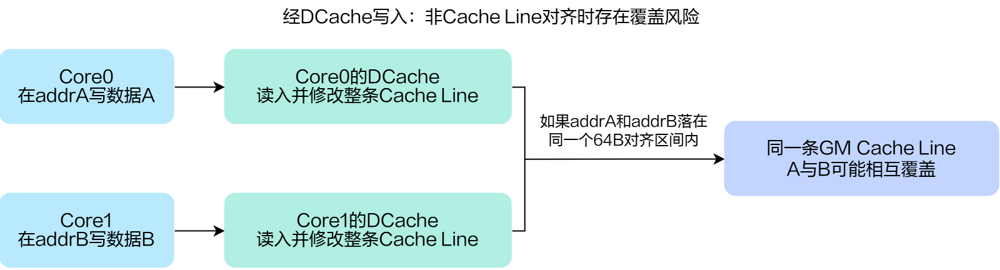

# `vec_store_bypass`

## 产品支持情况

- Ascend 950PR/Ascend 950DT：支持
- Atlas A3 训练系列产品/Atlas A3 推理系列产品：不支持
- Atlas A2 训练系列产品/Atlas A2 推理系列产品：不支持
- Atlas 200I/500 A2 推理产品：不支持
- Atlas 推理系列产品 AI Core：不支持
- Atlas 推理系列产品 Vector Core：不支持
- Atlas 训练系列产品：不支持

## 功能说明

不经过DCache向GM地址上写数据。

当多核操作GM地址时，如果数据无法对齐到Cache Line，经过DCache的方式下，由于按照Cache Line大小进行读写，会导致多核数据随机覆盖的问题。此时，可以采用不经过DCache直接读写GM地址的方式，从而避免上述随机覆盖的问题。



本接口在 Mix 模式下由 Vector Core（AIV）执行，两个 Vector 子核都会执行本接口，仅用于指定执行侧，不建立任何顺序、可见性、栅栏或 Mix 级同步协议。

## 函数原型

```python
def vec_store_bypass(ptr, value) -> None: ...
```

**支持的数据类型：**

`dtypes.int8`、`dtypes.uint8`、`dtypes.int16`、`dtypes.uint16`、`dtypes.int32`、`dtypes.uint32`、`dtypes.int64`、`dtypes.uint64`。

## 参数说明

**表** 参数说明

| 参数名 | 输入/输出 | 描述 |
| --- | --- | --- |
| `ptr` | 输出 | 目标GM地址。 |
| `value` | 输入 | 待写入目标的数据。 |

## 返回值说明

- 无返回值。

## 约束说明

- `ptr`起始地址须按写入`dtype`字节数对齐。
- `ptr`须落在GM可访问地址空间内。
- 本接口运行在标量流水上，与后续依赖该写入结果的指令之间存在标量数据依赖；如后续有读取同一GM地址的指令，须通过同步指令建立依赖顺序，标量流水本身的顺序执行不保证跨指令访存可见性。
- 两个 Vector 子核都会执行本接口，若要求只由一个 Vector 子核写入，需通过 [`get_subblock_id()`](../../system/get-subblock-id.md) 判断，仅在返回值为 `0` 的子核上调用本接口。
- 本接口访问GM时绕过DCache，不维护缓存一致性。若其他核或其他通路通过缓存访问同一GM地址，调用方需使用`dcci_single`/`dci`清理或失效对应Cache Line，并保证相关访存操作的执行顺序和数据可见性。

## 调用示例

将代码保存为`vec_store_bypass.py`后，可通过`python`命令运行。

以下调用示例代码仅Ascend 950PR&950DT系列产品支持。

```python
# Copyright (c) 2026 Huawei Technologies Co., Ltd.
# Licensed under the CANN Open Software License Agreement Version 2.0.

import cannbotdsl as cb
import torch
import torch_npu  # noqa: F401  # Register the Ascend NPU backend with PyTorch.


@cb.kernel
def vec_store_bypass_kernel(dst):
    cb.scalar.vec_store_bypass(dst.ptr(0), 42)


@cb.jit
def run(dst):
    vec_store_bypass_kernel[1](dst)


dst = torch.zeros((1,), dtype=torch.int32, device="npu:0")

run(dst)
torch.npu.synchronize()

result = int(dst.cpu()[0])
assert result == 42, result
print("vec_store_bypass example passed")
print(f"stored={result}")
```

### 预期结果

```text
vec_store_bypass example passed
stored=42
```
