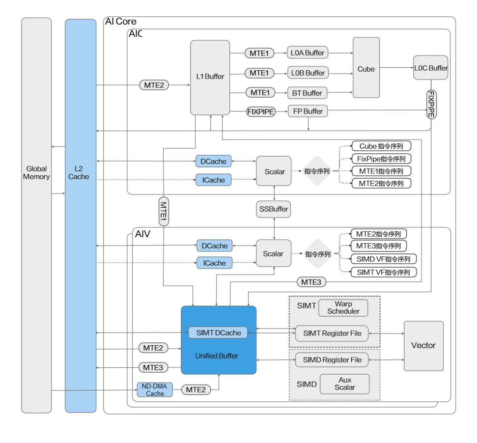

# 系统缓存概述

## Cache类型

Cache（缓存）的主要作用是在搬运单元或Scalar单元与外部存储之间提供一层高速缓冲，以降低数据访问延迟并提高带宽利用率。通常情况下，被频繁访问的数据会写入Cache，搬运单元或Scalar单元在执行过程中优先从Cache中读取数据；当Cache未命中时，再从外部存储加载数据并更新到Cache中。

表1展示了不同类型的Cache的功能，其中Data Cache（DCache）和Instruction Cache（ICache）分别用于缓存数据和指令。Ascend 950PR/Ascend 950DT支持的Cache类型如下：

以NPU架构版本3510为例，图1展示了AI Core中支持的五类Cache（L2 Cache、DCache、ICache、SIMT DCache、NDDMA Cache）在硬件架构中的位置关系。

**图1** 五类Cache在AI Core中的位置关系示意图

**表1** Cache类型及功能说明

| Cache类型 | 说明 |
|------------|------|
| L2 Cache | L2 Cache作为二级缓存，专门用于存储频繁访问的数据和指令，以便减少对GM的读写。 &bull;通过MTE2单元读取GM时，优先从L2 Cache中读取数据；当L2 Cache未命中时，再从GM加载数据并更新到L2 Cache中。 &bull;通过Scalar单元读取GM时，优先从DCache中读取数据；当DCache未命中时，再从L2 Cache中读取数据。当L2 Cache也未命中时，再从GM加载数据并更新到L2 Cache和DCache中。 &bull;通过Scalar单元读取GM指令时，优先从ICache中读取指令；当ICache未命中时，再从L2 Cache中读取指令。当L2 Cache也未命中时，再从GM加载指令并更新到L2 Cache和ICache中。 |
| DCache | DCache用于缓存Scalar单元近期可能被重复访问的数据段。 通过Scalar单元读取GM时，优先从DCache中读取数据；当DCache未命中时，再从L2 Cache中读取数据。当L2 Cache也未命中时，再从GM加载数据并更新到L2 Cache和DCache中。 |
| ICache | ICache用于缓存Scalar单元最近使用或频繁使用的指令。 通过Scalar单元读取GM指令时，优先从ICache中读取指令；当ICache未命中时，再从L2 Cache中读取指令。当L2 Cache也未命中时，再从GM加载指令并更新到L2 Cache和ICache中。 |
| SIMT DCache | SIMT访问GM需要经过SIMT DCache中转。数据流经由GM到SIMT DCache，再从SIMT DCache到SIMT寄存器，SIMT DCache充当中间缓冲层，减少对GM的直接访问次数。 |
| NDDMA Cache | NDDMA Cache用于缓存最近或即将被[`mem_copy`](/api/kernel/data-movement/mem-copy)（`kind="nddma"`）接口搬运的数据。 |

## Cache操作及使用场景

表2介绍了缓存的四种基础操作及其核心功能。

**表2** Cache操作及功能说明

| 操作名称 | 功能说明 |
|---------|---------|
| Prefetch | 硬件根据访问模式自动将预期访问的数据提前加载到缓存，提升后续访问速度。 |
| Preload | 软件通过显式指令将指定数据主动加载到缓存，为即将到来的读写操作做准备。 |
| Invalid | &bull;将指定地址范围的Cache Line（缓存的最小操作单元）标记为"无效"，使其从缓存中移除。 &bull;保证下一次访问这些内存地址时，会从GM重新加载数据，而不是使用可能过期的缓存数据。 &bull;注意：Invalid操作不检查缓存行是否为"脏"（dirty，表示该数据已被修改但尚未写回到GM），若存在脏数据将被直接丢弃。 |
| Clean | 将缓存中被修改过的数据（脏数据）写回到GM中，避免数据丢失。Clean操作不将缓存行标记为"无效"，缓存行仍保持有效状态。 |

## Cache写策略与Cache一致性问题

当向GM写入数据，并且启用Cache时，存在以下两种Cache写策略：延迟写回（Write-Back）和直写（Write-Through）。

当向GM写数据时采取延迟写回策略，工作原理如下：

- 开发者预期向GM写入数据（即期望数据直接写入GM），硬件实际行为是：
    - 当数据被修改时，只在缓存中更新数据。
    - 缓存中的数据标记为"脏"。
    - 当该Cache Line被替换时（或通过软件显式执行Clean操作时），数据才会被写回GM，Cache Line何时被替换由硬件决定。

- 替换Cache Line数据时：
    - 当缓存空间不足需要替换数据时，检查被替换的数据是否为"脏"。
    - 如果是"脏"数据，先将其写回到GM，然后再将该Cache Line替换出缓存。

当向GM写入数据时，若采用直写（Write-Through）策略，其工作原理如下：

- 开发者预期向GM写入数据（即期望数据直接写入GM），硬件实际行为是：
    - 当数据被修改时，立即在缓存和GM中更新数据。
    - 缓存行无需标记为"脏"。

- 替换Cache Line数据时：

    由于每次写数据都同步更新GM，因此缓存中的数据不存在"脏"状态，也无需在替换时额外写回GM。

在延迟写回策略下，被修改的数据仅更新在本地缓存中，不会立即同步到GM。当其他核读取GM上同一地址时，获取的将是过时数据，从而导致不同核间缓存数据不一致。
Cache一致性是多核中确保数据正确性的核心机制。简单来说，当多个核各自拥有独立的Cache时，它们可能同时缓存相同的数据。如果某个核修改了缓存中的数据，其他核的缓存副本就会变得“过时”，如果不及时同步，就会导致多个核间的数据不一致，进而引发计算错误。

下面介绍每种类型Cache是否需要考虑多核间数据不一致：

- 针对NPU架构版本3510，该产品支持的五类Cache在多核间数据一致性方面的情况如下：
    - L2 Cache：多核间共享的缓存，因此不需要考虑多核间数据不一致的问题。
    - DCache：多核独立缓存，因此需要考虑多核间数据一致性的问题。
    - ICache：只读，因此不需要考虑多核间数据不一致的问题。
    - NDDMA Cache：多核独立缓存，因此需要考虑多核间数据一致性的问题。
    - SIMT DCache：在SIMT中，写入数据时会立即写入GM，不存在一致性问题；从GM读取数据时，多核独立缓存，需要考虑多核间数据一致性的问题。

## 缓存控制接口汇总

表3按照Cache类型（L2 Cache、DCache、NDDMA Cache）汇总了与缓存控制相关的接口及其功能说明。

**表3** 缓存控制接口汇总

| Cache类型 | 接口名称 | 功能简述 |
|-----------|---------|---------|
| L2 Cache | [`mem_copy`](/api/kernel/data-movement/mem-copy)（数据搬运，读GM） | 以该接口为例，从GM读数据的数据搬运接口，可通过`l2_cache_ctl`入参控制L2 Cache模式；部分搬运接口支持该入参，具体以各搬运接口的参数说明为准。 |
| L2 Cache | [`mem_copy`](/api/kernel/data-movement/mem-copy)（数据搬运，写GM） | 以该接口为例，向GM写数据的数据搬运接口，可通过`l2_cache_ctl`入参控制L2 Cache模式；部分搬运接口支持该入参，具体以各搬运接口的参数说明为准。 |
| DCache | [`dcci_single`](/api/kernel/synchronization-cache/dcci-single) [`dcci_entire_out`](/api/kernel/synchronization-cache/dcci-entire-out) [`dcci_entire_atomic`](/api/kernel/synchronization-cache/dcci-entire-atomic) [`dci`](/api/kernel/synchronization-cache/dci) | 当Scalar单元访问GM时，按接口操作类型刷新Cache以保证一致性。读取可能被其他核修改的数据，或要求Scalar写入立即对外可见时，需要结合访问顺序选择清理、失效或清理并失效操作。 |
| DCache | [`load_bypass`](/api/kernel/scalar_compute/scalar_load/load-bypass) [`vec_store_bypass`](/api/kernel/scalar_compute/scalar_store/vec-store-bypass) [`cube_store_bypass`](/api/kernel/scalar_compute/scalar_store/cube-store-bypass) | `load_bypass`不经过DCache从GM地址上读数据；`vec_store_bypass`/`cube_store_bypass`不经过DCache向GM地址上写数据。当多核操作GM地址时，若数据无法对齐到Cache Line，经过DCache的读写以Cache Line为粒度，可能引发多核数据随机覆盖问题，使用这些接口不经过DCache直接读写GM可避免此问题。 |
