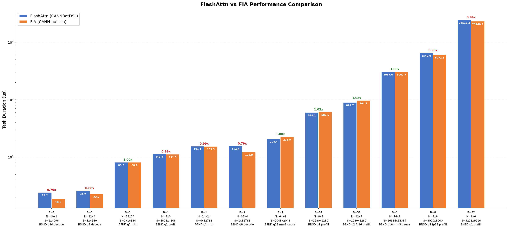

# Flash Attention

基于 CANNBotDSL 实现的 Flash Attention 算子，支持全注意力和因果注意力，面向 Ascend NPU。

## 算子介绍

计算公式：

$$
O = softmax(Q @ K^T * scale) @ V
$$

| 特性与约束 | 说明 |
| :--- | :--- |
| mask_mode | 0=全注意力，3=right-context causal |
| 数据类型 | float16、bfloat16（Q/K/V/O 一致） |
| Layout | BNSD [B,N,S,D]、BSND [B,S,N,D] |
| GQA | 支持，N1 须为 N2 的整数倍 |
| D | 128 |
| 支持架构 | NPU ARCH 3510（Ascend 950PR / Ascend 950DT） |

实现详见 `flash_attn.py`。

## 快速开始

```bash
source /home/<user>/Ascend/cann-9.1.0/set_env.sh
```

```python
import math
import torch
import torch_npu
from cannbotdsl import dtypes
from flash_attn import flash_attn

B, N1, N2, S1, S2, D = 1, 32, 4, 2048, 2048, 128
dtype = torch.bfloat16

q = torch.randn(B, S1, N1, D, dtype=dtype).npu()   # (B, S1, N1, D) BSND
k = torch.randn(B, S2, N2, D, dtype=dtype).npu()   # (B, S2, N2, D) BSND
v = torch.randn(B, S2, N2, D, dtype=dtype).npu()   # (B, S2, N2, D) BSND

scale = 1.0 / math.sqrt(D)
o = flash_attn(q, k, v, scale, mask_mode=3, layout_q="BSND", layout_kv="BSND", layout_out="BSND", dtype=dtypes.bfloat16)
```

`flash_attn()` 关键参数：

| 参数 | 默认值 | 说明 |
| :--- | :---: | :--- |
| `query` | — | Query 张量，shape `(B, N1, S1, D)` 或 `(B, S1, N1, D)`，由 layout_q 决定 |
| `key` | — | Key 张量，shape `(B, N2, S2, D)` 或 `(B, S2, N2, D)`，由 layout_kv 决定 |
| `value` | — | Value 张量，shape 同 key |
| `scale` | — | Softmax 缩放因子，通常为 `1/sqrt(D)` |
| `mask_mode` | 0 | 0=全注意力，3=right-context causal |
| `attn_mask` | None | causal mask 张量（2048x2048, float32），mask_mode=3 时传入 |
| `layout_q` | BNSD | Query 布局："BNSD" 或 "BSND" |
| `layout_kv` | BNSD | Key/Value 布局："BNSD" 或 "BSND" |
| `layout_out` | BNSD | 输出布局："BNSD" 或 "BSND" |
| `dtype` | `dtypes.float16` | 计算精度：`dtypes.float16` 或 `dtypes.bfloat16` |
| 返回值 `o` | — | Attention 输出，shape 与 query 相同，dtype 与输入一致 |

## 精度测试

测试脚本位于 `test/flash_attn/test_flash_attn.py`，需在 NPU 环境下运行。

```bash
pytest test/flash_attn/test_flash_attn.py -v
```

包含 12 个代表性 case，比对 CPU golden，覆盖以下场景：

- **dtype**：float16、bfloat16
- **layout**：BNSD、BSND
- **mask_mode**：0（全注意力）、3（causal）
- **group size**：g=1（MHA）、g=2、g=8、g=10、g=16
- **场景**：prefill、decode（S1=1）、MTP（1<S1≤4）、causal
- **耗时范围**：小 case（~25us）到大 case（~24000us）

精度容差：float16 atol/rtol=1e-3，bfloat16 atol/rtol=2e-2。

## 性能对比



FlashAttn (CANNBotDSL) 与 FIA (CANN built-in) 在 12 个典型 case 上的性能对比（msprof 采集，按 FlashAttn 耗时升序排列）。
