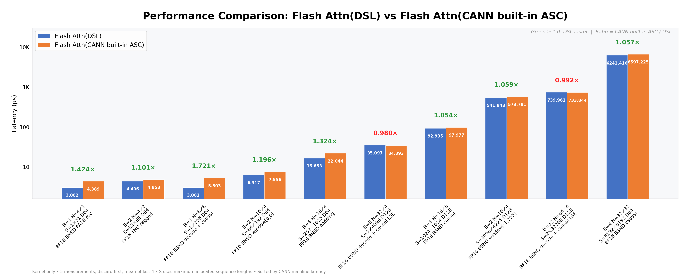

# Flash Attention

基于 CANNBot-DSL 实现的 Flash Attention 算子，支持全注意力、right-context causal、
滑动窗口、变长序列和 paged KV cache，面向 Ascend NPU。

## 算子介绍

计算公式：

$$
O = softmax(Q @ K^T * scale) @ V
$$

| 特性与约束 | 说明 |
| :--- | :--- |
| mask_mode | 0=全注意力，3=right-context causal，4=滑动窗口 |
| 数据类型 | float16、bfloat16（Q/K/V/O 一致）；LSE 为 float32 |
| Layout | BNSD [B,N,S,D]、BSND [B,S,N,D]、TND [T,N,D]（变长） |
| GQA | 支持，N1 须为 N2 的整数倍 |
| D | 64、128（Q/K/V 的 D 相同） |
| Paged KV | PA_BNBD、PA_BBND、PA_NZ |
| 支持架构 | NPU ARCH 3510（Ascend 950PR / Ascend 950DT） |

本目录提供以下文件：

- `flash_attn.py`：注意力计算入口。
- `flash_attn_metadata.py`：生成分核调度 metadata。
- `flash_attn_validation.py`：输入参数校验。

调用时先生成 metadata，再将其与相同的布局、head 数和序列参数传给
`flash_attn`。支持 Split-KV，分块由算子内部自动选择。

## 快速开始

安装与项目兼容的 `cannbotdsl`、`torch` 和 `torch_npu`，
加载 CANN 环境后，在仓库根目录执行以下示例。

```bash
source /path/to/CANN/set_env.sh  # 替换为实际 CANN 安装路径
export PYTHONPATH="$PWD/samples/flash_attn:$PYTHONPATH"
```

```python
import math
import torch
import torch_npu
from cannbotdsl import dtypes
from flash_attn import flash_attn
from flash_attn_metadata import flash_attn_metadata

B, N1, N2, S1, S2, D = 1, 32, 4, 2048, 2048, 128
dtype = torch.bfloat16

q = torch.randn(B, S1, N1, D, dtype=dtype).npu()   # (B, S1, N1, D) BSND
k = torch.randn(B, S2, N2, D, dtype=dtype).npu()   # (B, S2, N2, D) BSND
v = torch.randn(B, S2, N2, D, dtype=dtype).npu()   # (B, S2, N2, D) BSND

scale = 1.0 / math.sqrt(D)
attn_mask = torch.triu(torch.ones(2048, 2048, dtype=torch.int8), diagonal=1).npu()
attrs = dict(max_seqlen_q=S1, max_seqlen_kv=S2, mask_mode=3,
             layout_q="BSND", layout_kv="BSND", layout_out="BSND")
metadata = flash_attn_metadata(N1, N2, D, batch_size=B, **attrs)
o, lse = flash_attn(q, k, v, metadata=metadata, softmax_scale=scale,
                   attn_mask=attn_mask, return_softmax_lse=True,
                   dtype=dtypes.bfloat16, **attrs)
```

## 接口说明

### `flash_attn_metadata()`

生成注意力计算所需的调度信息，返回一维 int32 NPU tensor。
前三个参数为 Q head 数、KV head 数和 head dimension，其余参数通过关键字传入。

| 参数 | 默认值 | 说明 |
| :--- | :---: | :--- |
| `num_heads_q / num_heads_kv` | — | Q/KV head 数，Q head 数须为 KV head 数的整数倍 |
| `head_dim` | — | head dimension，当前允许 64、128 |
| `batch_size` | -1 | 无 Q 序列输入时必须提供 |
| `cu_seqlens_q / cu_seqlens_kv` | None | TND 变长序列的物理累积长度，带前导 0，长度为 `B+1` |
| `seqused_q / seqused_kv` | None | 逐 batch 有效长度，长度为 `B`；PA 场景必须提供 `seqused_kv` |
| `max_seqlen_q / max_seqlen_kv` | -1 | 最大序列长度，须与 `flash_attn` 使用一致的值 |
| `mask_mode` | 0 | 0=全注意力，3=right-context causal，4=滑动窗口 |
| `win_left / win_right` | -1 | 滑动窗口范围，-1 表示对应方向无限制 |
| `layout_q / layout_kv / layout_out` | BSND | 布局，须与后续 `flash_attn` 调用一致 |

TND Q 必须提供 `cu_seqlens_q`；PA KV 必须提供 `seqused_kv`，
且 `cu_seqlens_kv` 必须为 `None`。

### `flash_attn()`

执行注意力计算，返回 `(o, lse)`；`return_softmax_lse=False` 时
`lse` 为 `None`。

| 参数 | 默认值 | 说明 |
| :--- | :---: | :--- |
| `query` | — | Query 张量；dense 为 `(B,N1,S1,D)` / `(B,S1,N1,D)`，TND 为 `(Tq,N1,D)` |
| `key` | — | Key 张量，shape 由 `layout_kv` 决定 |
| `value` | — | Value 张量，shape 同 key |
| `metadata` | None | 与当前布局和序列参数匹配的 int32 NPU metadata |
| `block_table` | None | PA 专用，连续 NPU int32 `(B, max_blocks_per_seq)` |
| `softmax_scale` | 1.0 | Softmax 缩放因子，通常为 `1/sqrt(D)`，使用关键字传入 |
| `mask_mode` | 0 | 0=全注意力，3=right-context causal，4=滑动窗口 |
| `attn_mask` | None | 连续 NPU int8 上三角 mask 模板（2048x2048，1 表示遮挡），mask_mode=3/4 时传入 |
| `layout_q` | BSND | Query 布局："BNSD"、"BSND" 或 "TND" |
| `layout_kv` | BSND | Key/Value 布局："BNSD"、"BSND"、"TND"、"PA_BNBD"、"PA_BBND" 或 "PA_NZ" |
| `layout_out` | BSND | 输出布局："BNSD"、"BSND" 或 "TND" |
| `cu_seqlens_q` | None | TND Q 的物理前缀和，连续 NPU int32，带前导 0 |
| `cu_seqlens_kv` | None | 仅 TND：KV 的物理前缀和，连续 NPU int32，须独立传入 |
| `seqused_q` | None | 每 batch 实际 Q 长度，连续 NPU int32；TND 时**可小于** cu 差值，也支持 dense padding |
| `seqused_kv` | None | 每 batch 实际 KV 长度，连续 NPU int32；缺省使用物理长度 |
| `dtype` | `dtypes.float16` | 计算精度：`dtypes.float16` 或 `dtypes.bfloat16` |
| `max_seqlen_q / max_seqlen_kv` | -1 | 示例中显式给出最大物理长度，须与 metadata 参数一致 |
| `win_left / win_right` | -1 | mask_mode=4 的左右窗口；-1 表示对应方向无限制，模式 0/3 保持 -1 |
| `return_softmax_lse` | False | 是否输出 LSE |
| `o_workspace / lse_workspace` | None | 可选 split-KV workspace，缺省自动分配 |
| 返回值 `(o, lse)` | — | O 按 layout_out 排列，dtype 与输入一致；关闭 LSE 时第二项为 None |
| `lse` | — | 连续 FP32；dense 为 (B,N1,S1)，TND 为 (N1,T)；无效行和 padding 为 +inf |

## 精度测试

功能测试与 CPU FP32 reference 比较，覆盖不同数据类型、布局、mask、
变长序列和分页 KV，并分别检查开启和关闭 LSE 的结果。
在仓库根目录运行：

```bash
source /path/to/CANN/set_env.sh
python -m pytest test/flash_attn/test_flash_attn.py -v
python -m pytest test/flash_attn/test_flash_attn_metadata.py -v
```

## 性能对比



图中展示 10 个用例的 kernel 性能，按 CANN 主线耗时从小到大排列。
加速比为 CANN built-in ASC / DSL，大于 1 表示 DSL 更快；
耗时单位为 μs，不包含 metadata 和端到端开销。
