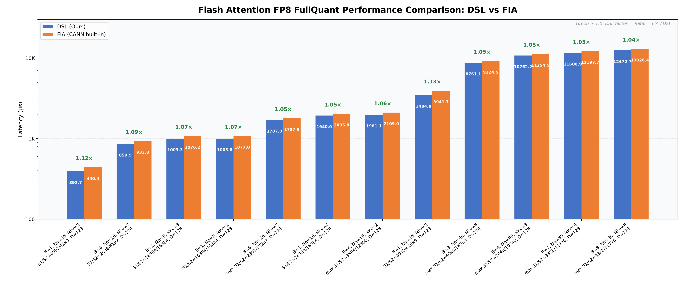

# Flash Attention FP8 FullQuant

基于 CANNBotDSL 实现的 FP8 全量化 Attention 算子，支持 GQA、PageAttention KV cache、全注意力和因果注意力，面向 Ascend NPU。

## 算子介绍

计算过程：

$$
S = (Q_{fp8} @ K_{fp8}^{T}) \cdot deqQ \cdot deqK \cdot scale
$$

$$
P_{fp8} = cast_{fp8}(exp(S-m)), \qquad O = acc \cdot deqV / l
$$

其中 `m`、`l` 和 `acc` 按 KV 块在线更新，分别表示运行最大值、指数和与输出分子；`acc` 累加经过最大值修正的 `P_fp8 @ V_fp8`。`quant_scale_p` 通过最大值偏移 `-log(quant_scale_p)` 控制 P 的量化幅度，分母使用量化前的指数和。

| 特性与约束 | 说明 |
| :--- | :--- |
| mask_mode | `on`：右下对齐 causal；`off`：全注意力，仍屏蔽 KV 尾块 padding |
| 数据类型 | Q/K/V/P：FP8 E4M3FN；反量化 scale：float32；输出：float16 |
| Layout | Q/O 支持 BNSD `[B,Nq,S1,D]`、TND `[T,Nq,D]`；K/V 使用分页 cache |
| GQA | 支持，`Nq` 须为 `Nkv` 的整数倍；二者相等时为 MHA |
| D | 128 |
| 分块 | Q tile 128 行，KV tile 256 行，物理 cache block 128 行 |
| 变长输入 | TND 支持不同 batch 长度和非整块尾部 |
| 支持架构 | NPU ARCH 3510（Ascend 950PR / Ascend 950DT） |

实现详见 [flash_attn_fp8_fullquant.py](flash_attn_fp8_fullquant.py)。分核区间和序列边界由 Host tiling 根据 shape、核数及 Host 长度参数生成。

## 快速开始

加载实际安装的 CANN 环境，并确保 Python 环境已安装 CANNBotDSL、PyTorch 和 torch_npu。在仓库根目录执行：

```bash
source /path/to/Ascend/cann/set_env.sh
export PYTHONPATH="$PWD/samples/flash_attn_fp8_fullquant:$PYTHONPATH"
```

下面构造 BNSD 输入及两页 KV cache，完成一次调用：

```python
import torch
import torch_npu
from flash_attn_fp8_fullquant import flash_attn_fp8_fullquant

B, Nq, Nkv, S1, S2, D = 1, 8, 2, 128, 256, 128
block_size = 128
fp8 = torch.float8_e4m3fn
torch.manual_seed(0)
q = torch.randn(B, Nq, S1, D)
k = torch.randn(B, Nkv, S2, D)
v = torch.randn(B, Nkv, S2, D)

# Q/K 按 token 量化，V 按 KV head 量化；deq 为反量化尺度。
deq_q = q.abs().amax(dim=-1, keepdim=True).clamp_min(1e-8) / 448
deq_k = k.abs().amax(dim=-1, keepdim=True).clamp_min(1e-8) / 448
deq_v = v.abs().amax(dim=(0, 2, 3), keepdim=True).clamp_min(1e-8) / 448
q8 = (q / deq_q).clamp(-448, 448).to(fp8)
k8 = (k / deq_k).clamp(-448, 448).to(fp8)
v8 = (v / deq_v).clamp(-448, 448).to(fp8)

# 本例 B=1、S2=256，两页按顺序存储；每页尾部预留 4 行。
k_cache = torch.zeros(2, Nkv, block_size + 4, D, dtype=torch.uint8)
v_cache = torch.zeros_like(k_cache)
for page in range(2):
    start, end = page * block_size, (page + 1) * block_size
    k_cache[page, :, :block_size] = k8[0, :, start:end].view(torch.uint8)
    v_cache[page, :, :block_size] = v8[0, :, start:end].view(torch.uint8)
    scale_bytes = deq_k[0, :, start:end, 0].contiguous().view(torch.uint8)
    k_cache[page, :, block_size:] = scale_bytes.reshape(Nkv, 4, D)
block_table = torch.tensor([[0, 1]], dtype=torch.int64)

output = flash_attn_fp8_fullquant(
    q8.npu(), k_cache.npu(), v_cache.npu(), block_table.npu(),
    deq_q.npu(), deq_v.reshape(Nkv).npu(),
    s1=S1, s2=S2, n_kv_heads=Nkv,
    layout="BNSD", mask_mode="on", quant_scale_p=1.0,
)
# output: [1, 8, 128, 128]，torch.float16，位于 NPU。
```

`flash_attn_fp8_fullquant()` 关键参数：

| 参数 | 默认值 | 说明 |
| :--- | :---: | :--- |
| `q_fp8` | — | FP8 Q；BNSD `[B,Nq,S1,D]` 或 TND `[T,Nq,D]` |
| `k_cache_u8` | — | uint8 packed K cache，`[num_blocks,Nkv,132,128]` |
| `v_cache_u8` | — | uint8 packed V cache，shape 与 K cache 相同 |
| `block_table` | — | int64 逻辑块到物理块映射，`[B,max_blocks]` |
| `deq_q` | — | float32 Q 逐 token 反量化尺度；BNSD `[B,Nq,S1,1]`，TND `[Nq,T,1]` |
| `deq_v` | — | float32 V 逐 KV head 反量化尺度，`[Nkv]` |
| `s1` / `s2` | — | Q / KV 最大序列长度 |
| `n_kv_heads` | — | KV head 数量 |
| `scale` | `1/sqrt(D)` | Attention score 缩放因子 |
| `block_dim` | `None` | 启动 Cube 核数；默认自动查询 |
| `mask_mode` | `"on"` | `on`：右下对齐 causal；`off`：全注意力 |
| `layout` | `"BNSD"` | Q 和输出布局，支持 `BNSD`、`TND` |
| `actual_seq` | `None` | 仅 TND：Host 整数列表，Q 累计结束位置，不带前导 0 |
| `actual_seq_kv` | `None` | Host 整数列表，各 batch 的 KV 长度，不是前缀和 |
| `quant_scale_p` | `1.0` | 有限正数，或单元素 float32 Tensor；控制 P 量化幅度 |
| 返回值 `output` | — | shape 与 Q 相同，dtype 为 float16，位于 NPU |

### KV cache 与变长输入

- K/V cache 每页前 128 行保存 FP8 数据的字节视图。K 页尾 4 行保存 128 个 FP32 K scale 的字节视图；V 页尾预留，V scale 由 `deq_v` 单独传入。
- `block_table[b,i]` 表示 batch `b` 的第 `i` 个逻辑页对应的物理页号；调用者保证有效页号在 `[0,num_blocks)` 内。
- Host 只校验 Tensor 的 dtype、shape 等规格，不读取设备 Tensor 内容。Tensor 形式的 `quant_scale_p` 由调用者保证有限且为正，其 log 在设备上计算。
- TND 按 batch 拼接 Q token。例如 Q 长度为 `[119,181,131]`，则 `T=431`、`actual_seq=[119,300,431]`、`s1=181`。若 KV 长度为 `[256,512,384]`，则 `actual_seq_kv=[256,512,384]`、`s2=512`。

## 精度测试

测试脚本位于 [test_flash_attn_fp8_fullquant.py](../../test/flash_attn_fp8_fullquant/test_flash_attn_fp8_fullquant.py)，在仓库根目录、NPU 环境下运行：

```bash
python -m pytest test/flash_attn_fp8_fullquant/test_flash_attn_fp8_fullquant.py -v -s
```

包含 12 个 TND case，与 CPU 在线 Softmax golden 比对：

- `on` 8 例、`off` 4 例。
- 覆盖 MHA/GQA、不同 batch 长度、Q/KV 尾块和基本块边界。
- 覆盖 `quant_scale_p` 为 0.5、1、3、448，以及单元素 Tensor 入参。

当前测试标准：逐元素 `rtol=0.005`、`atol=2.5e-5`；通过率不低于 99.5%，且失败元素最大归一化相对误差小于 10，具体定义见测试脚本。

## 性能对比



FlashAttn FP8 FullQuant（CANNBot-DSL）与 FIA FP8 全量化（CANN BuiltIn）在 12 个典型 case 上的性能对比（双端均为 36 核，msprof 采集，按 DSL 耗时升序排列）。
