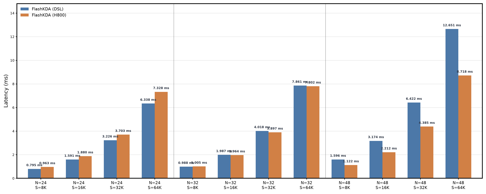

# FlashKDA

基于 CANNBotDSL 的 Kimi Delta Attention prefill 融合算子，面向 Ascend 950。
包括原始 gate 和 beta 的激活、Q/K 的 L2 normalize 以及完整的 Chunk KDA 计算。算子按 64-token chunk 计算，并在 chunk 间递推状态。实现位于 [`flash_kda.py`](flash_kda.py)。

令 $\gamma_t=\exp(\sum_{i\le t}g_i)$，并定义：

$$
\tilde K=\gamma\odot K,\qquad
\bar K=\gamma^{-1}\odot K,\qquad
\tilde Q=\operatorname{scale}\cdot(\gamma\odot Q).
$$

序列按 $C=64$ 切分。每个 chunk 内先计算严格下三角矩阵及其逆：

$$
T=\operatorname{stril}\!\left(\operatorname{diag}(\beta)\tilde K\bar K^{\top}\right),
\qquad A^{-1}=(I+T)^{-1},
$$

$$
U=A^{-1}\operatorname{diag}(\beta)V,
\qquad W=A^{-1}\operatorname{diag}(\beta)\tilde K.
$$

以 $S_0=$ `initial_state`，第 $c$ 个 chunk 的状态和输出为：

$$
S_c=\operatorname{diag}(\gamma_C)S_{c-1}+(K_c^r)^{\top}(U-WS_{c-1}),
$$

$$
O_c=\tilde Q_cS_{c-1}+\operatorname{tril}\!\left(\tilde Q_c\bar K_c^{\top}\right)(U-WS_{c-1}).
$$

| 特性 | 说明 |
|:---|:---|
| 场景 | Prefill |
| Layout | BNSD、BSND |
| 数据类型 | Q/K/V/g/beta/out: BF16；state/A_log/dt_bias: FP32 |
| GQA | 支持，`Nv % Nk == 0` |
| Head dimension | `Dk = Dv = 128` |
| 序列长度 | `S` 为 64 的整数倍 |

## 快速开始

```python
import math
import torch
import torch.nn.functional as F
import torch_npu

from flash_kda import flash_kda

B, Nk, Nv, S, D = 1, 3, 3, 8192, 128
q = torch.randn(B, Nk, S, D).bfloat16().npu()
k = torch.randn(B, Nk, S, D).bfloat16().npu()
v = torch.randn(B, Nv, S, D).bfloat16().npu()
g = torch.randn(B, Nv, S, D).bfloat16().npu()
beta = torch.randn(B, Nv, S).bfloat16().npu()
initial_state = torch.zeros(B, Nv, D, D, dtype=torch.float32).npu()
A_log = torch.randn(Nv, dtype=torch.float32).npu()
dt_bias = torch.randn(Nv, D, dtype=torch.float32).npu()

out, final_state = flash_kda(
    q, k, v, g, beta, 1 / math.sqrt(D), initial_state,
    A_log, dt_bias, -5.0, "BNSD"
)
```

## 参数

| 参数 | Shape (BNSD) | 类型 | 说明 |
|:---|:---|:---|:---|
| `q`, `k` | `[B, Nk, S, D]` | BF16 | Query 和 Key。算子内部完成行级 L2 normalize。 |
| `v` | `[B, Nv, S, D]` | BF16 | Value。 |
| `g` | `[B, Nv, S, D]` | BF16 | 原始门控输入；算子内计算 `lower_bound * sigmoid(exp(A_log) * (g + dt_bias))`。 |
| `beta` | `[B, Nv, S]` | BF16 | 原始写入 logits；算子内计算 `sigmoid(beta)`。 |
| `scale` | scalar | FP32 | 常用值为 `D ** -0.5`。 |
| `initial_state` | `[B, Nv, D, D]` | FP32 | 初始状态，布局为 `[Dv, Dk]`。 |
| `A_log` | `[Nv]` | FP32 | 每个 value head 的 log 时间尺度。 |
| `dt_bias` | `[Nv, D]` | FP32 | 每个 value head、每个 D 通道的 gate bias。 |
| `lower_bound` | scalar | FP32 | gate 下界，取值范围 `[-5, 0]`。 |
| `layout_qkv` | scalar | string | `"BNSD"` 或 `"BSND"`。 |

返回 `(out, final_state)`。`out` 的 layout 跟随 `layout_qkv`，`final_state` 的 shape 为 `[B, Nv, D, D]`。

## 精度测试

测试脚本位于 `test/flash_kda/test_flash_kda.py`，需在 NPU 环境下运行：

```bash
pytest -q test/flash_kda/test_flash_kda.py
```

默认容差为 `atol=rtol=5e-3`。

## 性能对比



CANNBot-DSL 生成的 FlashKDA 代码与 H800 上的 FlashKDA 代码在 12 个典型配置上的平均延迟对比：`B=1`、`D=128`、`N=24/32/48`、`S=8K/16K/32K/64K`。
