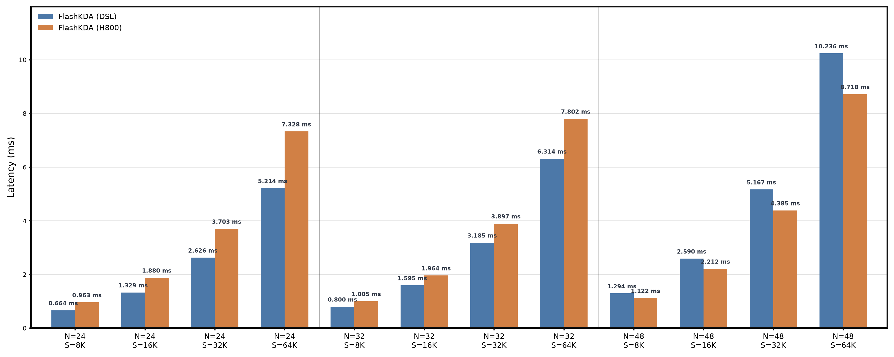

# FlashKDA

基于 CANNBot-DSL 的 Kimi Delta Attention prefill 融合算子，面向 Ascend 950。实现位于 [`flash_kda.py`](flash_kda.py)，配套的 AICPU 调度实现在同目录的 [`flash_kda_metadata.py`](flash_kda_metadata.py)。先生成可复用的 metadata，再由 FlashKDA 消费它并计算序列输出和最终状态。

## 功能说明

算子融合原始 gate 和 beta 的激活、Q/K 行级 L2 normalize，以及完整的 Chunk KDA 计算。令 $\gamma_t=\exp(\sum_{i\le t}g_i)$，每个 64-token chunk 内计算

$$
\tilde K=\gamma\odot K,\quad \bar K=\gamma^{-1}\odot K,\quad
\tilde Q=\operatorname{scale}\cdot(\gamma\odot Q),
$$

$$
T=\operatorname{stril}\!\left(\operatorname{diag}(\beta)\tilde K\bar K^\top\right),\quad
A^{-1}=(I+T)^{-1},\quad
U=A^{-1}\operatorname{diag}(\beta)V,\quad
W=A^{-1}\operatorname{diag}(\beta)\tilde K.
$$

以 $S_0=$ `initial_state`，chunk 间递推状态并生成输出。输入序列不必按 64 对齐，尾块由内核处理。

`flash_kda_metadata(q, v, initial_state, layout_qkv, cu_seqlens=None)` 根据形状、布局、有效长度和当前 stream 的设备核数生成一维 int32 调度张量。它不读取 Q/V/state 的数值，也不计算 attention 输出。调度配置相同时，可在层间复用 metadata；`flash_kda` 只消费该张量，不启动 AICPU。

## 快速开始

在仓库根目录运行以下示例。`metadata` 是必选参数；若使用 TND 布局，还须给 metadata 函数传入 `cu_seqlens`。

```python
import math
import torch
import torch_npu

from flash_kda.flash_kda import flash_kda
from flash_kda.flash_kda_metadata import flash_kda_metadata

B, Nqk, Nv, S, D = 1, 3, 3, 8192, 128
q = torch.randn(B, Nqk, S, D, device="npu", dtype=torch.bfloat16)
k = torch.randn_like(q)
v = torch.randn(B, Nv, S, D, device="npu", dtype=torch.bfloat16)
g = torch.randn_like(v)
beta = torch.randn(B, Nv, S, device="npu", dtype=torch.bfloat16)
initial_state = torch.zeros(B, Nv, D, D, device="npu", dtype=torch.float32)
A_log = torch.randn(Nv, device="npu", dtype=torch.float32)
dt_bias = torch.randn(Nv, D, device="npu", dtype=torch.float32)

metadata = flash_kda_metadata(q, v, initial_state, "BNSD")
out, final_state = flash_kda(
    q, k, v, g, beta, 1 / math.sqrt(D), initial_state,
    A_log, dt_bias, -5.0, "BNSD", metadata,
)
```

## 参数说明

`B` 是 batch 数，`Nqk` 和 `Nv` 分别是 Query/Key 与 Value 头数，`S` 是每条序列的存储长度，`T` 是 packed token 总数，`D=128`。

| 参数 | BNSD shape | 类型 | 说明 |
|:---|:---|:---|:---|
| `q`, `k` | `[B, Nqk, S, D]` | BF16 | 原始 Query/Key；算子内完成 L2 normalize。 |
| `v`, `g` | `[B, Nv, S, D]` | BF16 | Value 与原始 gate；gate 由 `A_log`、`dt_bias`、`lower_bound` 激活。 |
| `beta` | `[B, Nv, S]` | BF16 | 原始写入 logits；算子内执行 sigmoid。 |
| `scale` | 标量 | float | Query/Key 缩放值，常用 `D ** -0.5`。 |
| `initial_state` | `[B, Nv, D, D]` | FP32 | 初始递归状态，最后两维依次为 Dv、Dk。 |
| `A_log` | `[Nv]` | FP32 | 每个 Value 头的 log 时间尺度。 |
| `dt_bias` | `[Nv, D]` | FP32 | gate 偏置。 |
| `lower_bound` | 标量 | float | gate 下界，范围 `[-5, 0]`。 |
| `layout_qkv` | 标量 | string | `"BNSD"`、`"BSND"` 或 `"TND"`。 |
| `metadata` | `[M]` | int32 | 同目录 `flash_kda_metadata` 返回的调度张量，必选。 |

BSND 的 `q/k` 为 `[B,S,Nqk,D]`、`v/g` 为 `[B,S,Nv,D]`、`beta` 为 `[B,S,Nv]`。TND 分别为 `[T,Nqk,D]`、`[T,Nv,D]`、`[T,Nv]`。

metadata 函数接收与主算子相同的 `q`、`v`、`initial_state` 和 `layout_qkv`，另有可选的 `cu_seqlens`。TND 必须传 `cu_seqlens`；BNSD/BSND 可传它指定每条序列的有效长度，不传时每条长度均为 `S`。

## 返回值说明

`flash_kda` 返回 `(out, final_state)`；metadata 函数返回一维 int32 调度张量。

| 返回值 | Shape | 类型 | 说明 |
|:---|:---|:---|:---|
| `out` | 与 `v` 相同 | BF16 | 序列输出，布局与 `v` 相同；仅 metadata 指定的有效行有定义。 |
| `final_state` | `[B,Nv,D,D]` | FP32 | 最终递归状态；新建张量，不原地修改 `initial_state`。 |

输出内部按 64 个 token 对齐存储，再裁剪为逻辑 shape；非对齐长度下，`out` 可能是不连续的视图。

## 约束说明

- 支持 Ascend 950，`Dk = Dv = 128`，`B >= 1`，序列存储长度大于 0；支持 BNSD、BSND 和 packed TND。
- 支持 GQA，要求 `1 <= Nqk <= Nv`、`Nv % Nqk == 0`。metadata 调度要求 `Nv <= 861`。
- Q/K/V/g/beta 为 BF16，`initial_state`、`A_log`、`dt_bias` 为 FP32；`lower_bound` 必须在 `[-5, 0]`。
- 所有公开输入张量必须连续且位于同一设备；`metadata` 必须是一维 int32 张量。BNSD/BSND 的物理 batch 数必须与 `initial_state` 一致。
- TND 的 `cu_seqlens` 必须是同设备、连续的 int32 `[B+1]` 前缀和：首项为 0、末项为 `T`，并严格递增。BNSD/BSND 传入 `cu_seqlens` 时，每条有效长度须在 `[1,S]` 内。

## 精度测试

在仓库根目录运行：

```bash
python -m pytest -q test/flash_kda/test_flash_kda.py test/flash_kda/test_flash_kda_metadata.py
```

测试覆盖三种布局、尾块、跨轮调度以及 metadata 容量边界。FlashKDA 输出与最终状态对照 PyTorch 参考实现，默认容差为 `atol=rtol=5e-3`。上板测试需使用支持当前 CANNBot-DSL API 的环境；`-m 'not npu'` 可只运行导入与设备核数的非 NPU 检查。

## 性能对比



CANNBot-DSL 生成的 FlashKDA 代码与 H800 上的 FlashKDA 代码在 12 个典型配置上的平均延迟对比：`B=1`、`D=128`、`N=24/32/48`、`S=8K/16K/32K/64K`。
