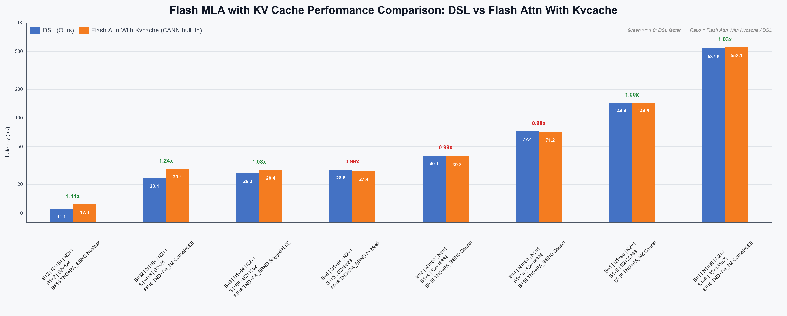

# Flash MLA with KV Cache

基于 CANNBot-DSL 实现的 Flash MLA 推理算子，使用 paged KV cache 完成注意力计算：

$$
O = \operatorname{softmax}(QK^T \cdot \text{softmax\_scale} + M)V
$$

## 支持范围

| 特性与约束 | 说明 |
| :--- | :--- |
| 数据类型 | `float16`、`bfloat16`，Q 与 KV cache 类型一致 |
| Query | `TND`，shape 为 `[T, N, 576]`，`N` 支持 64 或 96 |
| KV cache | `PA_NZ` 或 `PA_BBND`，page size 固定为 128，KV head 数固定为 1 |
| 输出布局 | `NTD`，Attention 输出 shape 为 `[N, T, 512]` |
| Mask | `mask_mode=0`（无 mask）或 `mask_mode=3`（right-down causal） |
| Value head dim | 512 |

实现由三个 Python 文件组成：

- `flash_mla_with_kvcache.py`：主算子和 host launch。
- `flash_mla_with_kvcache_metadata.py`：生成设备侧调度 metadata。
- `checker.py`：公开接口参数校验。

## 快速开始

在已加载 CANN 环境并将当前 sample 目录加入 `PYTHONPATH` 后，可运行下面的
`TND + PA_BBND` 示例。它包含一个 batch、2 个 Query token 和 129 个 KV token：

```python
import math

import torch
import torch_npu

from flash_mla_with_kvcache import flash_mla_with_kvcache
from flash_mla_with_kvcache_metadata import flash_mla_with_kvcache_metadata

dtype = torch.bfloat16
num_heads_q = 64
num_heads_kv = 1
query_tokens = 2
kv_tokens = 129
page_size = 128
page_count = 2

q = torch.randn(
    query_tokens, num_heads_q, 576, dtype=dtype, device="npu"
)
k_cache = torch.randn(
    page_count, page_size, num_heads_kv, 576,
    dtype=dtype,
    device="npu",
)
block_table = torch.tensor([[0, 1]], dtype=torch.int32, device="npu")
cache_seqlens = torch.tensor([kv_tokens], dtype=torch.int32, device="npu")
cu_seqlens_q = torch.tensor([0, query_tokens], dtype=torch.int32, device="npu")

metadata = flash_mla_with_kvcache_metadata(
    cache_seqlens,
    num_heads_q,
    num_heads_kv,
    cu_seqlens_q=cu_seqlens_q,
    max_seqlen_q=query_tokens,
    max_seqlen_kv=kv_tokens,
    layout_q="TND",
)

attention_out, softmax_lse = flash_mla_with_kvcache(
    q,
    k_cache,
    block_table=block_table,
    cache_seqlens=cache_seqlens,
    cu_seqlens_q=cu_seqlens_q,
    metadata=metadata,
    softmax_scale=1.0 / math.sqrt(576),
    layout_q="TND",
    layout_kv="PA_BBND",
    layout_out="NTD",
    return_softmax_lse=True,
)
torch.npu.synchronize()
```

调用顺序固定为：先生成 metadata，再将其与同一组序列信息传给主算子。调度配置不变时，metadata 可以复用。

metadata 调度和主算子启动均使用当前 stream 的有效 AIC/AIV 核数，支持 stream 控核；主算子的 block 数和 workspace 随有效 AIC 核数缩放。生成与使用 metadata 时须保持相同的设备与核数配置，修改 stream 核数配额后应重新生成 metadata。此路径不将设备侧 metadata 回读到 host，支持 ACLGraph capture。

## Metadata 接口

```python
flash_mla_with_kvcache_metadata(
    cache_seqlens,
    num_heads_q: int,
    num_heads_kv: int,
    cu_seqlens_q=None,
    seqused_q=None,
    max_seqlen_q=-1,
    max_seqlen_kv=-1,
    head_dim_qk=576,
    head_dim_v=512,
    mask_mode=0,
    layout_q="BSND",
)
```

| 参数 | 说明 |
| :--- | :--- |
| `cache_seqlens` | 必选，NPU 上连续的一维 `int32` Tensor，shape 为 `[B]`，表示每个 batch 的有效 KV 长度 |
| `num_heads_q` | Query head 数；配合当前主算子使用时为 64 或 96 |
| `num_heads_kv` | KV head 数，当前固定为 1 |
| `cu_seqlens_q` | `TND` 必选，NPU 上连续的一维 `int32` Tensor，shape 为 `[B+1]` |
| `seqused_q` | 可选，NPU 上连续的一维 `int32` Tensor，shape 为 `[B]`，表示每个 batch 实际使用的 Query 数 |
| `max_seqlen_q` | 最大 Query 长度，`-1` 表示未指定；也可传非负整数供调度使用 |
| `max_seqlen_kv` | 最大 KV 长度，`-1` 表示未指定；也可传非负整数供调度使用 |
| `head_dim_qk` | Q/K head dim，当前固定为 576 |
| `head_dim_v` | Value head dim，当前固定为 512 |
| `mask_mode` | 0 表示无 mask，3 表示 right-down causal |
| `layout_q` | metadata 支持 `TND`、`BSND`、`BNSD`；当前主算子使用 `TND` |
| 返回值 | NPU 上的一维 `int32` metadata Tensor，供主算子直接使用 |

## 主算子接口

```python
flash_mla_with_kvcache(
    q,
    k_cache,
    block_table=None,
    cache_seqlens=None,
    cu_seqlens_q=None,
    seqused_q=None,
    attn_mask=None,
    metadata=None,
    head_dim_v=512,
    softmax_scale=1.0,
    mask_mode=0,
    max_seqlen_q=-1,
    max_seqlen_kv=-1,
    layout_q="BSND",
    layout_kv="PA_BBND",
    layout_out="BSND",
    return_softmax_lse=False,
)
```

| 参数 | 说明 |
| :--- | :--- |
| `q` | 必选，`float16` 或 `bfloat16`，当前为 `TND [T, N, 576]` |
| `k_cache` | 必选，与 Q 同 dtype；`PA_BBND [blocks, 128, 1, 576]` 或 `PA_NZ [blocks, 1, 36, 128, 16]` |
| `block_table` | 必选，`int32 [B, max_pages]`，记录各 batch 使用的物理 page 编号 |
| `cache_seqlens` | 必选，`int32 [B]`，每个 batch 的有效 KV 长度 |
| `cu_seqlens_q` | `TND` 必选，`int32 [B+1]` Query 前缀和 |
| `seqused_q` | 可选，`int32 [B]`，每个 batch 实际参与计算的 Query 数 |
| `attn_mask` | `mask_mode=3` 时必选，shape 为 `[2048, 2048]`、dtype 为 `int8`；`mask_mode=0` 时必须为 `None` |
| `metadata` | 必选，由 `flash_mla_with_kvcache_metadata()` 生成的一维 `int32` Tensor |
| `head_dim_v` | 当前固定为 512 |
| `softmax_scale` | Softmax 缩放系数，默认值和传入 `None` 时均为 `1.0` |
| `mask_mode` | 0 表示无 mask，3 表示 right-down causal |
| `max_seqlen_q` | 当前主算子要求为 `-1` 或 `None` |
| `max_seqlen_kv` | 当前主算子要求为 `-1` 或 `None` |
| `layout_q` | 当前必须为 `TND` |
| `layout_kv` | `PA_NZ` 或 `PA_BBND` |
| `layout_out` | 当前必须为 `NTD` |
| `return_softmax_lse` | 是否返回 Softmax LSE |

返回 `(attention_out, softmax_lse)`：

- `attention_out`：shape 为 `[N, T, 512]`，dtype 与 Q 一致。
- `softmax_lse`：启用时 shape 为 `[N, T]`、dtype 为 `float32`；关闭时返回空的 `float32` Tensor。

注意：虽然函数签名保留了 `BSND` 默认值，当前 checker 开放的主算子组合为 `layout_q="TND"` 和 `layout_out="NTD"`，调用时应显式传入。

## 性能对比

下图为 CANNBot-DSL 与 Flash Attn With Kvcache（CANN built-in ASC）在 8 个代表性 case 上的 kernel device time。
使用 msprof 采集 `Task Duration`，每个实现执行两组、每组 1 次 warmup 和
20 次正式采样；丢弃 warmup 后，从 40 个样本中取最小值。首次编译和 host
开销不计入结果。加速比定义为 `Flash Attn With Kvcache / CANNBot-DSL`，大于 1 表示
CANNBot-DSL 更快。



测试环境为 CANN 9.2.0 两种实现使用同一
设备、相同输入配置和相同重复次数。

## 功能测试

在仓库根目录执行：

```bash
python -m pytest test/flash_mla_with_kvcache/test_flash_mla_with_kvcache.py -v
```

ACLGraph 模式：

```bash
python -m pytest test/flash_mla_with_kvcache/test_flash_mla_with_kvcache.py -v -o mode=aclgraph
```

测试覆盖两种 KV layout、两种数据类型、普通与 causal attention、ragged/empty batch、尾块和非连续外层 stride。
