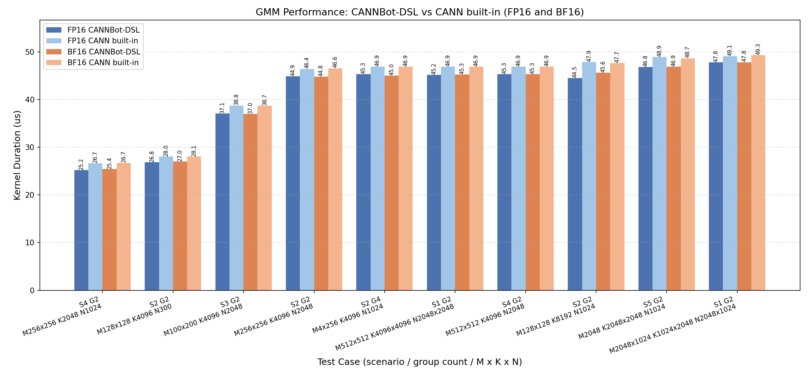

# GroupMatmul

基于 CANNBot-DSL 实现的非量化 GroupedMatmul（分组矩阵乘）算子，支持 float16、bfloat16 数据类型，面向 Ascend NPU。

## 算子介绍

计算公式（其中 `g` 为分组个数，`i=1...g`）：

$$
y_i[m_i, n_i] = x_i[m_i, k_i] \times weight_i[k_i, n_i]
$$

分组方式：

- M 轴分组（group_type=0）：`group_list` 将 M 轴划分为 g 组，各组 `k_i`、`n_i` 相同，`m_i` 可不同；
- K 轴分组（group_type=2）：`group_list` 将 K 轴划分为 g 组，各组 `m_i` 相同，`k_i` 可不同；
- 不分组（group_type=-1）：各组 `m_i`、`k_i`、`n_i` 均可不同。

支持场景（"单/多"指 tensorlist 中的张量个数）：

| 场景 | group_type | x | weight | y | split_item | group_list |
| :--- | :---: | :--- | :--- | :--- | :---: | :--- |
| S1 | -1 | 多个 `[m_i, k_i]` | 多个 2-D | 多个 | 0/1 | 必须为 None |
| S2 | 0 | 单个 `[M, K]` | 单个 3-D `[G, K, N]` | 单个 | 2/3 | 必传 |
| S3 | 0 | 单个 `[M, K]` | 多个 2-D | 单个 | 2/3 | 必传 |
| S4 | 0 | 多个 `[m_g, K]` | 多个 2-D | 单个 | 2 | 可选 |
| S5 | 2 | 单个转置 `[M, K_total]` | 单个 `[K_total, N]` | 单个 3-D | 2/3 | 必传 |
| S6 | 2 | 单个转置 `[M, K_total]` | 多个 2-D | 多个 | 0/1 | 可选 |

| 特性与约束 | 说明 |
| :--- | :--- |
| 数据类型 | float16、bfloat16（x/weight/y 一致） |
| group_type | -1（不分组）、0（M 轴分组）、2（K 轴分组） |
| group_list_type | 0（cumsum 累积和）、1（count 计数）；group_list 为 None 时按各组张量首维隐式分组 |
| transpose | 由输入视图判定：weight 支持转置/不转置（各组状态须一致）；SPLIT_K 要求 x 为转置视图、weight 不转置；其余场景 x 不转置 |
| 组间 shape | M 轴分组各组 M 可不同；K 轴分组各组 K 可不同；S1 各组 M/K/N 均可不同；支持零大小组 |
| 无 padding 设计 | 核内按组真实边界切片读写，无需 host 侧 padding 或对齐约束 |
| 零物化 | 输入 tensorlist 原样传入 kernel，不做 cat/stack/contiguous |
| 多核并行 | 自适应滑动窗口多核调度 + 偶数行 N 反转，count 跨组负载均衡 |
| L2 cache | 按矩阵复用情况自适应开关（逐组判定尾部小组） |
| 支持架构 | NPU ARCH 3510（Ascend 950PR / Ascend 950DT） |

算子结构：host 侧 `GmmTiling` 推导 baseM/baseN/baseK、
L1/L0 切分与 double buffer 参数；device kernel
由 `BlockMmad` 完成 per-tile GM→L1→L0A/L0B→MMAD→L0C→GM 流水线，`GmmKernel` 统一调度全部场景，核内读取 `group_list` 迭代各组，
按组切片到真实 M/K 范围，`tile_view` 裁剪尾 tile 到组动态边界。实现详见 `group_matmul.py`。

## 快速开始

```python
import torch
import torch_npu

from group_matmul import group_matmul

dtype = torch.float16
M, K, N, G = 512, 1024, 256, 2

# SPLIT_M（S2 场景）：x 单张量，weight 单个 3-D，y 单张量
x = torch.randn(M, K, dtype=dtype).npu()                    # (M, K)
weight = torch.randn(G, N, K, dtype=dtype).npu()            # (G, N, K)，transB
weight = weight.transpose(-1, -2)                           # 转置视图 (G, K, N)
group_list = torch.tensor([256, 512], dtype=torch.int64).npu()  # cumsum

y = group_matmul([x], [weight], group_list=group_list,
                 group_type=0, group_list_type=0, split_item=2)
# y: List[Tensor]，长度 1，y[0] 为 (M, N)
```

```python
# SPLIT_K（S5 场景）：x 单张量转置视图，weight 单个 2-D，y 单个 3-D
K_total, M, N = 384, 128, 256
k_groups = [192, 128, 64]                                   # 各组 K

x = torch.randn(K_total, M, dtype=dtype).npu()              # (K_total, M)
x = x.transpose(-1, -2)                                     # 转置视图 (M, K_total)
weight = torch.randn(K_total, N, dtype=dtype).npu()         # (K_total, N)
group_list = torch.tensor([192, 320, 384], dtype=torch.int64).npu()

y = group_matmul([x], [weight], group_list=group_list,
                 group_type=2, group_list_type=0, split_item=3)
# y: List[Tensor]，长度 1，y[0] 为 (G, M, N)，第 g 片为 x[:, k_g 切片] @ weight[k_g 切片]
```

```python
# 多 x 多 weight（S4 场景）：group_list 可省略，按各组 x 首维隐式分组
K, N = 512, 256
m_list = [128, 100]

x = [torch.randn(m, K, dtype=dtype).npu() for m in m_list]
weight = [torch.randn(K, N, dtype=dtype).npu() for _ in m_list]

y = group_matmul(x, weight, group_type=0, split_item=2)
# y: List[Tensor]，长度 1，y[0] 为 (sum(m_list), N)
```

`group_matmul()` 参数说明：

| 参数 | shape | dtype | 说明 |
| :--- | :---: | :---: | :--- |
| `x` | List[Tensor]，见场景表 | float16/bfloat16 | 输入矩阵列表 |
| `weight` | List[Tensor]，见场景表 | float16/bfloat16 | 权重矩阵列表 |
| `group_list` | (G,) | int64 | 分组列表，cumsum（type 0）或 count（type 1）；S1 必须为 None，S4/S6 可省略 |
| `group_list_type` | - | int | 0（cumsum）或 1（count） |
| `group_type` | - | int | -1（不分组）、0（M 轴分组）或 2（K 轴分组） |
| `split_item` | - | int | 0/1（多输出张量）或 2/3（单输出张量） |
| `output_dtype` | - | dtype | None 或 x.dtype |
| 返回值 `y` | List[Tensor] | float16/bfloat16 | 恒为列表：split_item 0/1 返回 G 个张量；2/3 返回长度 1 的列表（SPLIT_K 元素为 3-D `[G, M, N]`） |

## 精度测试

测试代码位于 `test/grouped_matmul/test_group_matmul.py`，使用 pytest 驱动，运行命令如下：

```bash
pytest test/grouped_matmul/test_group_matmul.py -v
```

## 性能数据

基于 CANNBot-DSL 实现的 group_matmul 算子与 9.1.0 CANN 包内置 GroupedMatmul
算子在部分用例上的性能对比结果如下：


