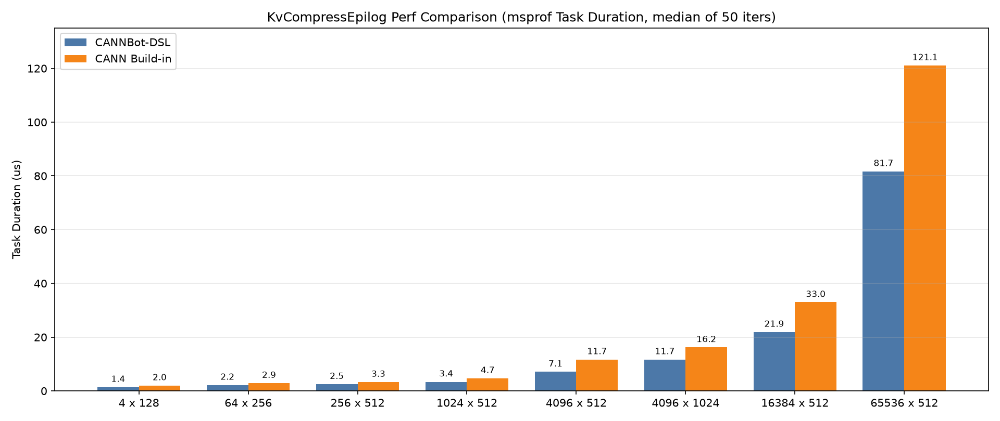

# KvCompressEpilog

基于 CANNBot-DSL 实现的 KV Cache 压缩更新算子，将 bfloat16 激活值量化压缩后按 slotMapping 散写到 cache 的对应行，面向 Ascend NPU。

## 算子介绍

原地更新算子，输出行布局：

```
[rope bf16 128B][nope fp8 (d-64)B][scale][pad]
```

per-group FP8 量化：nope 段每 64 个元素为一组，独立计算 scale 并量化为 FP8(e4m3)。rope 段保留原始 bfloat16。scale 段支持 bf16（quant_mode=0）和 e8m0（quant_mode=1）两种格式。

| 特性与约束 | 说明 |
| :--- | :--- |
| 数据类型 | x: bfloat16，cache: uint8，slot_mapping: int32/int64 |
| 量化模式 | quant_mode=0: bf16 scale; quant_mode=1: e8m0 scale |
| round_scale | True: scale 向上取整为 2 的幂; False: 不取整 |
| d 约束 | 64 < d <= 8192，d % 64 == 0 |
| headDim 约束 | headDim >= kvCacheCol |
| 支持架构 | NPU ARCH 3510（Ascend 950PR/Ascend 950DT） |

实现详见 `kv_compress_epilog.py`。

## 快速开始

```bash
source ${install_path}/ascend-toolkit/set_env.sh
```

```python
import torch
import torch_npu
from kv_compress_epilog import kv_compress_epilog

bs, d = 1024, 512
head_dim = 608
cache = torch.zeros(1, bs, 1, head_dim, dtype=torch.uint8).npu()
x = torch.randn(bs, d, dtype=torch.bfloat16).npu()
slot_mapping = torch.arange(bs, dtype=torch.int64).npu()

kv_compress_epilog(cache, x, slot_mapping, quant_mode=1, round_scale=True)
```

`kv_compress_epilog()` 关键参数：

| 参数 | 默认值 | 说明 |
| :--- | :---: | :--- |
| `cache` | — | KV cache，4D uint8，原地更新 |
| `x` | — | 激活值，2D bfloat16 |
| `slot_mapping` | — | 行映射，-1 表示跳过 |
| `quant_mode` | 1 | 0=bf16 scale，1=e8m0 scale |
| `round_scale` | True | scale 是否向上取整为 2 的幂 |

## 精度测试

测试代码位于 `test/kv_compress_epilog/test_kv_compress_epilog.py`，使用 pytest 驱动，运行命令如下：

```bash
pytest test/kv_compress_epilog/test_kv_compress_epilog.py -v
```

覆盖 quant_mode=0/1 × round_scale=True/False × 2 种 shape，共 8 个用例。

精度判定标准：算子输出与 golden 输出逐字节进行对比，`round_scale=False` 场景接受 ±1 容差（FP8 量化舍入方向差异），`round_scale=True` 场景与 golden 完全一致。

## 性能数据

以下为 CANNBot-DSL 实现与 CANN Built-in 实现在部分用例上的性能对比结果：


