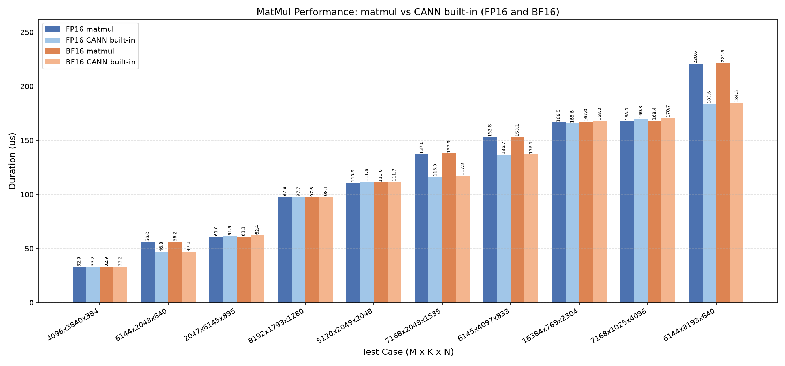

# Matmul

基于 CANNBot-DSL 实现的非量化矩阵乘算子，支持 float16、bfloat16 数据类型，面向 Ascend NPU。

## 算子介绍

计算公式：

$$
C[M,N] = A[M,K] @ B[N,K]^T
$$

| 特性与约束 | 说明                                              |
| :--------- | :------------------------------------------------ |
| 数据类型   | float16、bfloat16（A/B/C 一致）                   |
| transpose  | 当前核内仅支持transpose_a=False、transpose_b=True |
| 输入       | 二维 contiguous 矩阵                              |
| 多核并行   | 自适应滑动窗口多核调度                            |
| L2 cache   | 按矩阵复用情况自适应开关                          |
| 支持架构   | NPU ARCH 3510（Ascend 950PR / Ascend 950DT）      |

算子由 host 侧 tiling 推导 baseM/baseN/baseK、L1/L0 切分与 double buffer 参数，device kernel 采用自适应滑动窗口多核调度 + L1/L0 ping-pong 流水线，数据流为 GM → L1（MTE2）→ L0A/L0B（MTE1）→ MMAD（M）→ L0C → GM（FIXPIPE）。实现详见 `matmul.py`。

## 快速开始

```python
import torch
import torch_npu
from matmul import matmul

M, K, N = 1024, 1024, 1024
dtype = torch.float16

a = torch.randn(M, K, dtype=dtype).npu()   # (M, K)
b = torch.randn(N, K, dtype=dtype).npu()   # (N, K)

c = matmul(a, b, transpose_a=False, transpose_b=True)
```

`matmul()` 参数说明：

| 参数            | shape |      dtype      | 说明                                   |
| :-------------- | :----: | :--------------: | :------------------------------------- |
| `a`           | (M, K) | float16/bfloat16 | 左矩阵                                 |
| `b`           | (N, K) | float16/bfloat16 | 右矩阵                                 |
| `transpose_a` |   -   |       bool       | 左矩阵是否转置（当前核内仅支持 False） |
| `transpose_b` |   -   |       bool       | 右矩阵是否转置（当前核内仅支持 True）  |
| 返回值`c`     | (M, N) | float16/bfloat16 | 矩阵乘结果，与输入同 dtype             |

## 精度测试

测试代码位于 `test/matmul/test_matmul.py`，使用 pytest 驱动，运行命令如下：

```bash
pytest test/matmul/test_matmul.py -v
```

## 性能数据

基于 CANNBot-DSL 实现的 matmul 算子与 CANN 包内置 matmul 算子基础模板在部分用例上的性能对比结果如下：


