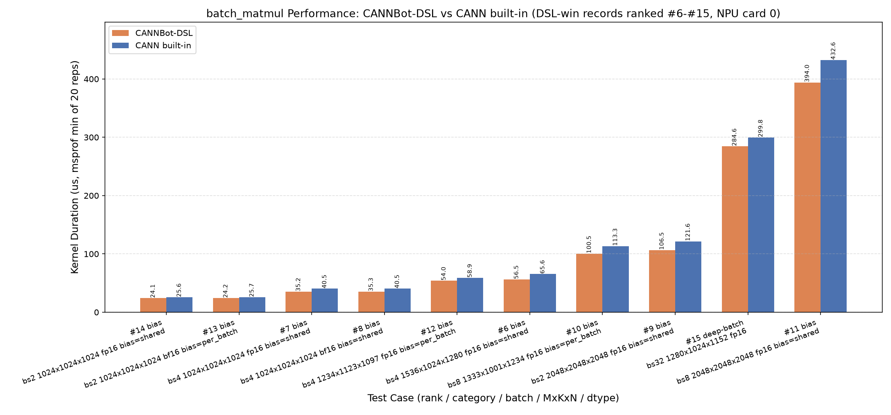

# BatchMatmul

基于 CANNBot-DSL 实现的非量化批量矩阵乘算子（带 batch 维广播、转置视图零拷贝推导、bias 融合），支持 float16、bfloat16、float32 数据类型，面向 Ascend NPU。

## 算子介绍

计算公式：

$$
C[\underbrace{c_0,\dots,c_r}_{c\_batch}, M, N] = A[a\_batch, M, K] \, @ \, B[b\_batch, N, K]^T + bias, \quad c\_batch = \mathrm{broadcast}(a\_batch,\, b\_batch)
$$

| 特性与约束 | 说明 |
| :--------- | :--- |
| 数据类型   | float16、bfloat16、float32（核内 fp32 累加）；fp32 可选 HF32 快速模式（`hf32=True`，TF32 档截断，误差 ~3e-4，仅 fp32 有效） |
| 输入秩     | rank 2~6（末两维为矩阵维；2-D 自动升维，双 2-D 返回 2-D） |
| batch 广播 | numpy/torch.matmul 语义：batch 维右对齐，size-1 维广播（含多维同时广播、混合秩、0 维退化） |
| 转置推导     | 无转置入参：a/b 逻辑形状固定为 `[...bsA, M, K]` / `[...bsB, N, K]`（K 恒为末维，`F.linear` 语义）；canonical `transpose(-1,-2)` 视图（K-major 存储）由 stride 自动识别并零拷贝翻转到对应 kernel 路径（A 走 dn2nz/zn，B 走 (K,N) 通路），其余非连续布局拒绝 |
| bias       | 可选加性偏置，经 BT（Bias Table）折入 init MMAD（只加一次）；`[N]` 共享（广播到 M 与 batch）或 `[*c_batch, N]` 逐 batch（需与输出 batch 精确匹配，BatchMatMulV3 契约）；dtype 为 fp32 或输入 dtype |
| 输入       | a/b 需 contiguous 或 canonical 转置视图（其余非连续布局拒绝） |
| 多核并行   | 展平 batch×M×N tile 空间线性 stride 调度（grid = min(tile 总数, 平台 cube 核数，dav-3510 为 28)，batch 数任意） |
| 尾块处理   | `tile_view` 裁剪 + ND2NZ 引擎零填充，M/N/K 任意值 |
| L2 hint    | 逐 copy `l2_cache_ctl` 策略：A/B 默认旁路、按复用分析（跨 tile 重读 / broadcast）使能，含 nd2nz 方向 + 128 元素对齐守卫；C 按容量使能；bias 恒使能 |
| 支持架构   | NPU ARCH 3510（Ascend 950PR / Ascend 950DT） |

### Tiling（对齐 dav-3510 主线）

host 侧 tiling 镜像主线 `batch_mat_mul_v3` 的 basic 路径（`ResetBaseDav3510 + CalL1TilingDefault + GetBaseK`）：

- base_m/base_n 默认 256（16 对齐、shape 截断；fp32 亦为 256）
- base_k = 128B/dtype（fp16=64 / fp32=32），K 可全载时全载（`k_align ≤ max_k → base_k=K` 单段直达）
- k_l1 = base_k × step_k（step_k ≤ 8，L1 双缓冲预算 `(aL1+bL1)×2 + bias ≤ 512KB`）
- L1 恒双缓冲；L0C 深度按 `base_m·base_n·fp32×2 ≤ 256KB` 取 2 或 1
- AIC 核数平台查询（28），替代硬编码

### 数据流

device kernel 采用线性 stride 多核调度 + L1/L0 ping-pong 流水线：GM → L1（MTE2 + ND2NZ/DN2NZ）→ L0A/L0B（MTE1）→ MMAD（M，fp32 累加，bias 经 BT 折入 init）→ L0C → GM（FIXPIPE，NZ2ND + 按输出 dtype 量化）。

广播寻址在 kernel 内由 host 常量 (div, extent, mul) 解码项完成（源 batch 下标 = Σ((out_idx // div) % extent) × mul），host 侧零拷贝展平 leading 维；A/B 侧各自独立解码。实现详见 `batch_matmul.py`。

### 边角契约

- **静态短 N tile pad**：bias 场景或 4 字节 dtype 的 (K,N) b 存储在 N < base_n（单 tile 且未 16 对齐）时，host 侧 pad 到 base_n 并返回 `[..., :N]` 视图（L1→BT 等形状链约束 / nd2nz 亚分形行 MTE 崩溃规避，plog 实证）；多 tile 尾块无需 pad（运行时长度直下）
- **K=0 退化**：无 bias 返回零张量；有 bias 返回 bias 广播（torch baddbmm 语义）
- **L2 容量配置**：C 写回的 `l2_cache_ctl` 判定依赖 L2 容量，默认 128MB（134217728 字节，dav-3510 规格；DSL 平台查询未暴露 L2 键，`get_mem_size` 仅支持 bt/fb0/l0a/l0b/l0c/l1/ub）。调试其他 SoC 时可用环境变量 `BMM_L2_SIZE_BYTES` 覆盖：单位为字节，须为正整数，在 kernel 构造时读取并校验（非法取值报清晰错误，不影响模块导入），仅作用于 C 的缓存判定，不影响 A/B 的旁路策略

## 快速开始

```python
import torch
import torch_npu
from batch_matmul import batch_matmul

bs, M, K, N = 8, 256, 1024, 512
dtype = torch.float16

a = torch.randn(bs, M, K, dtype=dtype).npu()   # (bs, M, K)
b = torch.randn(bs, N, K, dtype=dtype).npu()   # (bs, N, K)

c = batch_matmul(a, b)                          # (bs, M, N)

# 广播：A 单份复用到所有 batch
a1 = torch.randn(1, M, K, dtype=dtype).npu()
c = batch_matmul(a1, b)                        # (bs, M, N) = a1[0] @ b[b]^T

# 多维 batch 广播（rank 2~6，torch.matmul 语义）：
a4 = torch.randn(2, 1, M, K, dtype=dtype).npu()    # batch (2,1)
b4 = torch.randn(1, 3, N, K, dtype=dtype).npu()    # batch (1,3)
c4 = batch_matmul(a4, b4)                          # (2, 3, M, N)

# K-major 存储的 A：传 (bs, M, K) 的转置视图，stride 自动推导，零拷贝
a_kmaj = torch.randn(bs, K, M, dtype=dtype).npu()  # (bs, K, M) contiguous
c = batch_matmul(a_kmaj.transpose(-1, -2), b)      # (bs, M, N)，等价
                                                   # a_kmaj.contiguous().t() @ b^T

# K-major 存储的 B（(K, N) 权重）：同样传转置视图
b_kmaj = torch.randn(bs, K, N, dtype=dtype).npu()  # (bs, K, N) contiguous
c = batch_matmul(a, b_kmaj.transpose(-1, -2))      # C = A @ B^T

# bias：[N] 共享或 [*c_batch, N] 逐 batch
bias = torch.randn(N, dtype=torch.float32).npu()
c = batch_matmul(a, b, bias=bias)              # C = A @ B^T + bias（init MMAD 折入）

# fp32 HF32 快速模式
a32 = torch.randn(bs, M, K, dtype=torch.float32).npu()
b32 = torch.randn(bs, N, K, dtype=torch.float32).npu()
c = batch_matmul(a32, b32, hf32=True)          # TF32 档，误差 ~3e-4
```

`batch_matmul()` 参数说明：

| 参数           | shape |      dtype       | 说明 |
| :------------- | :---: | :--------------: | :--- |
| `a`          | (*a_batch, M, K) | float16/bfloat16/float32 | 左矩阵（2-D 自动升维；contiguous 或 canonical 转置视图零拷贝；rank 2~6） |
| `b`          | (*b_batch, N, K) | float16/bfloat16/float32 | 右矩阵，`C = A @ B^T`；布局契约同 `a` |
| `bias`       | [N] 或 (*c_batch, N) | fp32 或输入 dtype | 可选加性偏置，BT 折入 init MMAD |
| `hf32`       |   -   |       bool       | fp32 专用快速模式：MMAD 以 HF32（TF32 档）计算，误差 ~3e-4；非 fp32 输入时报错（默认 False） |
| 返回值 `c`   | (*c_batch, M, N) | 同输入 | 批量矩阵乘结果（双 2-D 输入返回 2-D；触发 pad 契约时为 `[..., :N]` 视图） |

## 精度测试

测试代码位于 `test/matmul/batch_matmul/test_batch_matmul.py`，使用 pytest 驱动，覆盖 fp16/bf16/fp32（含 HF32 快速模式）、bias（shared / per-batch、尾块 N pad）、K-major 转置视图、多维 batch 广播（rank 2~6、双侧广播、混合秩）、非对齐尾块与 k_l1 边界、2-D 输入及不可广播拒绝共 18 个用例，运行命令如下：

```bash
pytest test/matmul/batch_matmul/test_batch_matmul.py -v
```

## 性能数据

基于 msprof 的设备侧 kernel 时间（每用例重复 20 次取 Task Duration 最小值，vs `torch.bmm/matmul`，Ascend 950，主线 tiling）：



| 用例 | 本算子 | torch | 本算子 TF/s | torch TF/s |
| :--- | :---: | :---: | :---: | :---: |
| bs8 256×1024×512 fp16 | 14.0us | 11.6us | 153.5 | 185.1 |
| bs1 4096³ fp16 | 411.1us | 371.5us | 334.3 | 369.9 |
| bs8 512³ fp16 | 14.6us | 11.3us | 147.4 | 189.0 |
| bs32 128³ fp16 | 2.7us | 3.3us | 50.4 | 40.7 |
| bs4 1024³ fp32（精确） | 486.0us | 391.7us | 17.7 | 21.9 |
| bs4 1024³ **HF32** vs torch fp32 | **68.9us** | 391.7us | **124.7** | 21.9 |
| bs4 1024³ HF32 vs torch HF32（模式对齐） | 68.9us | 58.3us | 124.7 | 147.2 |

- 大方形 fp16/fp32 与主线差距 1.1~1.25×（残余为主线策略矩阵：尾块分裂 / StreamK / ND_FIXPIPE AIV 协同回写）；深批量小矩阵反超主线（0.82×）
- HF32 模式比任何 fp32 路径快 3~7×（torch 亦支持 `torch.npu.matmul.allow_hf32=True`，模式对齐后主线仍略优）
- JIT 便捷入口每次调用含 ~100ms 框架重 trace 开销；低延迟场景请用 `run.compile()` AOT 路径（~156us/调用，同步语义）
