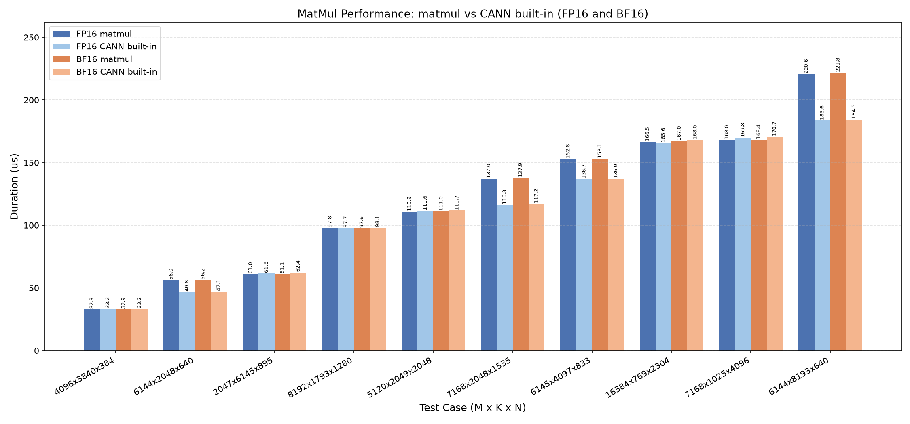
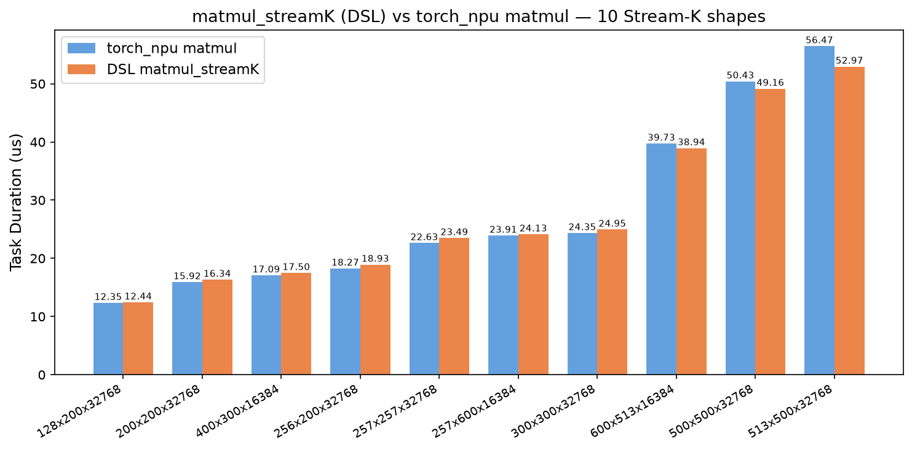

# Matmul A16W16

基于 CANNBot-DSL 实现的非量化矩阵乘算子，支持 float16、bfloat16 数据类型，面向 Ascend NPU。本目录包含基础调度和 Stream-K（DPSK）调度两种实现。

| 实现 | Python 接口 | 说明 |
| :--- | :---------- | :--- |
| `matmul.py` | `matmul()` | 自适应滑动窗口多核调度 |
| `matmul_streamk.py` | `matmul_streamk()` | DP + SK 混合调度，适合小 MN、大 K 场景 |

## 基础实现

计算公式：

$$
C[M,N] = A[M,K] @ B[N,K]^T
$$

| 特性与约束 | 说明 |
| :--------- | :--- |
| 数据类型 | float16、bfloat16（A/B/C 一致） |
| transpose | 当前核内仅支持 transpose_a=False、transpose_b=True |
| 输入 | 二维 contiguous 矩阵 |
| 多核并行 | 自适应滑动窗口多核调度 |
| L2 cache | 按矩阵复用情况自适应开关 |
| 支持架构 | NPU ARCH 3510（Ascend 950PR / Ascend 950DT） |

算子由 host 侧 tiling 推导 baseM/baseN/baseK、L1/L0 切分与 double buffer 参数，device kernel 采用自适应滑动窗口多核调度 + L1/L0 ping-pong 流水线，数据流为 GM → L1（MTE2）→ L0A/L0B（MTE1）→ MMAD（M）→ L0C → GM（FIXPIPE）。实现详见 `matmul.py`。

## 快速开始

```python
import torch
import torch_npu
from matmul import matmul

M, K, N = 1024, 1024, 1024
dtype = torch.float16

a = torch.randn(M, K, dtype=dtype).npu()   # (M, K)
b = torch.randn(N, K, dtype=dtype).npu()   # (N, K)

c = matmul(a, b, transpose_a=False, transpose_b=True)
```

`matmul()` 参数说明：

| 参数 | shape | dtype | 说明 |
| :--- | :---: | :---: | :--- |
| `a` | (M, K) | float16/bfloat16 | 左矩阵 |
| `b` | (N, K) | float16/bfloat16 | 右矩阵 |
| `transpose_a` | - | bool | 左矩阵是否转置（当前核内仅支持 False） |
| `transpose_b` | - | bool | 右矩阵是否转置（当前核内仅支持 True） |
| 返回值 `c` | (M, N) | float16/bfloat16 | 矩阵乘结果，与输入同 dtype |

## 精度测试

测试代码位于 `test/matmul/matmul/test_matmul.py`，使用 pytest 驱动，运行命令如下：

```bash
pytest test/matmul/matmul/test_matmul.py -v
```

## 性能数据

基于 CANNBot-DSL 实现的 matmul 算子与 CANN 包内置 matmul 算子基础模板在部分用例上的性能对比结果如下：



## Stream-K 实现

Stream-K 实现采用 DP + SK 混合调度：

- **DP tiles**（能被核数整除的 tile）：各 AIC 核独立计算完整 K 维度，结果直接写回 output GM。纯 DP 路径启用 slide window 调度（WINDOW_LEN=4）和行反转，使相邻核共享 B 矩阵同一行，提升 L2 命中率。
- **SK tiles**（尾部不能整除的 tile）：按 K 维 split，多个 AIC 核分别计算部分 K 段，结果写入 workspace GM。
- **AIV reduce**：AIV 核从 workspace 读取各 K 段部分和，fp32 累加后 cast 回输入 dtype 写回 output GM。

数据流为 GM → L1（MTE2, nd2nz, L2 cache 控制）→ L0A/L0B（MTE1）→ MMAD（M）→ L0C → GM（FIXPIPE）。AIV reduce 数据流为 workspace GM → UB（MTE3）→ add（V）→ cast → output GM（MTE3）。实现详见 `matmul_streamk.py`。

| 特性与约束 | 说明 |
| :--------- | :--- |
| 数据类型 | float16、bfloat16（A/B/C 一致） |
| transpose | 当前核内仅支持 transpose_a=False、transpose_b=False |
| 输入 | 二维 contiguous 矩阵 |
| 多核并行 | DP（Data Parallel）+ SK（Split-K）混合调度 |
| 调度策略 | AIC 负责 DP/SK tile 计算，AIV 负责 workspace reduce |
| L2 cache | 按矩阵复用情况自适应开关 |
| 滑动窗口 | 纯 DP 路径启用 slide window + 行反转 |
| 支持架构 | NPU ARCH 3510（Ascend 950PR / Ascend 950DT） |

### 快速开始

```python
import torch
import torch_npu
from matmul_streamk import matmul_streamk

M, K, N = 1024, 8192, 1024
dtype = torch.float16

a = torch.randn(M, K, dtype=dtype).npu()   # (M, K)
b = torch.randn(K, N, dtype=dtype).npu()   # (K, N)

c = matmul_streamk(a, b, transpose_a=False, transpose_b=False)
```

`matmul_streamk()` 参数说明：

| 参数 | shape | dtype | 说明 |
| :--- | :---: | :---: | :--- |
| `a` | (M, K) | float16/bfloat16 | 左矩阵 |
| `b` | (K, N) | float16/bfloat16 | 右矩阵 |
| `transpose_a` | - | bool | 左矩阵是否转置（当前核内仅支持 False） |
| `transpose_b` | - | bool | 右矩阵是否转置（当前核内仅支持 False） |
| 返回值 `c` | (M, N) | float16/bfloat16 | 矩阵乘结果，与输入同 dtype |

### 精度测试

测试代码位于 `test/matmul/matmul/test_matmul_streamk.py`，使用 pytest 驱动，运行命令如下：

```bash
pytest test/matmul/matmul/test_matmul_streamk.py -v
```

包含 5 组代表性 shape × 2 dtype = 10 个用例，比对 CPU golden（fp32 累加），覆盖 DP、SK、DP+SK 混合调度、大 K 与极端形状。精度容差为相对误差 `< 1e-2 * max(|ref_max|, 1.0)`。

### 性能数据

基于 CANNBotDSL 实现的 `matmul_streamk` 算子与 CANN 包内置 torch_npu matmul 算子在 100 个纯 SK 用例上的性能对比结果如下：



测试条件：100 个纯 Stream-K shape（小 MN 大 K，MN tile 数 ≤ 16、K ≥ 8192），msprof 采集 Task Duration（每 shape 重复 10 次取 min），fp16 输入输出。

| 加速比区间 | 用例数 |
| :--------- | :----: |
| < 0.8 | 4 |
| 0.8 ~ 0.9 | 11 |
| ≥ 0.9 | 85 |

DSL 在 42/100 个用例上快于 torch_npu，geomean 加速比 0.968。DSL 在小 M+N（如 M=37,N=32）场景优势显著（最高 1.22x），在 M 或 N=1 的退化形状上存在劣势。
