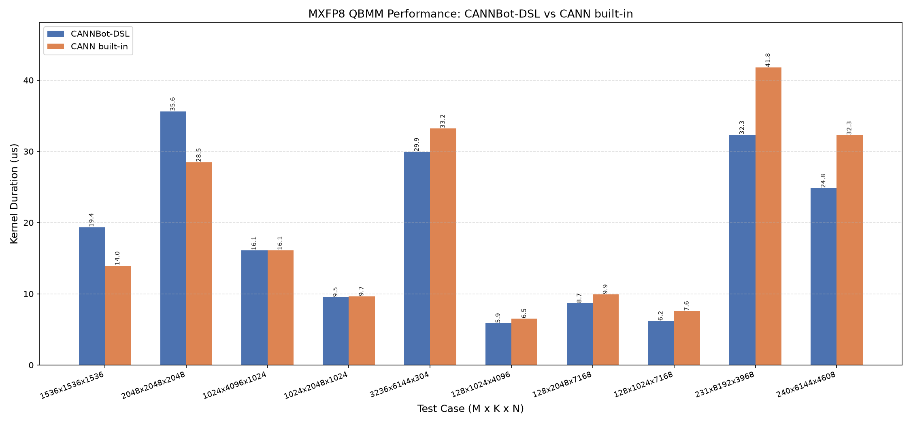

# QBMM MXFP8

基于 CANNBot-DSL 实现的 MXFP8 全量化矩阵乘算子，支持 float8_e4m3fn、
float8_e5m2 输入和 float16、bfloat16、float32 输出，面向 Ascend NPU。

## 算子介绍

计算公式：

$$
C[M,N] = Dequant(A)[M,K] @ Dequant(B)[N,K]^T
$$

其中，MXFP8 沿 K 轴每 32 个数据使用一个 E8M0 Scale。公开 Scale 接口将相邻
两个 Scale 组成一个 pair，因此 Scale 的分组轴长度为 `ceil(K / 64)`，最后一维为 2。

| 特性与约束 | 说明 |
| :--- | :--- |
| 数据类型 | A/B 为 float8_e4m3fn 或 float8_e5m2；输出为 float16、bfloat16 或 float32 |
| Scale | ScaleA/ScaleB 为 float8_e8m0fnu 三维 paired-scale Tensor |
| transpose | 通过 A/B 与 Scale 的 view shape 推导四种 transposeA/transposeB 组合 |
| 输入 | 二维 A/B 与三维 Scale Tensor |
| 多核并行 | 自适应滑动窗口多核调度 |
| A 全载 | `AL1_FULL_LOAD`：A 与 ScaleA 常驻 L1，跨多个 N Tile 复用，B 与 ScaleB 沿 K 流式搬运 |
| Buffer | 按 L1 容量选择数据 2/4 Buffer；L0A/L0B 使用双缓冲；L0C 容量足够时使用双缓冲，Cube-bound 的 FP16/BF16 场景同步调整 Scale 窗口并开启 UnitFlag |
| L2 cache | 按矩阵复用情况自适应开关 |
| 支持架构 | NPU ARCH 3510（Ascend 950PR / Ascend 950DT） |

算子由 Host 侧 tiling 推导 baseM/baseN/baseK、L1/L0 切分与 Buffer 参数，
device kernel 采用自适应滑动窗口多核调度、AL1 full-load 和 L1/L0 ping-pong
流水线，数据流为 GM -> L1（MTE2）-> L0A/L0B（MTE1）-> MMAD -> L0C -> GM
（FIXPIPE）。实现详见 `quant_batch_matmul_mxfp8.py`。

## 快速开始

```python
import torch
import torch_npu

from quant_batch_matmul_mxfp8 import npu_quant_matmul

M, K, N = 256, 256, 256

a = torch.randn(M, K).to(torch.float8_e4m3fn).npu()  # (M, K)
b = torch.randn(N, K).to(torch.float8_e4m3fn).npu()  # (N, K)

# [M, ceil(K / 64), 2] 为 ScaleAND，
# [N, ceil(K / 64), 2] 为 ScaleBDN。
scale_a = torch.full((M, (K + 63) // 64, 2), 127, dtype=torch.uint8).npu()
scale_b = torch.full((N, (K + 63) // 64, 2), 127, dtype=torch.uint8).npu()
scale_a = scale_a.view(torch.float8_e8m0fnu)
scale_b = scale_b.view(torch.float8_e8m0fnu)

c = npu_quant_matmul(
    a,
    b,
    scale_b,
    pertoken_scale=scale_a,
    output_dtype=torch.float32,
)
```

`npu_quant_matmul()` 输入/输出说明：

| 参数 | shape | dtype | 说明 |
| :--- | :---: | :---: | :--- |
| `a` | (M, K) 或 (K, M) | float8_e4m3fn/float8_e5m2 | A，左矩阵 |
| `b` | (N, K) 或 (K, N) | float8_e4m3fn/float8_e5m2 | B，右矩阵 |
| `scale_b` | (N, ceil(K / 64), 2) 或 (ceil(K / 64), N, 2) | float8_e8m0fnu | ScaleB，作为第三个位置参数，分别对应 ScaleBDN/ScaleBND |
| `pertoken_scale=scale_a` | (M, ceil(K / 64), 2) 或 (ceil(K / 64), M, 2) | float8_e8m0fnu | ScaleA，分别对应 ScaleAND/ScaleADN |
| `output_dtype` | - | torch.dtype | 输出类型：float16、bfloat16 或 float32 |
| 返回值 `c` | (M, N) | output_dtype | 矩阵乘结果 |

## 精度测试

测试代码位于 `test/matmul/quant_matmul/test_quant_batch_matmul_mxfp8.py`，使用 pytest
驱动，运行命令如下：

```bash
pytest test/matmul/quant_matmul/test_quant_batch_matmul_mxfp8.py -v
```

## 性能数据

基于 CANNBot-DSL 实现的 MXFP8 QBMM 算子与 CANN 包内置
`npu_quant_matmul` 算子在部分用例上的性能对比结果如下：


