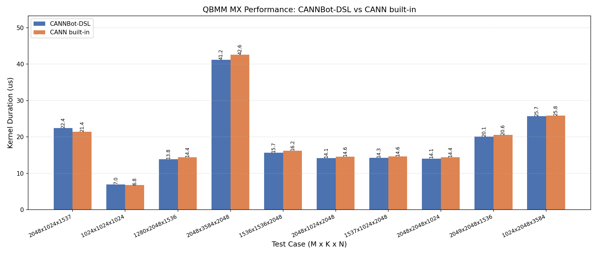
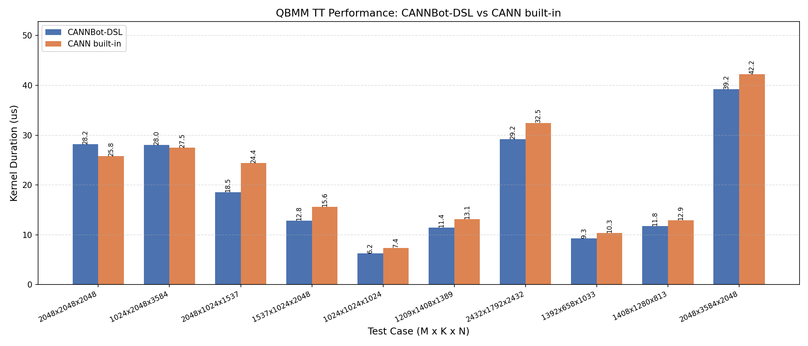
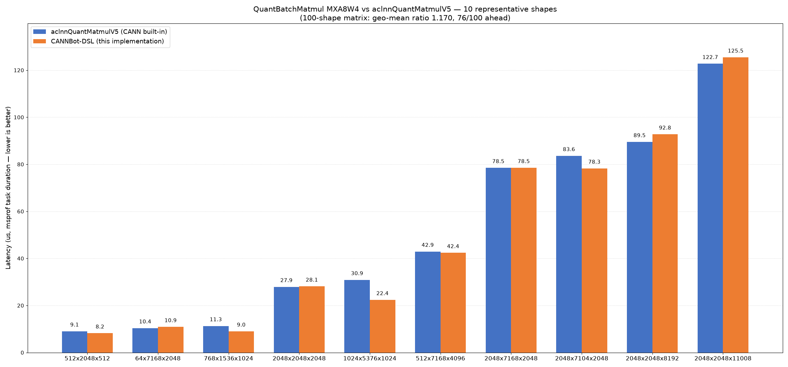

# QuantBatchMatmul MX

基于 CANNBot-DSL 实现的 MX 全量化矩阵乘算子，统一支持 MXFP8 和 MXFP4，
面向 Ascend NPU。MXFP8 输入支持 `float8_e4m3fn`、`float8_e5m2`，MXFP4
输入支持 `float4_e2m1fn_x2`；输出支持 `float16`、`bfloat16` 和 `float32`。

## 算子介绍

计算公式：

$$
C[M,N] = Dequant(A)[M,K] @ Dequant(B)[K,N]
$$

MXFP8 和 MXFP4 均沿 K 轴每 32 个数据使用一个 E8M0 Scale。公开 Scale
接口将相邻两个 Scale 组成一个 pair，因此 Scale 的分组轴长度为
`ceil(K / 64)`，最后一维为 2。

| 特性与约束 | 说明 |
| :--- | :--- |
| 数据类型 | A/B 为 float8_e4m3fn、float8_e5m2 或 float4_e2m1fn_x2；输出为 float16、bfloat16 或 float32 |
| Scale | ScaleA/ScaleB 为 float8_e8m0fnu 三维 paired-scale Tensor |
| transpose | 通过 A/B 与 Scale 的 view shape 推导四种 transposeA/transposeB 组合 |
| 输入 | 二维 A/B 与三维 Scale Tensor |
| MXFP4 打包 | 物理连续内轴每个字节保存两个 FP4 元素；打包内轴必须为偶数，尾轮负载均衡只选择整字节边界的子块 |
| Bias | 可选一维 float32 Bias，长度为 N |
| 尾块 | 支持 M/N/K 非基本块整数倍；Host Tiling 对尾轮进行负载均衡并保留实际 M/N/K |
| 多核并行 | 自适应滑动窗口多核调度 |
| A 全载 | `AL1_FULL_LOAD`：A 与 ScaleA 常驻 L1，跨多个 N Tile 复用，B 与 ScaleB 沿 K 流式搬运 |
| Buffer | 按 L1 容量和 MTE2/Cube 模型选择数据 2/3/4 Buffer；L0A/L0B 使用双缓冲；L0C 容量足够时使用双缓冲 |
| UnitFlag | 中间 MMAD 使用 UnitFlag 2，最终 MMAD 与 FixPipe 使用 UnitFlag 3 |
| L2 cache | 按矩阵复用情况自适应开关 |
| 支持架构 | NPU ARCH 3510（Ascend 950PR / Ascend 950DT） |

算子由 Host 侧 tiling 推导 baseM/baseN/baseK、L1/L0 切分与 Buffer 参数，
Device Kernel 采用自适应滑动窗口多核调度、AL1 full-load 和 L1/L0 ping-pong
流水线，数据流为 GM -> L1（MTE2）-> L0A/L0B（MTE1）-> MMAD -> L0C -> GM
（FIXPIPE）。实现详见 `quant_batch_matmul_mx.py`。

## 快速开始

```python
import torch
import torch_npu

from quant_batch_matmul_mx import npu_quant_matmul

M, K, N = 256, 256, 256

a = torch.randn(M, K).to(torch.float8_e4m3fn).npu()  # (M, K)
b = torch.randn(N, K).to(torch.float8_e4m3fn).npu()  # (N, K)

# [M, ceil(K / 64), 2] 为 ScaleAND，
# [N, ceil(K / 64), 2] 为 ScaleBDN。
scale_a = torch.full((M, (K + 63) // 64, 2), 127, dtype=torch.uint8).npu()
scale_b = torch.full((N, (K + 63) // 64, 2), 127, dtype=torch.uint8).npu()
scale_a = scale_a.view(torch.float8_e8m0fnu)
scale_b = scale_b.view(torch.float8_e8m0fnu)

c = npu_quant_matmul(
    a,
    b,
    scale_a,
    scale_b,
    output_dtype=torch.float32,
)
```

`npu_quant_matmul()` 输入/输出说明：

| 参数 | shape | dtype | 说明 |
| :--- | :---: | :---: | :--- |
| `a` | MXFP8: (M,K)/(K,M)；MXFP4: (M,K/2)/(K,M/2) | float8_e4m3fn / float8_e5m2 / float4_e2m1fn_x2 | A，左矩阵；MXFP4 shape 为物理打包 shape |
| `b` | MXFP8: (N,K)/(K,N)；MXFP4: (N,K/2)/(K,N/2) | float8_e4m3fn / float8_e5m2 / float4_e2m1fn_x2 | B，右矩阵；MXFP4 shape 为物理打包 shape |
| `scale_a` | (M, ceil(K / 64), 2) 或 (ceil(K / 64), M, 2) | float8_e8m0fnu | A 的 ScaleA，分别对应 ScaleAND/ScaleADN |
| `scale_b` | (N, ceil(K / 64), 2) 或 (ceil(K / 64), N, 2) | float8_e8m0fnu | B 的 ScaleB，分别对应 ScaleBDN/ScaleBND |
| `bias` | (N,) | float32 | 可选 Bias |
| `output_dtype` | - | torch.dtype | 输出类型：float16、bfloat16 或 float32 |
| 返回值 `c` | (M, N) | output_dtype | 矩阵乘结果 |

## 精度测试

测试代码位于 `test/matmul/quant_matmul/test_quant_batch_matmul_mx.py`，使用 pytest
驱动，运行命令如下：

```bash
pytest test/matmul/quant_matmul/test_quant_batch_matmul_mx.py -v
```

## 性能数据

本 Sample 与 built-in `npu_quant_matmul`（MX group 量化路径）在部分用例上的
性能对比结果如下。用例覆盖多种对齐与非对齐 Shape（7~43us），
MXFP8 E4M3 输入、FF/FT/TF/TT 布局及多种输出类型。
使用 msprof 采集 AI Core Kernel Task Duration，每个 Shape 预热 3 次后重复
15 次取中位数；图中不包含编译、Launch、同步和输入构造时间。



# QuantBatchMatmul HiFloat8 TT

基于 CANNBot-DSL 实现的 TT（per-tensor）量化矩阵乘算子，重点展示
HiFloat8 数据在 Cube 上的矩阵乘计算，同时支持 INT8、FP8 E4M3FN 和
FP8 E5M2 输入，面向 Ascend NPU。

## 算子介绍

计算公式：

$$
C[M,N] = (scaleA \times scaleB) \times (A[M,K] @ B[K,N])
$$

TT 量化对 A、B 各使用**一个 FP32 标量 Scale**：`scale_a` 为 ScaleA，
`scale_b` 为 ScaleB。ScaleA/ScaleB 作为 Kernel Runtime 参数从 GM 读取，设备侧
计算 `deqScale = scaleA * scaleB`，再通过 `deq_scale` 传给 FIXPIPE,L0C
累加结果写回 GM 时完成反量化。

### HiFloat8 数据表示

HiFloat8 是 Ascend 支持的一种 8-bit 浮点数据格式，不等同于
`torch.float8_e4m3fn` 或 `torch.float8_e5m2`。Torch 当前没有对应的原生
`torch.dtype`，因此 A/B 使用 `torch.int8` Tensor 保存 HiFloat8 编码，并设置
`a_dtype=b_dtype=torch_npu.hifloat8`。接口将存储字节原样传给 Kernel，
`dtypes.hifloat8` 告诉 Cube 按 HiFloat8 解释。`a_dtype` 和 `b_dtype` 必须
同时设置，且 A/B 存储类型必须都是 INT8。

| 特性与约束 | 说明 |
| :--- | :--- |
| 数据类型 | HiFloat8 使用 INT8 存储，并设置 `a_dtype/b_dtype=torch_npu.hifloat8`；也支持原生 INT8 或 E4M3FN/E5M2（两种 FP8 可混用） |
| 输出类型 | HiFloat8/FP8 输出 float16、bfloat16 或 float32；INT8 输出 float16 或 bfloat16 |
| 量化粒度 | TT：A、B 各一个 FP32 标量 Scale；设备侧计算 `deqScale` |
| transpose | A/B 的 view shape 固定为 (M,K)/(K,N)，根据 stride 支持 FF/FT/TF/TT 四种存储布局 |
| 输入 | 二维 A/B 与标量 Scale Tensor |
| 多核并行 | 根据平台 AIC 数量进行自适应滑动窗口多核调度 |
| Buffer | 按 L1 容量选择数据 2/4 Buffer；L0A/L0B 使用双缓冲；L0C 容量足够时使用双缓冲 |
| L2 cache | 按矩阵复用情况自适应开关 |
| UnitFlag | 中间 MMAD 使用 UnitFlag 2，最终 MMAD 与 FixPipe 使用 UnitFlag 3 |
| 支持架构 | NPU ARCH 3510（Ascend 950PR / Ascend 950DT） |

### 输入路径

| 路径 | 输入 | L0C 累加 | 输出 |
| :--- | :--- | :--- | :--- |
| INT8 | int8 | int32 | float16 / bfloat16 |
| FP8 | float8_e4m3fn / float8_e5m2 | float32 | float16 / bfloat16 / float32 |
| HiFloat8 | int8 存储 Tensor，并设置 `a_dtype/b_dtype=torch_npu.hifloat8` | float32 | float16 / bfloat16 / float32 |

数据流：A/B GM → L1（MTE2，ping-pong）→ L0A/L0B（MTE1，ping-pong）
→ MMAD → L0C → FIXPIPE（使用设备侧计算的 `deqScale`）→ C GM。接口根据
Torch 输入 dtype 选择对应 DSL dtype、L0C 累加类型和合法输出类型。

## 快速开始

```python
import torch
import torch_npu

from quant_batch_matmul_hif8_tt import npu_quant_matmul

M, K, N = 256, 256, 256

a = torch.randint(-5, 5, (M, K), dtype=torch.int8).npu()
b = torch.randint(-5, 5, (K, N), dtype=torch.int8).npu()
scale_a = torch.tensor([0.01], dtype=torch.float32).npu()
scale_b = torch.tensor([0.02], dtype=torch.float32).npu()
c = npu_quant_matmul(
    a,
    b,
    scale_a,
    scale_b,
    a_dtype=torch_npu.hifloat8,
    b_dtype=torch_npu.hifloat8,
    output_dtype=torch.float32,
)
```

`npu_quant_matmul()` 输入/输出说明：

| 参数 | shape | dtype | 说明 |
| :--- | :---: | :---: | :--- |
| `a` | (M, K) | int8 / float8_e4m3fn / float8_e5m2 | 左矩阵；HiFloat8 使用 int8 存储；stride 决定 transposeA |
| `b` | (K, N) | int8 / float8_e4m3fn / float8_e5m2 | 右矩阵；HiFloat8 使用 int8 存储；stride 决定 transposeB |
| `scale_a` | (1,)、(1,1) 或标量 | float32 | ScaleA（A，per-tensor） |
| `scale_b` | (1,)、(1,1) 或标量 | float32 | ScaleB（B，per-tensor） |
| `a_dtype` / `b_dtype` | - | int | HiFloat8 输入时二者均传 `torch_npu.hifloat8`；其他输入不传 |
| `output_dtype` | - | torch.dtype | HiFloat8/FP8：float16/bfloat16/float32；INT8：float16/bfloat16 |
| 返回值 `c` | (M, N) | output_dtype | 反量化后的矩阵乘结果 |

## 精度测试

测试代码位于 `test/matmul/quant_matmul/test_quant_batch_matmul_hif8_tt.py`，使用 pytest
驱动，运行命令如下：

```bash
pytest test/matmul/quant_matmul/test_quant_batch_matmul_hif8_tt.py -v
```

## 性能数据

本 Sample 与 built-in `npu_quant_matmul` 在部分用例上的性能对比结果如下。
用例采用较大的对齐与非对齐 Shape（13~77us），
覆盖 HiFloat8 / FP8 输入、FF/FT 布局及多种输出类型。
使用 msprof 采集 AI Core Kernel Task Duration，每个 Shape 预热 3 次后重复
15 次取中位数；图中不包含编译、Launch、同步和输入构造时间。



# QuantBatchMatmul MXA8W4

基于 CANNBot-DSL 实现的混合精度量化矩阵乘算子（MXA8W4）：激活为 MXFP8
（float8_e4m3fn + E8M0 Scale），权重为 MXFP4（float4_e2m1 + E8M0 Scale），
输出 float16，面向 Ascend NPU。

## 算子介绍

计算公式：

$$
C[M,N] = (A[M,K] \cdot sa) @ (B[N,K] \cdot sb)^T + bias
$$

其中 A/B 沿 K 轴每 32 个数据使用一个 E8M0 Scale（MX group size = 32）。
公开 Scale 接口将相邻两个 Scale 组成一个 pair，因此 Scale 的分组轴长度为
`ceil(K / 64)`，最后一维为 2。B 的 fp4 数据以 uint8 打包（每字节 2 个
e2m1 元素，偶数 K 在低 nibble）。

| 特性与约束 | 说明 |
| :--- | :--- |
| 数据类型 | A 为 float8_e4m3fn，B 为打包 float4_e2m1（uint8 载体）；输出 float16 |
| Scale | ScaleA/ScaleB 为 float8_e8m0fnu 三维 paired-scale Tensor |
| Shape | M/N 任意；K 为 32 的倍数且无上限（片上 K 状态全部窗化） |
| 尾块 | M/N/K 尾块由引擎在搬运途中补零；K 尾子块运行期缩窄（`k_extent`），读界不超过 `align64(K)` |
| 多核并行 | 平衡连续 tile 分配，自适应核数（grid 上限 32） |
| 架构 | 双核混合：AIV 权重转换 prologue + AIC MX matmul，CrossCore 通道交接 |

算子由 Host 侧 cost-model tiling 推导 baseM/baseN/baseK、L1 K 窗
（`k_l1 = step_k × base_k`，与 L0/mmad 块解耦）、环深与核数。device 侧
AIV 将 B 的 fp4 → fp8 做**纯位置换转换**（`[s e e m] → [s 0 0 e e m 0 0]`，
数值恒为 e2m1 的 2^-6，含次正规精确），经 UB 环形缓冲写入 CrossCore L1
通道；AIC 完成 A/B 的 MX 矩阵乘与 fixpipe 输出，转换的 2^-6 因子由
fixpipe `deq_scale=64` 与 host 侧 `bias/64` 补偿。数据流为
GM → L1（MTE2，nd2nz）→ L0A/L0B（MTE1，MX scale 联动加载）→ MMAD（MX）
→ L0C → GM（FIXPIPE）。实现详见 `quant_batch_matmul_mxa8w4.py`。

## 快速开始

```python
import torch
import torch_npu

from quant_batch_matmul_mxa8w4 import matmul_mix_quant

M, K, N = 256, 352, 256

a = torch.randn(M, K).to(torch.float8_e4m3fn).npu()          # (M, K)
codes = torch.randint(0, 16, (N, K), dtype=torch.uint8).npu()
b = (codes[:, 0::2] & 0xF) | ((codes[:, 1::2] & 0xF) << 4)   # (N, K // 2)

# [M, ceil(K / 64), 2] 为 ScaleAND，[N, ceil(K / 64), 2] 为 ScaleBDN。
scale_a = torch.full((M, (K + 63) // 64, 2), 127, dtype=torch.uint8).npu()
scale_b = torch.full((N, (K + 63) // 64, 2), 127, dtype=torch.uint8).npu()
scale_a = scale_a.view(torch.float8_e8m0fnu)
scale_b = scale_b.view(torch.float8_e8m0fnu)

c = matmul_mix_quant(a, b, scale_a, scale_b)                 # (M, N) float16
```

`matmul_mix_quant()` 输入/输出说明：

| 参数 | shape | dtype | 说明 |
| :--- | :---: | :---: | :--- |
| `a` | (M, K) | float8_e4m3fn | A，左矩阵 |
| `b` | (N, K // 2) | uint8 | B，右矩阵（fp4 e2m1 打包，偶数 K 低 nibble） |
| `scale_a` | (M, ceil(K / 64), 2) | float8_e8m0fnu | ScaleA（ScaleAND） |
| `scale_b` | (N, ceil(K / 64), 2) | float8_e8m0fnu | ScaleB（ScaleBDN） |
| `bias` | (N,) | torch.float32 | 可选，bias（内部按 2^-6 补偿） |
| 返回值 `c` | (M, N) | float16 | 矩阵乘结果 |

## 精度测试

测试代码位于 `test/matmul/quant_matmul/test_quant_batch_matmul_mxa8w4.py`，
11 个用例（5 组代表性形状 × 含 bias + 输入校验，覆盖尾块/部分尾窗/深环/退化形状），pytest 驱动：

```bash
pytest test/matmul/quant_matmul/test_quant_batch_matmul_mxa8w4.py -v
```

## 性能数据

与 CANN 内置 `aclnnQuantMatmulV5`（QuantBatchMatmulV4 官方 kernel +
SWAT tiling solver）在 100 形状（方形/常规/瘦长/尾块 × M 扫描/宽 N/
奇 M,N/K 尾残差/大 K ≤ 16384/种子随机）上的 msprof task duration
对比（比值 = aclnn / 本实现，大于 1 表示本实现更快）：几何平均
**1.170**，76/100 形状领先，无落后超过 9% 的形状；小形状（K ≤ 1024）
最高 2.28x，尾块形状（K 非 256 倍数）1.07-1.38x。


