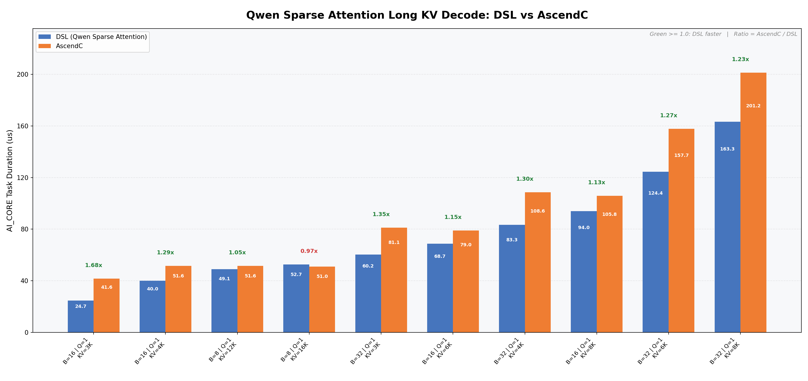

# Qwen Sparse Attention

本样例实现稀疏注意力，固定 `block_size=128`。算子在 Ascend NPU 上执行；AICPU metadata 算子先过滤稀疏块、映射物理页并分配多核任务，主算子只消费其输出。当前采用单 Query metadata ABI。

## 文件与运行环境

- `qwen_sparse_attn.py`：BF16、FP16、FP8 E4M3 主算子；公开入口为 `qwen_sparse_attn`。
- `qwen_sparse_attn_metadata.py`：AICPU metadata 规划器。
- `qwen_sparse_attn_check.py`：输入、属性及 metadata 校验。
- `../../test/qwen_sparse_attn/test_qwen_sparse_attn.py`：NPU 精度测试。

使用 `cannbotdsl 0.7.0+g8f313d6.0.7.x`、兼容的 CANN 运行时、`torch_npu` 与 `opkit`。主 kernel 的 profiler `name` 和 `op_type` 均为 `Qwen_Sparse_Attn`。

## 算子约束

| 参数 | 格式或要求 |
| --- | --- |
| Q | 连续 TND `[T,N1,128]`，`T <= 16384` |
| K/V | PA_BBND `[P,128,N2,128]`，二者形状与 dtype 相同 |
| 稀疏索引 | `sparse_block_idx`：INT32 `[N2,T,topK]`；`sparse_block_count`：INT32 `[N2,T]` |
| GQA | `N1 % N2 == 0`，group 不超过 128 |
| `block_shape` | `[1,128]` |
| `mask_mode` | `3`（right-down causal）；需要连续 INT8 `[2048,2048]` mask 模板 |
| 量化 | BF16/FP16 输入输出类型相同；FP8 E4M3 输入需指定 FP16 或 BF16 输出 |
| 输出 | `(attention_out, softmax_lse)`；当前 `softmax_lse` 为空 FP32 NPU 张量 |

Q 的 `softmax_scale=0` 对应 `1/sqrt(128)`。无效、越界或未来位置的稀疏块被跳过；重复块保留重数。当前不支持 window attention、dequant/P scale 或 LSE 输出。

## Metadata 接口与 ABI

先调用 metadata，再将完整返回值传给主算子：

```python
from qwen_sparse_attn_metadata import qwen_sparse_attn_metadata
from qwen_sparse_attn import qwen_sparse_attn

metadata = qwen_sparse_attn_metadata(
    sparse_block_idx, sparse_block_count, cu_seqlens_q,
    seqused_kv, q, block_table, seqused_q=seqused_q,
)
out, lse = qwen_sparse_attn(
    q, k, v, sparse_block_idx, sparse_block_count, [1, 128],
    attn_mask=attn_mask, cu_seqlens_q=cu_seqlens_q,
    seqused_q=seqused_q, seqused_kv=seqused_kv,
    block_table=block_table, metadata=metadata,
)
```

返回值为 `(core_spans, tasks, pages, counts, status)`：

| 张量 | dtype / shape | 内容 |
| --- | --- | --- |
| `core_spans` | INT64 `[2,core_capacity]` | 每个 Cube core 的任务起止下标 |
| `tasks` | INT64 `[5,task_capacity]` | Query 下标、KV head、GQA chunk、页偏移、页数 |
| `pages` | INT32 `[2,page_capacity]` | 物理页号、causal 有效行数 |
| `counts` | INT32 `[4]` | 已用核数、任务数、页数、ABI 版本 |
| `status` | int | `0` 表示成功 |

当前 ABI 版本为 1，每个任务处理一个 Query token 和一个 KV head；`pages` 始终有两行，因此主算子使用 `queries_per_tile=1`。`pack_queries` 仅为接口兼容而保留，当前不影响任务或张量形状。FP8 单 Query 导入只写有效 Q 行，后续 Vector 与输出也只消费这些行，因此不清零未写入的暂存行；打包路径仍保留清零。

规划器先按有效性与 causal 位置过滤逻辑页，再通过 `block_table` 映射物理页。任务权重为 `2 + page_count`；按 96 MiB K/V page visit 预算分 section，在 section 内按预计代价降序分配给当前负载最小的核，负载跨 section 累计。`counts[0]` 决定主 kernel 启动的 Cube core 数。默认 `task_capacity = T * N2 * ceil(G/32) + 1`，`page_capacity = sum(clamp(sparse_block_count, max=topK)) + 1`。

## 精度与性能

19 个 BF16 NPU 精度 case 全部通过；非零 Q/K/V 的 FP16、FP8→FP16 与 FP8→BF16 精度检查通过。测试覆盖稀疏块乱序、重复、物理页重排、自定义 scale、Q 长于 KV 及 13 种 GQA group。在 Ascend NPU 机器上先进入本仓库根目录，然后运行这 19 个 BF16 精度 case：

```bash
source /path to cann/cann-9.2.0/set_env.sh
python -m pytest -q test/qwen_sparse_attn/test_qwen_sparse_attn.py
```

上述 `pytest` 命令只运行仓库内的 BF16 精度 case，不会重新测量性能 case。

性能采用 `msprof --aic-metrics=PipeUtilization --task-time=on --ai-core=on`，每个 case 预热 5 次、测量 20 次，取 AI_CORE Task Duration 最小值。22 个 FP8 case 中 DSL 快于 AscendC 的有 20 个。图中仅展示 10 个 FP8 长 KV decode case（省略 6 个短 KV case），其中 DSL 快于 AscendC 的有 9 个，几何平均 `AscendC / DSL` 为 1.229 倍。DSL 数值来自 `cannbotdsl 0.7.0+g8f313d6.0.7.x` 的实测结果，AscendC 数值取自 `GBSA_128_CURRENT_VS_HISTORY_PRE_MATCHED_20260922.csv`。性能 case 的输入与测量脚本未包含在本样例中。


