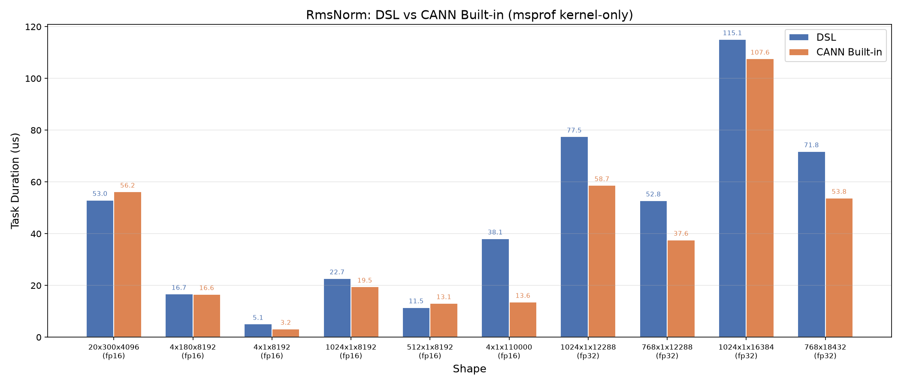

# RmsNorm

基于cannbotdsl实现的RmsNorm归一化算子，支持bfloat16、float16、float32数据类型，面向Ascend NPU。

## 算子介绍

计算公式：

$$
rstd = 1 / sqrt(mean(x^2) + epsilon) \\
y    = x * rstd * gamma
$$

| 特性与约束 | 说明 |
| :--- | :--- |
| 数据类型 | x/gamma/y支持bfloat16、float16、float32（三者一致），rstd恒为float32 |
| 归一化轴 | x的最后K维，须与gamma形状一致 |
| 核内切分 | 按UB容量与数据类型自适应选择全载（整行驻留UB）或列切分（沿归一化轴分tile） |
| 输入约束 | x、gamma均为contiguous |
| 支持架构 | NPU ARCH 3510（Ascend 950PR/Ascend 950DT） |

算子由host侧通过 `const_expr` 编译期分支选择UB全载或列切分kernel模板，device kernel 采用二分折叠归约 + 牛顿迭代 + Channel流水，数据流为GM → UB（MTE2）→ 向量计算（V）→ GM（MTE3）。实现详见 `rms_norm.py`。

## 快速开始

```python
import torch
import torch_npu
from rms_norm import rms_norm

M, N = 1024, 8192
dtype = torch.float16

x = torch.randn(M, N, dtype=dtype).npu()
gamma = torch.randn(N, dtype=dtype).npu()

y, rstd = rms_norm(x, gamma, epsilon=1e-6)
```

`rms_norm()` 关键参数：

| 参数 | 默认值 | 说明 |
| :--- | :---: | :--- |
| `x` | — | 归一化输入，支持float16/float32 |
| `gamma` | — | 缩放权重，与x同数据类型 |
| `epsilon` | 1e-6 | 分母稳定项 |
| 返回值 `y` | — | 归一化结果，与x形状和数据类型一致 |
| 返回值 `rstd` | — | 标准差倒数，数据类型为fp32 |

## 精度测试

测试代码位于 `test/rms_norm/test_rms_norm.py`，使用 pytest 驱动，运行命令如下：

```bash
pytest test/rms_norm/test_rms_norm.py -v
```

## 性能数据

基于cannbotdsl实现的RmsNorm算子与CANN内置RmsNorm算子在部分用例上的性能对比结果如下（所有数据均在同一台设备上通过msprof采集）：


